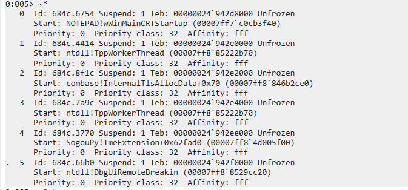
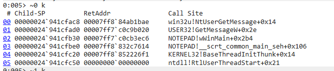
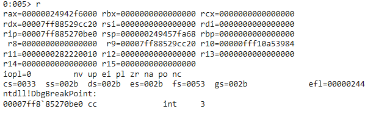
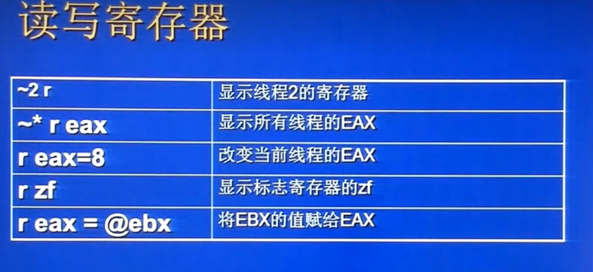
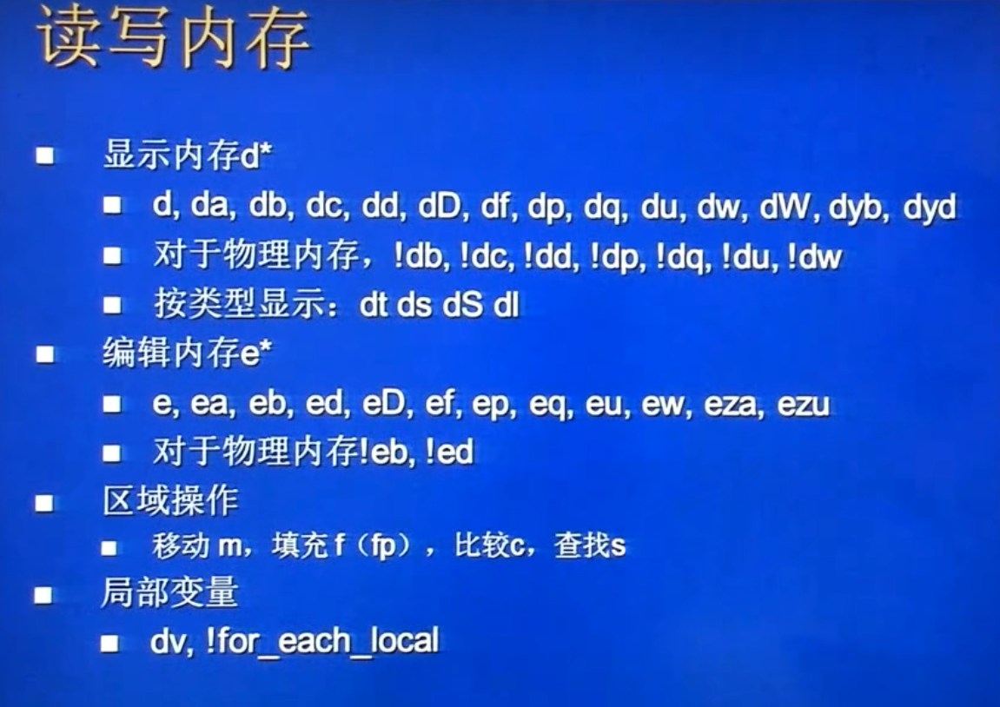

[TOC]

## WinDbg 的三类命令

### 常规命令 Regular command (d *,  e *, b * ,r *)


### 元命令 Meta-Command (.reboot  .reload)


### 扩展命令 Extended Command (!process , !thread)


## 用户态调试

例如 attach 到 notepad.exe 进行举例：


**~***：查看所有线程，可以看到这个进程有 6 个<u>线程</u>



> ​		注意： 5号线程在执行 ：DbgUiRemoteBreakin，显然是我们在调试应用的时候，windbg插入到进程里面去的，它专门执行break


**~0 k**: 查看 <u>0 线程</u>的<u>堆栈</u>  同理可以把 0 换成其他数字



​		可以看到这是 notepad.exe 的主线程，收到windows msg之后启动了窗口main函数(wWinMain).


**r**：查看和修改寄存器的值。



- `r`：不带参数的 `r` 命令会显示当前线程的所有寄存器的值，包括通用寄存器（如 EAX、EBX、ECX、EDX）、段寄存器（如 CS、DS、ES、FS、GS）、指令指针寄存器（EIP）、堆栈指针寄存器（ESP）等。
- `r <寄存器>`：指定一个具体的寄存器名，如 `r EAX`，将只显示该寄存器的值。
- `r <寄存器>=<值>`：用于修改寄存器的值。通过指定等号后面的新值，可以修改寄存器中存储的数据。
- `r *`：显示所有线程的寄存器值。
- `r @<寄存器名>`：显示某个特定线程的寄存器值。通过 `@` 符号后跟线程编号和寄存器名，可以选择要显示的特定线程的特定寄存器。




**u**：用于反汇编指令，将机器码转换为可读的汇编指令。

- `u <地址>`：反汇编从指定地址开始的一条或多条指令。WinDbg 会将机器码转换为相应的汇编指令，并显示在屏幕上。默认情况下，会显示当前指令和后面的几条指令。
- `u <地址> L <行数>`：反汇编从指定地址开始的指定行数的指令。通过指定 `L` 选项和行数，可以控制要显示的指令数量。
- `u <函数名>`：反汇编给定函数的代码。通过指定函数名而不是具体的地址，可以方便地查看整个函数的代码。
- `u -<地址>`：反汇编从指定地址开始向上的指令。通过在地址前加上减号 `-`，可以反汇编以指定地址为终点的代码段。
- `u *`：反汇编当前代码段中的所有指令。通过 `*` 通配符，可以反汇编当前上下文中的所有可执行代码。

​        `u` 命令还支持其他选项，如 `/c`（显示指令的机器码）、`/s`（将反汇编结果发送到输出窗口）等。

**k**:  用于显示当前线程的堆栈跟踪（stack trace）。

- `k`：显示当前线程的简化调用栈信息。它会以函数调用的逆序列出函数的名称和模块名，但不会显示每个函数的参数和局部变量。
- `kb`：显示当前线程的详细堆栈跟踪信息。它会以函数调用的逆序列出函数的名称和模块名，并且对于每个函数还会显示一些关键的调试信息，如栈指针 (`rsp`)、指令指针 (`rip`)、参数值等。

**g**：继续执行，进程可以继续活动。

**p**:  单步执行。




## 远程调试

1.使用远程的环境(pdb)

windbg的<u>cmd</u>输入命令：

```cmd
.server tcp:port=16580
```

在远程的windbg中连接远程回话并输入

```
tcp:Port=16580,Server=<对方的ip>
```


2.使用本地的环境(pdb)

在<u>windbg的安装目录</u>输入：

```
dbgsrv -t tcp:prot=<想输入的端口号>
```

在远程的windbg中选择**Connect to Remote Stub Server**并输入:

```
tcp:Port=<想输入的端口号>,Server=<对方的ip>
```

此时，使用的是连接者的环境。


