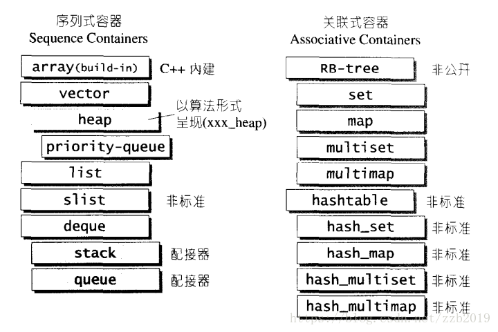

# 一.STL有哪些组件？

STL提供六大组件彼此此可以组合套用：

**1、容器**
　　容器就是各种数据结构，从实现角度看，STL容器是一种class template。

 

 

 

 

**2、算法**
　　各种常见算法，如sort，search，copy，erase等，我觉得其中比较值得学习的就是sort，next_permutation，partition，merge sort，从实现角度看，STL算法是一种function template。

 

**3、迭代器**
　　扮演容器与算法之间的胶合剂，是所谓的“泛型指针”。共有五种类型，从实现角度看，迭代器是一种将operator*，operator->，operator++，operator--等指针相关操作予以重载的class template。所有STL容器都附带有自己专属的迭代器，只有容器设计者才知道如何设计迭代器。原生指针也是一种迭代器。是设计模式的一种，所以被问到了解的设计模式可以用来凑数。

 

**4、仿函数**
　　行为类函数，可作为算法的某种策略，从实现角度看，仿函数是一种重载了operator()的class或class template。一般函数指针可视为狭义的仿函数。

 

**5、容器配接器**
　　一种用来修饰容器或者仿函数或迭代器接口的东西。比如queue和stack，看着像容器，其实就是deque包了一层皮。

 

**6、空间配置器**
　　负责空间配置与管理。从实现角度看，配置器是一个实现了动态空间配置、空间管理、空间释放额class template。

 

**二.STL常用的容器有哪些以及各自的特点是什么?**

1.vector:底层数据结构为数组 ，支持快速随机访问。

2.list:底层数据结构为双向链表，支持快速增删。

3.deque:底层数据结构为一个中央控制器和多个缓冲区，详细见STL源码剖析P146，支持首尾（中间不能）快速增删，也支持随机访问。

4.stack:底层一般用23实现，封闭头部即可，不用vector的原因应该是容量大小有限制，扩容耗时

5.queue:底层一般用23实现，封闭头部即可，不用vector的原因应该是容量大小有限制，扩容耗时（stack和queue其实是适配器,而不叫容器，因为是对容器的再封装）

6.priority_queue:的底层数据结构一般为vector为底层容器，堆heap为处理规则来管理底层容器实现

7.set:底层数据结构为红黑树，有序，不重复。

8.multiset:底层数据结构为红黑树，有序，可重复。 

9.map:底层数据结构为红黑树，有序，不重复。([一篇好的文章](https://blog.csdn.net/sevenjoin/article/details/81943864))

10.multimap:底层数据结构为红黑树，有序，可重复。

11.unordered_set:底层数据结构为hash表，无序，不重复。

12.unordered_multiset:底层数据结构为hash表，无序，可重复 。

13.unordered_map :底层数据结构为hash表，无序，不重复。

14.unordered_multimap:底层数据结构为hash表，无序，可重复。 

 

**三、说说std::vector的底层（存储）机制。**

   vector就是一个动态数组，里面有一个指针指向一片连续的内存空间，当空间不够装下数据时，会自动申请另一片更大的空间（一般是增加当前容量的50%或100%），然后把原来的数据拷贝过去，接着释放原来的那片空间；当释放或者删除里面的数据时，其存储空间不释放，仅仅是清空了里面的数据。

 

**四、vector插入删除和list有什么区别？**

　　vector插入和删除数据，需要对现有数据进行复制移动，如果vector存储的对象很大或者构造函数很复杂，则开销较大，如果是简单的小数据，效率优于list。

　　list插入和删除数据，需要对现有数据进行遍历，但在首部插入数据，效率很高。

 

**五、什么情况下用vector，什么情况下用list。**

　　vector可以随机存储元素（即可以通过公式直接计算出元素地址，而不需要挨个查找），但在非尾部插入删除数据时，效率很低，适合对象简单，对象数量变化不大，随机访问频繁。

　　list不支持随机存储，适用于对象大，对象数量变化频繁，插入和删除频繁。

 

**六、vector中begin和end函数返回的是什么？**

　　begin返回的是第一个元素的迭代器，end返回的是最后一个元素后面位置的迭代器。

 

**七、为什么vector的插入操作可能会导致迭代器失效？**

　　vector动态增加大小时，并不是在原空间后增加新的空间，而是以原大小的两倍在另外配置一片较大的新空间，然后将内容拷贝过来，并释放原来的空间。由于操作改变了空间，所以迭代器失效。

 

**八、说说std::list的底层（存储）机制。**

　　以结点为单位存放数据，结点的地址在内存中不一定连续，每次插入或删除一个元素，就配置或释放一个元素空间

 

**九、list自带排序函数的排序原理。**

　　将前两个元素合并，再将后两个元素合并，然后合并这两个子序列成4个元素的子序列，重复这一过程，得到8个，16个，...，子序列，最后得到的就是排序后的序列。

时间复杂度：O(nlgn)

```c++
void List::sort(){
　　List carry;

　　List counter[64];  //数组元素为链表

　　int fill = 0;

　　while (head->next != tail){

　　　　//head是哨兵，不存放有效值

　　　　//head->next元素被移走，所以while循环不需要head=head->next;

　　　　carry.transfer(carry.getHead()->next, head->next, head->next->next);       

　　　　int i = 0;

　　　　while (i < fill && counter[i].getHead()->next != counter[i].getHead())

　　　　//counter[i]不是空

　　　　{

　　　　　　counter[i].merge(carry);

　　　　　　carry.swap(counter[i++]);

　　　　}

　　　　carry.swap(counter[i]);

　　　　if (i == fill) ++fill;

　　}

　　for (int i = 1; i < fill; i++)

　　　　counter[i].merge(counter[i - 1]);   

　　//通过这个实现排序（将有序的链表合成一个新的有序链表）

　　swap(counter[fill - 1]);

}
```


**十、deque与vector的区别。**

1）vector是单向开口的连续线性空间，deque是双向开口的连续线性空间。（双向开口是指可以在头尾两端分别做元素的插入和删除操作）。

2）deque没有提供空间保留功能，而vector则要提供空间保留功能。

3）deque也提供随机访问迭代器，但是其迭代器比vector迭代器复杂很多。

 

**十一、不允许有遍历行为的容器有哪些（不提供迭代器）？**

1）queue，除了头部外，没有其他方法存取queue的其他元素。

2）stack（底层以deque实现），除了最顶端外，没有任何其他方法可以存取stack的其他元素。

3）heap，所有元素都必须遵循特别的排序规则，不提供遍历功能。

 

**十二、STL容器的参数allocate是用来做什么的？**

　　一般用在容器中，作为容器的一个成员，但一般是用模版参数传入，这样才可以让我们换成我们自定义的allocator；分配器用于封装STL容器在内存管理上的底层细节

 

**十三、你怎样理解迭代器？**

　　Iterator(迭代器)用于提供一种方法顺序访问一个聚合对象中各个元素, 而又不需暴露该对象的内部表示，相当于智能指针。包括Input Iterator, Output Iterator, Forward Iterator, Bidirectional Iterator, Random Access Iterator.

 

**十四、 vector每次insert或erase之后，以前保存的iterator会不会失效？**

　　理论上会失效，理论上每次insert或者erase之后，所有的迭代器就重新计算的，所以都可以看作会失效，原则上是不能使用过期的内存
　　但是vector一般底层是用数组实现的，我们仔细考虑数组的特性，不难得出另一个结论，insert时，假设insert位置在p，分两种情况：

　　　　a) 容器还有空余空间，不重新分配内存，那么p之前的迭代器都有效，p之后的迭代器都失效

　　　　b) 容器重新分配了内存，那么p之后的迭代器无效

　　erase时，假设erase位置在p，则p之前的迭代器都有效并且p指向下一个元素位置（如果之前p在尾巴上，则p指向无效尾end），p之后的迭代器都无效

 

**十五、STL对于小内存块请求与释放的处理**

　　STL考虑到小型内存区块的碎片问题，设计了双层级配置器，第一级配置直接使用malloc()和free()；第二级配置器则视情况采用不同的策略，当配置区大于128bytes时，直接调用第一级配置器；当配置区块小于128bytes时，便不借助第一级配置器，而使用一个memory pool来实现。究竟是使用第一级配置器还是第二级配置器，由一个宏定义来控制。SGI STL中默认使用第二级配置器。
　　二级配置器会将任何小额区块的内存需求量上调至8的倍数，(例如需求是30bytes,则自动调整为32bytes)，并且在它内部会维护16个free-list， 各自管理大小分别为8， 16， 24，…，128bytes的小额区块，这样当有小额内存配置需求时，直接从对应的free list中拔出对应大小的内存(8的倍数)；当客户端归还内存时，将根据归还内存块的大小，将需要归还的内存插入到对应free list的最顶端。
小结：
STL中的内存分配器实际上是基于空闲列表(free list)的分配策略，最主要的特点是通过组织16个空闲列表，对小对象的分配做了优化。
1）小对象的快速分配和释放。当一次性预先分配好一块固定大小的内存池后，对小于128字节的小块内存分配和释放的操作只是一些基本的指针操作，相比于直接调用malloc/free，开销小。
2）避免内存碎片的产生。零乱的内存碎片不仅会浪费内存空间，而且会给OS的内存管理造成压力。
3）尽可能最大化内存的利用率。当内存池尚有的空闲区域不足以分配所需的大小时，分配算法会将其链入到对应的空闲列表中，然后会尝试从空闲列表中寻找是否有合适大小的区域，
但是，这种内存分配器局限于STL容器中使用，并不适合一个通用的内存分配。因为它要求在释放一个内存块时，必须提供这个内存块的大小，以便确定回收到哪个free list中，而STL容器是知道它所需分配的对象大小的，比如上述：
stl::vector array;
array是知道它需要分配的对象大小为sizeof(int)。一个通用的内存分配器是不需要知道待释放内存的大小的，类似于free(p)。

 

**十六、vector和list的区别**

　　vector和数组类似，拥有连续的内存空间，支持随机的存取，在中间进行元素的插入和删除的操作时间复杂度是O(n)

　　list是由双向链表实现的，只能通过数组指针来进行数据访问，遍历中间的元素，时间的复杂度是O(n).

 

**十七、vector中erase方法与algorithm中的remove方法区别**

　　vector中erase方法真正删除了元素，迭代器不能访问了

　　remove只是简单地将元素移到了容器的最后面，迭代器还是可以访问到。因为algorithm通过迭代器进行操作，不知道容器的内部结构，所以无法进行真正的删除。

 

**十八、STL中的容器都有哪些，优缺点？**

STL(标准模板库)可分为容器(containers)、迭代器(iterators)、空间配置器(allocator)、配接器(adapters)、算法(algorithms)、仿函数(functors)六个部分。
STL (标准模版库，Standard Template Library.它由容器、算法、迭代器组成。
STL有以下的一些优点：
　　1.可以方便容易地实现搜索数据或对数据排序等一系列的算法；
　　2.调试程序时更加安全和方便；
　　3.即使是人们用STL在UNIX平台下写的代码你也可以很容易地理解（因为STL是跨平台的）。


vector实质上就是一个动态数组，会根据数据的增加,动态的增加数组空间。
deque从逻辑上来看是连续的内存，本质上是由一段段固定大小 的连续空间组成。deque采用类似索引的结构管理内存。vector有capacity和reserve函数，deque和list一样，没有capacity和reserve函数。

总结如下： 
\1. 在deque中间 插入或者删除将使所有deque元素的迭代器、引用、指针失效 
\2. 在deque首部或者尾部插入元素会使迭代器失效，但不会引起引用和指针失效 
\3. 在其首部或尾部删除元素则只会使指向被删除元素的迭代器失效

vector模板的数据在内存中连续的排列，所以随机存取元素（即通过[]运算符存取）的速度最快，这一点和数组是一致的。同样由于它的连续排列，所以它在除尾部以外的位置删除或添加元素的速度很慢，在使用vector时，要避免这种操作。
list模板的数据是链式存储，所以不能随机存取元素。它的优势在于任意位置添加 删除元素的速度。
deque模板是通过链接若干片连续的数据实现的，所以均衡了以上两个容器的特点

 

**十九、说说std::deque的底层机制。**

deque动态地以分段连续空间组合而成，随时可以增加一段新的连续空间并链接起来。不提供空间保留功能。

注意：除非必要，我们尽可能选择使用vector而非deque，因为deque的迭代器比vector迭代器复杂很多。对deque排序，为了提高效率，可先将deque复制到一个vector上排序，然后再复制回deque。

deque采用一块map（不是STL的map容器）作为主控，其为一小块连续空间，其中每个元素都是指针，指向另一段较大的连续空间（缓冲区）。

deque的迭代器包含4个内容：

1）cur：迭代器当前所指元素

2）first：此迭代器所指的缓冲区的头。

3）last：缓冲区尾。

4）node：指向管控中心。

 

**二十、说说std::map底层机制。**

map以RB-TREE为底层机制。RB-TREE是一种平衡二叉搜索树，自动排序效果不错。

通过map的迭代器不能修改其键值，只能修改其实值。所以map的迭代器既不是const也不是mutable。

 

**二十一、红黑树有什么性质？**

1）每个结点是红色或者黑色。

2）根结点为黑色。

3）叶结点为黑色的NULL结点。

4）如果结点为红，其子节点必须为黑。

5）任一结点到NULL的任何路径，所含黑结点数必须相同。

 

**二十二、vector、list、map、deque用erase（it）后，迭代器的变化。**

vector和deque是序列式容器，其内存分别是连续空间和分段连续空间，删除迭代器it后，其后面的迭代器都失效了，此时it及其后面的迭代器会自动加1，使it指向被删除元素的下一个元素。

list删除迭代器it时，其后面的迭代器都不会失效，将前面和后面连接起来即可。

map也是只能使当前删除的迭代器失效，其后面的迭代器依然有效。

 

**二十三、unordered_map与map的区别？什么时候用unordered_map，什么时候用map？**

构造函数：unordered_map需要hash function和等于函数，而map需要比较函数（大于或小于）。

存储结构：unordered_map以hashtable为底层，而map以RB-TREE为底层。 

总的说来，unordered_map查找速度比map快，而且查找速度基本和数据量大小无关，属于常数级别。而map的查找速度是logn级别。但不一定常数就比log小，而且unordered_map还有hash function耗时。

如果考虑效率，特别当元素达到一定数量级时，用unordered_map。

考虑内存，或者元素数量较少时，用map。

 

**二十四、hashtable，unordered_set，unordered_map的区别。**

unordered_set以hashtable为底层，不具有排序功能，能快速查找。其键值就是实值。（set以RB-TREE为底层，具有排序功能。）

unordered_map以以hashtable为底层，没有自动排序功能，能快速查找，每一个元素同时拥有一个实值和键值。（map以RB-TREE为底层，具有排序功能。）

 

**二十五、map和set的3个问题。**

1）为何map和set的插入删除效率比其他序列容器高。

因为不需要内存拷贝和内存移动

2）为何map和set每次Insert之后，以前保存的iterator不会失效？

因为插入操作只是结点指针换来换去，结点内存没有改变。而iterator就像指向结点的指针，内存没变，指向内存的指针也不会变。

2）当数据元素增多时（从10000到20000），map的set的查找速度会怎样变化？

RB-TREE用二分查找法，时间复杂度为logn，所以从10000增到20000时，查找次数从log10000=14次到log20000=15次，多了1次而已。

 

**二十六、map是怎么实现的？查找的复杂度是多少？能不能边遍历边插入？**

红黑树

O(logn)

不可以，map不像vector，它在对容器执行erase操作后不会返回后一个元素的迭代器，所以不能遍历地往后删除。

 

**二十七、unordered_map和map的区别在哪里？**

unordered_map底层是散列的所以理论上操作的平均复杂度是常数时间，map底层是红黑树，理论上平均复杂度是O(logn)，这里总结一下，选用map还是unordered_map，关键是看关键字查询操作次数，以及你所需要保证的是查询总体时间还是单个查询的时间。如果是要很多次操作，要求其整体效率，那么使用unordered_map，平均处理时间短。如果是少数次的操作，使用 unordered_map可能造成不确定的O(N)，那么使用平均处理时间相对较慢、单次处理时间恒定的map，考虑整体稳定性应该要高于整体效率，因为前提在操作次数较少。如果在一次流程中，使用unordered_map的少数操作产生一个最坏情况O(N)，那么unordered_map的优势也因此丧尽了。

 

**二十八、为何map和set不能像vector一样有个reserve函数来预分配数据？**

map和set内部存储的已经不是元素本身了，而是包含元素的节点。也就是说map内部使用的Alloc并不是map声明的时候从参数中传入的Alloc。例如：
map, Alloc > intmap;
这时候在intmap中使用的allocator并不是Alloc, 而是通过了转换的Alloc，具体转换的方法时在内部通过
Alloc::rebind重新定义了新的节点分配器，详细的实现参看彻底学习STL中的Allocator。
其实你就记住一点，在map和set里面的分配器已经发生了变化，reserve方法你就不要奢望了