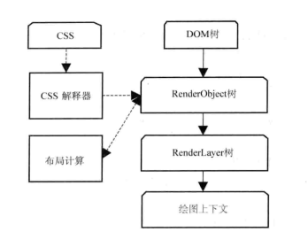
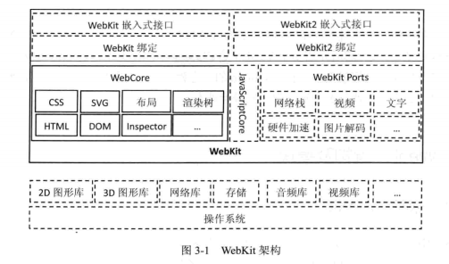
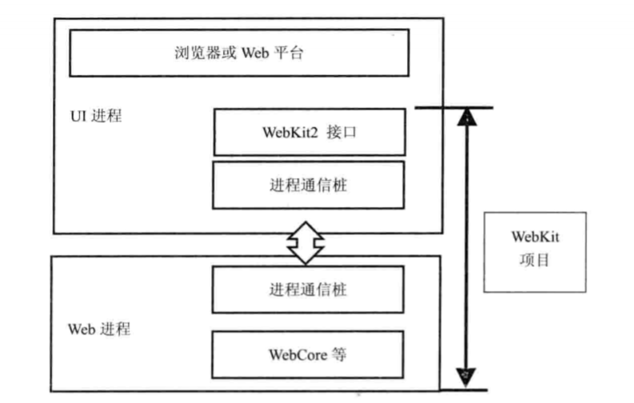
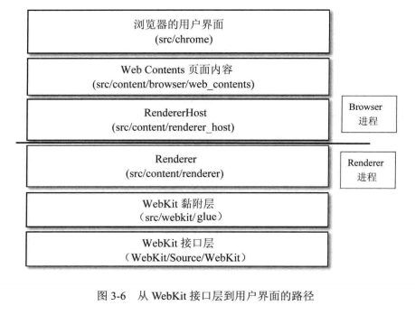
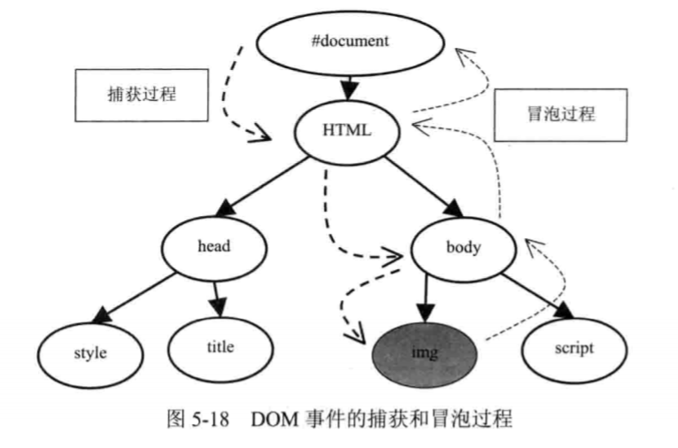
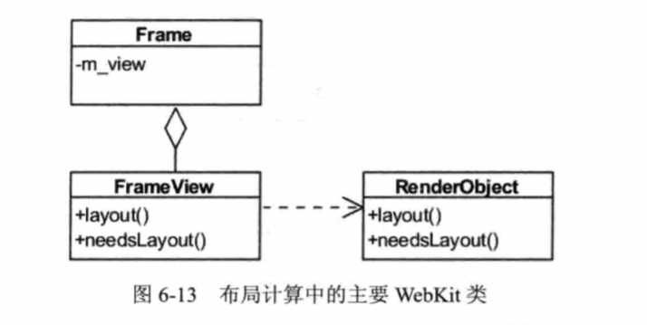

### 浏览器内核

内核主要分为三个层次，最上层为渲染引擎。

浏览器渲染引擎功能模块：

- HTML 解释器：解释 HTML 文本，将 HTML 文本解释成 DOM 树。
- CSS 解释器：级联样式表的解释器，为 DOM 中的各个元素对象计算出样式信息。
- 布局：DOM 创建之后，WebKit 需要将其中的元素对象同样式信息结合起来，计算它们的大小位置等布局信息，形成一个能够表示这所有信息的内部表示模型。
- JavaScript 引擎：JavaScript 引擎能够解释 JavaScript 代码并通过 DOM 接口和 CSSOM 接口来修改网页内容和样式信息，改变渲染结果。
- 绘图：使用图形库将布局计算后的各个网页的节点绘制成图像结果。

### 渲染引擎的一般渲染过程

webKit 的渲染过程大致可分成三大阶段（三阶段后面又细分具体过程）：

1. 从 URL 到构建完 DOM 树

   - 用户输入网页 URL 时，webKit 调用资源加载器加载对应资源
   - 加载器依赖网络模块建立连接，发送请求
   - 收到的网页被 HTML 解释器转变成 DOM 树
   - 如果遇到 JavaScript 代码，调用 js 引擎解释执行
   - DOM 树构建完触发 DOMContent 事件，DOM 树构建完成及网页依赖资源都加载完成后触发 onload 事件。

2. 从 DOM 树构建完 webKit 的绘图上下文

   

   - css 文件被解释成内部结构，附加在 DOM 树形成 renderObject 渲染树。
   - 渲染树创建，webKit 同时会构建 renderLayer 层次树和一个虚拟的绘图上下文。

3. 从绘图上下文到生成图像

   

   - 绘图实现类结合图像库将绘制的结果返回给浏览器

webKit 整体架构如下图：

而 webKit2 则是在 webKit 基础上一组支持新架构的接口层。该接口与网页渲染工作代码不在同一个进程，实现了 chromium 多进程的优点。webKit2 接口使用不需要接触背后的多进程机制。

如上图，网页渲染在 web 进程与 webKit2 所在的 UI 进程不是同一进程。

- #### chromium

​        chromium 浏览器使用的也是基于 webKit 的 Blink 引擎，它相当于 chrome 的创新版，一些新技术都会先在 chromium 上实验。在 chromium，webKit 只是它的一部分。其中 content 模块和接口是对 chromium 渲染网页功能的抽象，**它在 webKit 的上层渲染网页**，以便可以使用沙箱模型和跨进程 GPU 等机制。相当于封装内层，提供 content 接口层让人调用。

- #### 多进程模型

多进程模型的优势：

1. 避免单个页面的崩溃而影响浏览器的稳定性。
2. 避免第三方插件崩溃影响浏览器的稳定性。
3. 方便安全模型的实施。

上图是 chromium 的多进程模型，其中连线代表 IPC 进程间通信，chromium 浏览器主要进程类型有：

1. Browser 进程
   - 浏览器的主进程，负责页面的显示和各页面的管理，是所有其他类型线程的祖先，负责它们的创建与销毁，有且仅有一个。
2. Renderer 进程
   - 网页的渲染线程，可能有多个，不一定和网页数量相同
3. NPAPI 插件进程
   - 进程为创建 NPAPI 类型的插件创建，每种类型插件只会创建一次，插件进程共享
4. GPU 进程
   - 最多只有一个，GPU 硬件加速时才创建
5. Pepper 插件进程
   - 同 NPAP I插件进程 ，为创建 Pepper 类型的插件创建。
6. 其他类型进程
   - 分场景使用，例如 Linux 的 ”Zygote“ 进程，”Sandbox“ 准备进程。

**多进程模型下网页的渲染：**

1. Browser 进程收到请求，由 UI 线程处理，将对应任务转给 I/O 线程，再传递给 Render 进程
2. Render 进程的 IO 线程处理后交给渲染线程渲染，最后 render 进程将结果由IO 线程传递给 Browser 进程
3. Browser 进程收到结果并绘制出来。

**Renderer创建方式**

Chromium 允许用户配置 Renderer 进程的创建方式，有以下四种方式：

- Process-per-site-instance：每个页面都创建一个独立的渲染线程
- Process-per-site：同一个域的页面共享同一线程
- Process-per-tab（Chromium默认）：每个标签页都创建一个独立的渲染线程
- Single process：不为页面创建任何独立线程，渲染在Browser进程进行。**主要在Android WebView使用。**

下图为 WebKit 由内到外的交互：

- #### webKit2 与 chromium 的区别

  首先，两者都是多进程架构的模型，两者的根本目的都要实现 UI 和渲染的分离，区别在于设计理念：

1. Chromium 从浏览器角度出发，使用的仍是 webKit 接口，在 webKit 上构建多进程架构实现，成本低，对移动资源消耗大。
2. webKit2 定位为渲染引擎，尽量将多进程架构隐藏，只暴露相应接口，但实现代价高。

## 网页加载与渲染

### webKit 资源加载机制

1. **资源缓存**

   当 webKit 请求资源时，先从资源池查找是否存在相应的资源（通过URL，不同的 URL 被认为不同的资源。），如果有，直接取出使用，否则创建一个新的 CachedResource 子类的对象并真正发送请求给服务器，当 webKit 收到资源后将其设置到该资源类的对象中去，以便内存缓存后下次使用。

2. **资源加载器**

   webKit 共有三种类型的加载器：

   - 针对每种资源类型的特定加载器，仅加载某一种资源：例如 ImageLoader
   - 资源缓存机制的资源加载器，所有的特定加载器都可以共享它所查找出来的缓存资源 --CacheResourceLoader 类。
   - 通用的资源加载器 --resourceLoader 类，webKit 使用该类只负责获取资源的数据，属于 CachedResource 类，但不是继承CacheResourceLoader 类。

   

通常资源的加载是异步执行的，这样不会阻碍 WebKit 的渲染过程。webKit 能够并发下载资源以及下载 JavaScript 代码。

### DOM树

DOM 结构的基本要素就是“节点”，整个文档（Document）也是一个节点，称文档节点。除了文档节点还有元素节点，属性节点，注释节点等等。

Document 继承 Node，具有一些属性和方法。

###  HTML 解释器

HTML 解释器的工作就是讲网页资源由字节流解释成 DOM 树结构。

大体概括为：

1. 词法分析，解释器检查网页编码格式，通过 HTMLTokenizer 类将字节流转化为一个个词语。
2. XSSAuditor 验证词语，过滤不安全内容。
3. 词语到节点，调用 HTMLTreeBuilder 类来创建
4. 节点到 DOM 树，调用 HTMLConstructionSite 类来完成

### CSS

### 事件机制

​       事件在工作分为两主体，一是事件，二是事件目标。Node 节点继承EventTarget 类。下图接口用来注册和移除监听。

​		当渲染引擎收到事件，它会检查哪个元素是直接的事件目标，事件会经过自顶向下捕获和自底向上冒泡的两个过程。

### RenderObject树

在 DOM 树构建完成后，webKit 要为 DOM 树节点构建 RenderObject 树，一个 RenderObject 对应绘制 DOM 节点所需要的各种信息。那么问题来了，DOM树哪些节点需要创建 RenderObject 呢？大概有以下三类：

1. document 节点
2. 可视节点，如 body，div 。(ps: 不可视节点比如 head script 等)
3. 匿名的 RenderObject 不对应任何 DOM，例如 RenderBlock

### webKit布局

当 webKit 创建 RenderObject 对象后，根据框模型计算各对象的位置，大小等信息的过程称为布局计算。

Frame 类用于表示网页的框结构，每个框都有一个 frameView 类表示框的视图结构。其中 layout 和 needslayout 用来计算布局和是否需要重新布局。布局计算先递归子女节点的位置和大小，最后得出自己节点布局。当可视区域发生变化后，webKit 都需要重新计算布局。

### 渲染方式

网页渲染的方式主要有三种：

1. 软件渲染：CPU完成，处理2D方面的操作，适合简单网页

   RenderObject 图像的绘制又分为以下三阶段：

   - 绘制层中背景和边框
   - 绘制浮动内容
   - 绘制前景，即内容部分等

2. 硬件加速渲染：GPU完成，适合3D绘图，但消耗内存资源

3. 混合渲染：既有CPU也有GPU

CPU绘制使用缓存机制可以减少重绘开销，每个renderLayer对象对应图像的一个图层，浏览器把所有图层合成图像就叫做合成化渲染。

## JavaScript 引擎

**JavaScript与静态语言编译优化的区别：**

1. 编译确定位置：静态语言在编译阶段就确定的对象的属性和偏移信息，而 JavaScript 没有类型，只有在对象创建时才有信息，也就是执行阶段才确定。
2. 偏移信息共享：静态语言所有对象按类型确定，这些对象共享偏移信息，访问它们只需按照编译时确定的偏移量。而 JavaScript 每个对象都是自描述，属性和位置偏移都包含在自身的结构中。
3. 偏移信息查找：静态语言对使用到的成员变量直接设置偏移量，而 JavaScript 使用到一个对象需要通过属性名匹配才能找到对应的值。

### JIT（just in time）

JavaScript 为了提高运行速度加入了 JIT 技术，当解释器将源代码解释成内部表示时，JavaScript执行环境不仅解释这些内部表示而且将使用率较高的一些字节码转成本地代码（汇编）让CPU直接执行，而不是解释执行。这在Java虚拟机中也有应用。

### JavaScript引擎

JavaScript 引擎就是能够将JavaScript代码处理并执行的运行环境。

 

js引擎先将源代码转为抽象语法树，抽象语法树再转为中间表示（字节码表示），然后JIT转成本地代码运行。当然V8引擎可以直接从抽象语法树到本地代码，不经过中间表示，更加提高效率。

一个 JavaScript 引擎通常包括：

1. 编译器：将源代码编译成抽象语法树
2. 解释器：解释执行字节码
3. JIT工具：将字节码或抽象语法树转换为本地代码
4. 垃圾回收器：负责垃圾回收

###  js 引擎与渲染引擎

​		JavaScript 引擎需要能够访问渲染引擎构建的 DOM 树，这往往通过桥接的接口。通过桥接接口这对性能来说是很大的损失，所以应避免JavaScript 频繁地访问 DOM。

### V8引擎

​		V8 是谷歌的一个开源项目，是高性能 JavaScript 引擎的实现。它支持 window,linux,mac 等操作系统，也支持 X64，arm，IA32 等硬件架构。其中 node 就是基于 V8 的引擎。在 v8 中，数据表示分为数据实际内容和数据的句柄两部分，内容是变长的，类型也不一样，而句柄定长，包含指向数据的指针。

JavaScript 对象在 V8 的内部表示有三个成员：

1. 隐藏类指针：v8为JavaScript对象创建的隐藏类（用于对相同属性名和属性值的对象构建类型信息，划分相同的组，组内共享信息）
2. 属性表指针指向对象包含的属性值
3. 元素表指针指向对象包含的元素

**隐藏类的例子：**

### 内存管理

​		对于 V8 的内存划分，Zone 类先申请一块内存，然后管理和分配一些小内存。小内存被分配后，不能被 Zone 回收，只能一次性回收分配的所有小内存。这有个缺陷，如果 Zone 分配了大量内存，但又不能够释放就会导致内存不足。

​		V8 用堆来管理 JavaScript 数据，为了方便垃圾回收，v8 堆主要分成三部分：

- 年轻代：主要为新对象分配内存空间
- 年老代：较少地做垃圾回收
- 大对象：需要较多内存的大对象

对于垃圾回收，主要采用标记清除法（标记清除也分多种，如下所示）。

### V8为什么快？

1. **针对上下文的快照（Snapshot）技术**

   快照技术即将内置对象和函数加载之后的内存保存并序列化，缩短启动时间。打开snapshot=on即可开启快照机制（但快照代码没法被优化编译器优化）。上下文（Contexts）则是JS应用程序的运行环境，避免应用程序的修改相互影响，例如一个页面js修改内置对象方法，不应该影响到另外页面。chrome浏览器每个process只有一个V8引擎实例，浏览器中的每个窗口、iframe都对应一个上下文。

2. **Built-in代码**

   利用 JS 自表达内置对象、方法。

3. **AST的内存管理**

   针对 AST 建立过程中多结点内存申请和一次性回收的特点，V8 使用了内存段链表管理，并结合 scopelock 模式，实现少数申请（Segment，8KB~1MB）、多次分配 AST 结点、一次回收各个 Segment 的管理方式，既能避免内存碎片，又可以避免遍历 AST 结 点逐个回收内存。

4. **ComplieCache 避免重复编译**

   对于一段 JS 代码，在开始进行词法分析前，会从编译缓存区 CompilationCache 查找该段代码是否已经被编译过，如果是，则直接取出编译过的机器代码，并返回，这样降低 CPU 的使用率。

5. **属性快速访问**

   V8 没有使用词典结构或红黑树实现的 map 来管理属性，而是在每个对象附加一个指针，指向隐藏类 hidden class（如果第一次创建该类型对象，则新建 hidden class）；当对象每添加一个属性时，将新建一个 class（记录了每个属性的位移/位置），而原来的 class 指向新 class，即建立起一个 hidden class 的转换链表。

6. **一次性编译生成机器语言**

   V8 一次性把 AST 编译为机器语言，没有中间表示（通常先编译为字节码）。

## 如何在 Chromium 中处理渲染过程的安全性？请解释沙箱（Sandbox）机制

### **Chromium 中的沙箱机制**

**沙箱（Sandbox）**是一种安全机制，旨在限制进程的权限，从而保护系统免受恶意代码的攻击。在 Chromium 中，沙箱机制主要应用于渲染进程和插件进程，以确保即使某个网页包含恶意代码，也无法对操作系统或其他进程造成损害。

#### **具体实现**

1. **进程隔离**：Chromium 采用多进程架构，每个网页的渲染任务由独立的渲染进程完成，而渲染进程则运行在沙箱环境中。这个进程没有直接访问文件系统、设备、网络的权限。即便网页上的脚本试图执行恶意操作，沙箱会将它们限制在一个“受限空间”内，避免影响用户的系统。
2. **最小权限原则**：沙箱进程只拥有极其有限的权限，通常只能执行渲染 HTML、CSS、JavaScript 的操作。所有敏感的任务，如网络请求、文件系统访问等，必须通过浏览器进程来完成，这样可以确保渲染进程不能直接与系统交互。
3. **系统调用拦截**：在操作系统层面，Chromium 沙箱会拦截并过滤渲染进程发出的系统调用，只允许白名单中的调用通过，其他的调用请求会被拒绝。
4. **进程间通信（IPC）**：渲染进程无法直接访问系统资源，所以当渲染进程需要访问这些资源时，它会通过 IPC 向主进程发起请求，主进程会检查请求的合法性并决定是否授权访问。

#### **沙箱的优势**

- **安全性提升**：沙箱防止恶意代码对用户的系统进行未经授权的操作，即便是渲染进程中的代码被攻击，攻击者也无法突破沙箱的隔离。
- **稳定性提升**：渲染进程发生崩溃时，由于它们是独立运行的，不会影响主进程和其他渲染进程。用户可以选择只重新加载出问题的页面，而不需要关闭整个浏览器。

#### **例子**

比如，当你访问一个网页时，恶意网页可能包含试图修改本地文件的脚本。如果没有沙箱机制，渲染进程可以直接访问操作系统的文件系统，从而对文件造成损害。但有了沙箱，渲染进程无法直接访问文件系统，这些访问请求会被沙箱拦截，保护用户的文件安全。

### 总结

- **沙箱机制**主要用于保护系统免受恶意代码的攻击。
- **渲染进程**等子进程被限制在一个“沙箱”内，无法直接访问系统资源。
- 沙箱通过进程隔离和最小权限原则，极大地提高了浏览器的安全性和稳定性。

## 在浏览器中输入网址会发生什么？

当你在浏览器中输入一个网址并按下回车后，背后发生了很多复杂的操作。从**网络**和**浏览器内部结构**两个方面来解释这个过程，可以分解为以下步骤：

### 一、从**网络**角度来看

这是从客户端到服务器，再返回内容的整个网络流程。

1. **DNS 解析**：
   - **网址解析**：浏览器首先检查输入的 URL 是 IP 地址还是域名。如果是域名，浏览器需要通过 **DNS（Domain Name System）** 将域名解析为服务器的 IP 地址。这个过程可能会查找本地缓存、操作系统缓存、路由器缓存，最后如果还没找到则向 DNS 服务器发起查询。
   - 解析后，浏览器获得了该域名对应的 IP 地址。
2. **TCP 连接**：
   - **三次握手**：浏览器使用得到的 IP 地址，通过 **TCP（三次握手）** 与服务器建立连接。这个过程确保客户端和服务器都准备好了开始数据传输。
   - 在此期间，可能会发生 **SSL/TLS 握手**，尤其当 URL 是 `https://` 开头时。此时，浏览器和服务器会协商加密方式，并交换密钥，确保数据传输的安全性。
3. **HTTP 请求**：
   - **发送请求**：连接建立后，浏览器会发送 **HTTP 请求**，其中包含用户请求的资源路径（例如 `/index.html`），以及其他信息，如浏览器标识、支持的内容类型等。请求可以是 `GET`（获取数据）或 `POST`（提交数据）。
4. **服务器响应**：
   - **服务器处理请求**：服务器接收到请求后，处理请求并返回响应。响应可能包含 HTML 页面、CSS 样式表、JavaScript 脚本、图像等资源。响应的状态码如 `200 OK`（成功），`404 Not Found`（资源未找到），或 `500 Internal Server Error`（服务器内部错误）等，表示不同的处理结果。
5. **数据传输**：
   - **接收数据**：服务器将响应数据发送回浏览器。通过 TCP 的 **四次挥手**，数据的传输在客户端和服务器间可靠进行，直到传输结束。
6. **关闭连接**：
   - 当数据传输完成后，浏览器和服务器通过 **TCP 四次挥手** 来关闭连接。

### 二、从**浏览器内部结构**角度来看

浏览器接收到数据后，它的内部结构会执行多个步骤来呈现网页。

1. URL 解析与安全检查：
   - **安全检查**：浏览器首先会检查 URL 的合法性，并确保该请求是安全的（例如，检查浏览器的缓存或历史，阻止不安全的网站访问等）。
2. 处理资源请求：
   - **浏览器进程**：浏览器的主进程负责协调整个页面加载。它会将资源请求传递给网络进程，网络进程负责与服务器通信（如上文所述的 DNS、TCP 连接等）。
3. HTML 解析：
   - **生成 DOM 树**：浏览器从服务器接收到 HTML 文件后，渲染进程开始解析 HTML，将其转换为 **DOM 树**。每个 HTML 标签都会被解析为一个 DOM 节点，形成网页的结构化树形表示。
4. CSS 解析与 CSSOM 树生成：
   - **CSS 解析**：浏览器解析页面的 CSS 文件，生成 **CSSOM（CSS Object Model）树**，用于表示页面的样式规则。
5. JavaScript 解析与执行：
   - **V8 引擎（JavaScript 引擎）**：浏览器使用其内置的 JavaScript 引擎（如 Chromium 中的 V8）来解析并执行 JavaScript 代码。JavaScript 可以操作 DOM 树或发送新的网络请求来获取额外数据（如通过 AJAX 或 Fetch API）。
6. 合并 DOM 和 CSSOM 生成渲染树：
   - **生成渲染树**：浏览器将 DOM 树和 CSSOM 树结合，生成 **渲染树**。渲染树包含每个可见元素的位置信息、样式等，用于最终页面绘制。
7. 布局（Layout）计算：
   - **布局计算**：浏览器计算每个元素的大小和位置（例如，盒模型中的 `width`、`height`、`margin`、`padding`），并将其安排在页面上的具体位置。
8. 绘制（Painting）：
   - **绘制阶段**：浏览器根据渲染树计算的内容，开始将每个元素绘制到多个图层上（layer）。这个阶段包括绘制背景颜色、边框、文字等所有元素。
9. 合成与显示：
   - **层合成**：对于复杂的网页，浏览器会将页面分成多个图层进行渲染。浏览器使用 GPU 来加速这些图层的合成，并最终将它们组合成一个完整的页面，呈现给用户。
10. **处理交互**：

- 在页面加载完成后，浏览器继续响应用户的交互，如点击、滚动等，并通过 JavaScript 进行动态更新或处理用户输入。

### 综述：

1. **从网络的角度**：浏览器与服务器通过 **DNS 解析**、**TCP 连接**、**HTTP 请求/响应** 来完成数据的获取和传输。
2. **从浏览器内部结构的角度**：浏览器负责 **解析 HTML 和 CSS**，生成 **DOM 树** 和 **CSSOM 树**，计算 **布局** 和 **绘制** 页面，并使用 **JavaScript 引擎** 动态处理页面逻辑和用户交互。

这两个方向上的过程共同构成了从输入 URL 到网页呈现的一系列复杂操作。

