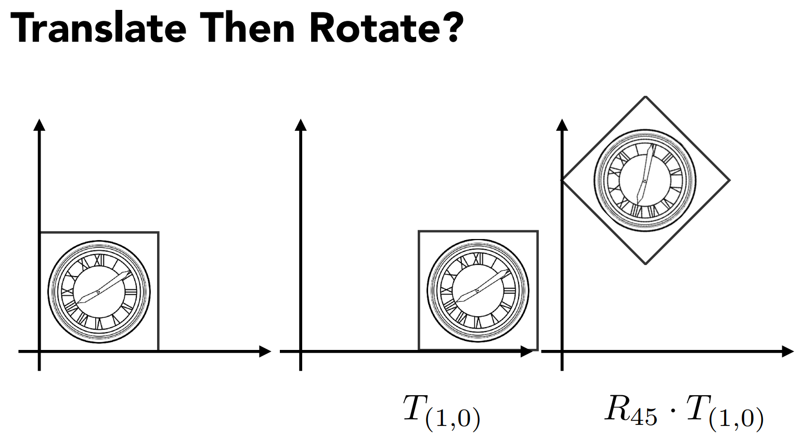
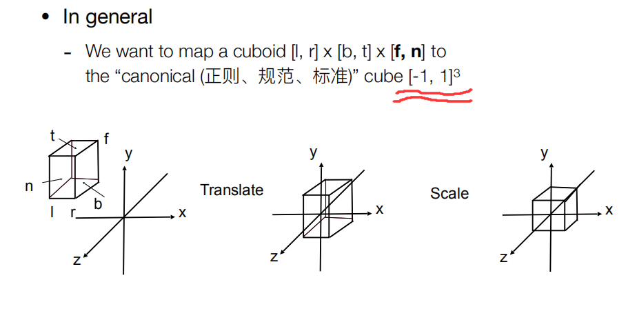

# 问题

典型的图形渲染管线分为多个阶段，每个阶段处理特定的任务，最终将 3D 场景渲染成 2D 图像。这一过程通常分为**三大阶段**：**应用阶段**、**几何阶段** 和 **光栅化阶段**。

### 1. **应用阶段（Application Stage）**

- CPU 处理阶段：在这一阶段，程序通常运行在 CPU 上，它负责处理所有高层逻辑，包括：

  - **模型、相机、光照等数据准备**：程序读取 3D 模型、纹理、材质等，并将数据发送给 GPU 进行渲染。
- **用户输入**：处理用户输入，更新相机位置、场景状态等。
  - **物理计算和动画**：在这一阶段，游戏引擎或渲染引擎可以进行物理模拟和动画计算，更新对象的位置、旋转等状态。

- **输出**：该阶段的输出是渲染命令、场景几何数据、材质、纹理等。接下来这些数据将通过 API（如 OpenGL、Vulkan、DirectX）发送到 GPU 进行处理。

### 2. **几何阶段（Geometry Stage）**

**几何阶段**在 GPU 上处理，主要负责将三维数据（顶点、法线、UV坐标等）转换为 2D 屏幕坐标，供后续的光栅化使用。

- **顶点着色器（Vertex Shader）**：
  - **作用**：处理每个顶点的属性（如位置、颜色、法线、UV 坐标等），并将它们转换为 3D 世界中的位置。通常也会进行矩阵变换（如模型矩阵、视图矩阵、投影矩阵的组合），将 3D 顶点从模型空间转换为裁剪空间。
  - **输出**：输出的顶点信息经过几何变换，并传递给后续阶段。
- **细分着色器（Tessellation Shader， 可选）**：
  - **作用**：将几何图元（如三角形、曲面等）进一步细分，以提高模型的细节。在这一阶段，可以根据需要细分原始图元，生成更多的顶点。
  - **适用场景**：常用于需要高细节的场景，如曲面细分、地形渲染等。
- **几何着色器（Geometry Shader， 可选）**：
  - **作用**：处理整个图元（如点、线、三角形等）。可以在这一阶段生成新的顶点或图元，也可以进行剔除操作，去除不需要渲染的图元。
  - **适用场景**：常用于粒子系统、体积渲染等效果的生成。
- **投影变换**：
  - **作用**：顶点着色器输出的顶点坐标通常位于 3D 世界空间或观察空间，通过投影矩阵将这些坐标转换到标准化设备坐标（NDC）中，即从 3D 空间映射到 2D 屏幕。
  - **输出**：转换后的顶点数据准备进入裁剪阶段。
- **视口变换和裁剪**：
  - **作用**：在这一阶段，所有不在视口范围内的顶点会被裁剪，避免不必要的渲染计算。视口变换会将裁剪后的顶点坐标映射到屏幕坐标空间中。

### 3. **光栅化阶段（Rasterization Stage）**

光栅化阶段负责将几何数据转换为**像素**或**片元**（Fragments），这些片元将用于最终生成屏幕上的图像。

- **光栅化（Rasterization）**：
  - **作用**：将 2D 顶点转换为片元。每个片元对应屏幕上的一个像素。这个过程根据图元的形状（如三角形）生成一组像素位置，称为“片元”。
  - **插值**：将顶点的属性（如颜色、纹理坐标、法线等）插值到片元上，使得片元拥有合适的属性值。
- **片元着色器（Fragment Shader）**：
  - **作用**：对每个片元进行着色计算，确定片元的颜色和其他属性。片元着色器通常会使用插值的顶点数据以及纹理、光照信息来计算最终颜色。
  - **光照计算**：片元着色器通常处理光照计算，包括漫反射、镜面反射、阴影等效果。
  - **纹理映射**：在片元着色器中，将纹理坐标映射到纹理图像上，以决定片元的颜色。
- **深度测试和模板测试（Depth and Stencil Testing）**：
  - **深度测试**：片元被着色后，GPU 会对其深度值进行测试，确定当前片元是否位于前景，如果不是，片元会被丢弃。
  - **模板测试**：模板缓冲可以控制某些区域的片元是否通过测试，以实现一些特殊的图形效果，如剪裁或蒙版效果。
- **Alpha混合（Blending）**：
  - **作用**：对于具有透明度的片元，进行颜色混合，将片元颜色与已经存在的背景颜色进行混合。通过 Alpha 混合，可以实现透明、半透明等效果。

### 4. **输出阶段**

- **颜色缓冲区写入**：片元处理完成后，最终的颜色被写入颜色缓冲区，准备输出到屏幕。
- **帧缓冲区（Frame Buffer）**：渲染的最终结果存储在帧缓冲区中，包含屏幕上的所有像素数据。
- **显示输出**：将帧缓冲区中的数据输出到屏幕上，生成最终的 2D 图像。

### 渲染管线总结

- **应用阶段**：CPU 执行应用逻辑、物理计算、动画等，将 3D 数据准备好传给 GPU。
- **几何阶段**：GPU 将 3D 顶点数据转换为 2D 图像数据，包括顶点着色、光照计算、投影、裁剪等。
- **光栅化阶段**：将几何数据转换为像素片元，对每个片元进行着色和光照处理，最终输出图像。

### 渲染管线简图：

```markdown
应用阶段
    ↓
几何阶段（顶点着色器 → 投影变换 → 裁剪）
    ↓
光栅化阶段（光栅化 → 片元着色器 → 深度测试 → 混合）
    ↓
帧缓冲区写入
    ↓
显示输出
```

这种渲染管线机制有效利用了 GPU 的并行计算能力，尤其在几何和光栅化阶段，大量的顶点和片元处理可以并行进行，从而提高渲染效率。


# 线代

## 矩阵变换

### 为什么需要Transformation

1. 描述摄像机的运动
2. 描述图像的缩放变化
3. 用于将3D视图投影到2D图像上

### 一、2D Transformation

Linear（线性） Transforms = Matrices
其中，线性变换包括以下4种：

#### 1.1 Scale（缩放）


#### 1.2 Reflection（反射）


#### 1.3. Shear（切变）


#### 1.4 Rotate（旋转）

默认都是按照远点逆时针旋转


#### 1.5 总结：线性变换=矩阵


## 二、Homogeneous coordinates（齐次坐标）

- 为什么要引入齐次坐标
  - 平移变换 ：它不是线性变换，不能写成 一个x’ = M x 的形式，


- 我们不希望把平移当做一种特殊的情况去考虑

- **引入齐次坐标：可以把线性变换和平移（二者合起来就是仿射变换），用同一种形式去表示。**

  

### 2.1 平移变换不是线性变换⟶⟶引入齐次坐标

#### 2.1.1 齐次坐标

- 可以把二维的点，增加一个维度，写成以下第一行形式
- 对于二维向量，写成以下第二行形式
- 对于二维的点，增加了一个“1”的维度，就有了一个非常好的性质
  - 在它前边乘以这样一个矩阵（图中红框圈出），得到的结果，**可以表示平移变换**。
  - 这样一来，我们的目的就达到了：用同一种形式表示线性变换和平移变换。


- 对于增加维度 “1” “0” 的解释
  - 为什么向量是 “0”
    - 首先回顾向量的概念：表示的是一个方向，也就是说，它有这样的性质：`平移不变性`。这就是为什么向量增加的维度是 “0” 的原因，这样一来，向量做任何平移变换操作时，就可以保证符合平移不变性。
  - 更深层次的理解
    - 增加维度的 “0” 和 “1” 是有意义的
    - 向量＋向量 = 向量   对应：0 + 0 = 0
    - 点 - 点 = 向量           对应：1 - 1 = 0
    - 点 + 向量 = 点          对应：1 + 0 = 1
    - 点 + 点 = ？？          本来一个点加一个点是没有意义的，但是人们扩充了它的定义：点+点表示的就是这两个点的中点。也就是2.1.2 中说的

#### 2.1.2 在齐次坐标下的2维点

对于任何w（w≠0），
$$
\left[
\begin{matrix}
    x\\\
    y\\\
    w
   \end{matrix}
\right]
$$
表示的就是二维点
$$
\left[\begin{matrix}    x/w\\\    y/w\\\    1   \end{matrix}\right]
$$
 

### 2.2 Affine Transformation（仿射变换）

`仿射变换=线性变换+平移`
顺序：先线性变换后平移（3D仿射同样）


### 2.3 齐次坐标下的2D Transformations


### 2.4 逆变换

逆变换就是乘以变换矩阵的逆矩阵


## 三、Composite Transformation（组合变换）

### 3.1 复杂的变换都是由简单的组合而来


### 3.2 变换的顺序很重要

矩阵的“左乘”
一般都是选旋转后平移



### 3.3 矩阵乘法无交换律

eg.一个不在原点的做旋转：先变换到原点→旋转→转换回原来位置


### 3.4 解耦复杂变换

注意矩阵的运算顺序是从右到左


## 四、3D Transformation

### 4.1 齐次坐标下的 3 维向量和点


### 4.2 齐次坐标下的 3D Affine Transformation


# 3D 视图模型

## 一、在旋转里面，矩阵的逆等价于矩阵的转置


结论：**在旋转里面，矩阵的逆=转置**。
数学上：**一个矩阵的逆=转置 →正交矩阵**


## 3D Translation

### 1.Scale缩放

### 2.Translation位移


### 3.Rotation

#### ①绕着坐标轴转


#### ②复杂的旋转→引入欧拉角


 下图源自维基百科的欧拉角示例图： 


注：由于存在旋转组合次序，所以当处于旋转次序中的中间轴一旦由于不当旋转使得它其他某个轴重合时，旋转就会出现扭曲，这种现象称为万向节死锁。而解锁时也会使得旋转插值十分扭曲。常见的解决方法是规定旋转次序、规定某个轴的旋转角度不能超过一定范围、使用四元数旋转。

#### ③罗德里格斯旋转公式

任意轴的旋转表示


 具体证明见如下链接：
https://blog.csdn.net/SKANK911/article/details/90056646 

注：

(a.)n是旋转轴，α是旋转角度

(b.)默认轴n过原点→不过原点就移到原点再变换，再移回去


## Viewing transformation（观测变换）

观测变换包括视图变换和投影变换


### 1.MVP变换（Model、View、Projection）

MVP的理解：

- Model transformation (placing objects)
  eg：找个好的地方，把所有人集合在一起，摆个pose！（把模型、场景搭好）
- View transformation (placing camera)
  eg：找一个好的角度/位置，把相机放好，往某一个角度去看。（改变的是相机）
- Projection transformation
  eg：茄子！

### 2.View translation（视图变换）

#### ①定义“Camera”


视图变化本质是通过定义一个摄像机来观察物体，所以该问题也可以转换成如何定义一个摄像机。通常一个摄像机由四个部分组成：

- 相机位置
- 相机朝向
- 相机上轴
- 相机右轴

但是我们一般只需要前三个分量，因为最后一个右轴就可以通过相机朝向和上轴叉乘得到。


我们通过相机空间观察物体，一般采用两种方式：

- 一种是相机动，物体不动；
- 另一种是物体动，相机不动。
  本课程采用的是第二种方式，并且将相机固定在`原点`，朝向`-z`轴，并使上轴与`y轴重合`。


#### ③视图变换矩阵实现


//右边的e/t/g 旋转到左边的xyz去

原始的旋转不好求→先求逆变换（好求）→旋转矩阵的逆（正交矩阵情况下=矩阵的转置）

#### ④总结

-对象会和相机一起变换（保证相对运动）

-模型变换和视图变换经常被一起叫作模型视图变换（Also know as ModelView Translation）


## 2.Projection Translation（投影变换）

​		投影所做的事是把3D空间物体投影到二维空间，同时通过一个范围约束所有坐标必须处于这段范围内，落到范围外的坐标应该被舍弃掉。

​		通常这里需要一个投影矩阵，它描述了一个范围的坐标，比如（-100,100）。投影矩阵接着会将在这个指定的范围内的坐标变换为标准设备坐标的范围(-1.0, 1.0)。

​		通常采用的投影方式有两种，一种是正交投影，另一种是透视投影。


### （1）正交投影

​		正交投影假设视点无限远，所以构成的范围是一个长方体。它常常需要我们提供长方体的高，宽，近平面距离以及远平面距离。如下图所示：


如何通过一个长方体[l,r]×[b,t]×[**f**,**n**]进行正交投影呢？通常有如下步骤：

1. 固定相机在原点，使其朝向-z，上轴和y重合；
2. 丢弃z轴；
3. 把正方体规范化到 [−1,1]3[−1,1]3 ，即先平移，后放缩



先移动到原点，再缩放


//注：

因为是右手坐标系，所以n>f

OpenGL是左手坐标系。


###  （2）透视投影 

​		透视投影更像一个近小远大的截体来规定坐标的范围，它更符合人眼成像，即产生近大远小效果，在图形学中也更常见，使用得更多。它通常需要我们提供:

- 截体的 FOV 角度
- 宽高比
- 近平面距离
- 远平面距离，如下图所示：


####   （a.）先回顾一下齐次坐标下的一个概念 


eg：两个表示的都是同一个点（1,0,0）

####  （b.）怎么做透视投影 

- 感性认识：
  - 先“挤”成长方体（①-⑥）
  - 再做一次正交投影（已知）


其中规定：       

- 近平面上和远平面上Z不变；
- 远平面中心那个点也不变；

**重点：如何挤**

① 找到挤前和挤后的关系：


② 在齐次坐标下


③ 到此已经能推出矩阵除了第三行以外的内容

一个矩阵M  乘以    $\bigl(    \begin{smallmatrix}	x\\y\\z\\1 \end{smallmatrix} \bigr)$ = $\bigl(    \begin{smallmatrix}	nx\\ny\\unknown\\z \end{smallmatrix} \bigr)$


根据矩阵乘法可以推出1、2、4行分别是什么


④ 接下来解决第三行的问题      →    近平面和远平面的z都不变、远平面中心点不变 


⑤ 近平面和远平面的 z 都不变：


假设 z 为 n，

那么，矩阵M的第三行  ×    $\bigl(    \begin{smallmatrix}	x\\y\\n\\1 \end{smallmatrix} \bigr)$ =   $n^2$ ⟹  和x，y无关  ⟹ 第三行的前两个数为0

→可知矩阵 M 第三行为（0，0，A，B）→ An + B = $n^2$

A，B未知


⑥ 远平面中心点（0，0，f）不变：

​	即 $\bigl(    \begin{smallmatrix}	0\\0\\f\\1 \end{smallmatrix} \bigr)$ 映射还是 $\bigl(    \begin{smallmatrix}	0\\0\\f\\1 \end{smallmatrix} \bigr)$ == $\bigl(    \begin{smallmatrix}	0\\0\\f^2\\f \end{smallmatrix} \bigr)$ 

​	同⑤一样，看矩阵M第三行 × $\bigl(    \begin{smallmatrix}	0\\0\\f\\1 \end{smallmatrix} \bigr)$=$f^2$   → Af+B=$f^2$

​	结合⑤和⑥的两个结论：

​	An+B = $n^2$

​	Af+B = $f^2$


​	两个式子，两个未知数，就可以解出A，B   →   解出矩阵M的第三行    →    解出矩阵M

  

 （c.）总结： 


# 光栅化

## 1.1 视锥定义（Define a fov）

只需要定义：`垂直的可视视角` 和 `宽高比` （其他的正交变换之类都可推导出）


fovY 表示视野角度，同时已知近平面深度为 n，远平面深度为 f，宽高比为 aspect，所以可以通过相似三角形和角度关系求得：

$tan⁡(fovY/2) = t/ |n|$

$aspect = r/t → r = aspect⋅t$

即构建透视矩阵需要视野角度 fov，宽高比，znear, zfar 四个参数。

## 1.2 视口变换

在`M（model）`,`V（view）`,`P（projection）`变换之后，我们已经得到了三维坐标在二维屏幕上的投影，同时也得到了`投影区域(Canonical Cube)`。之后所需要的就是`视口变换`。视口变换是把三维坐标与屏幕上指定的区域进行映射，简单来说就是我们在屏幕上规定了一块区域，然后将我们投影的坐标规定好，只能画在这块区域中，这就是视口变换所做的事情。


## 2.“MVP”后 做什么？

<u>MVP得到 $cube[-1，1]^3$ →   画在Screen（屏幕）</u>

### ①定义“Screen”：

- 一个二维数组
- 数组中的每个元素就是像素（分辨率就是像素的多少）
- 是一个典型的光栅成像设备

### ②Raster（光栅）就是德语中的Screen

动词化 Rasterize = drawing onto screen

### ③Pixel（像素）（PIcture element的缩写）


### ④定义“Screen Space”（屏幕空间）

认为屏幕左下角是原点，向右是 x，向上是 y

一些规定：

- Pixel's indices（像素坐标）是（x，y）的形式；x，y都是整数（integers）
- 所有的像素的表示（0，0）to（width-1，height-1）
- 像素的中心：（x+0.5，y+0.5）
- 整个屏幕覆盖（0，0）to（width，height）

### ⑤干正事：把得到的cube转换到屏幕上，即$[-1, 1]^3$  →屏幕

- 先不管z轴 →$[-1, 1]^2$ to [0, width] x [0, height]
- 方法：乘以矩阵：


 

## 2.回到正题，如何画在屏幕上。 

### 1 Rasterization 光栅化—Draw to Raster Displays

三角形：

 ①为什么是三角形： 

- 是最基础的图形，边最少
- 其他的多边形可以拆成三角形

 ②三角形的一些性质： 

-  三角形内一定是平面

-  内外的定义很明确

-  定义三个顶点后，三角形内可以插值

### 2 光栅化的关键

 如何判断一个像素和三角形的位置关系（像素中心点与三角形的位置关系）

### 3 判断方法

①采样

-  感性理解：给你一个连续函数，在不同的地方去问，它的值是多少

-  采样就是把函数离散化的过程

-  采样是图形学很重要的一个概念，此处是指利用像素中心对屏幕进行采样

 ②回到我们要做的：判断像素中心是否在三角形内： 

- 定义一个inside函数


●采样：


●具体的实现：叉积→全负/正即为三角形内


●一个特殊情况：点在边上怎么办 

- 不做处理（本课程） 
- 特殊处理（OPenGL和DX）

● Checking All Pixels on the Screen? 


 3.Rasterization on Real Displays 


 4.锯齿 


# 抗锯齿

​		上一节提到了光栅化三角形，而在实际中，屏幕会由于分辨率和采样频率的一些问题，导致三角形在光栅化过程中出现走样（当然，线条也会出现走样）。这是由于三角形的边或者线段在观测中是无限细的，**<u>可以看做是带宽无限的信号，而对这些图元进行像素化的过程中，采样频率不足，导致采样过程中丢失高频成分，所以产生的信号失真，在屏幕上就表现为锯齿状的图像，这种现象就称为`走样`，</u>**如下图：


​		所以我们就需要反走样来减少或消除这种效果。基本上反走样方法可分为两类。

- 第一类是<u>通过提高分辨率即增加采样点(提高采样频率)</u>，比如先在较高分辨率上对光栅进行计算，然后采用某种下采样算法得到较低分辨率的象素的属性，并显示在分辨率较低的显示器上，这类方法有SSAA；
- 另一类反走样是<u>把像素作为一个有限区域，对区域采样来调整像素的颜色或亮度，这种方法类似于图像中的前置滤波（blur等）</u>，这类方法有MSAA。

### 1.1 采样的artifacts

1. 锯齿
2. 摩尔纹
3. 车轮效应
4. 采样伪影(Artifacts)： 由于采样频率不足而产生的一些走样现象。


### 1.2 走样的原因

信号太快，采样太慢

### 1.3 反走样的一个想法：在采样前做一个模糊


注意：模糊和采样的顺序不能换，否则是错的 如下图↓


# 二、频域基本概念

### 2.1 sin/cos举例


### 2.2 傅里叶变换

关于傅里叶变换的资料：https://zhuanlan.zhihu.com/p/19763358

# 三、卷积与滤波基本概念

​		<u>假设我们以一定的频率对下面的函数进行采样，会发现当函数自身频率越高时，由于采样频率不够，恢复的函数与原来的函数也差异过大</u>。

​		高的频率需要快的采样，采样跟不上频率就会发生走样，一样的采样下无法区别出不同的频率的曲线


​		而滤波恰恰就是能够过滤掉图像（函数）中的某些频率部分。如高通滤波，低通滤波。卷积其实也是滤波的一种形式，它是对信号周围进行加权平均的一种运算。而卷积定理在频域与时域上也十分重要，即：
在函数在时域上的卷积等于其在频域上的积，反之亦然，如下图：


### 3.1 不同滤波的效果

高通滤波：边界
低通滤波：模糊


从图形学的角度考虑：滤波（Filtering）=卷积（Convolution）=平均（Averaging）


### 3.2 卷积操作

#### 3.2.1 卷积操作的定义

①原始信号的任意一个位置，取其周围的平均
②作用在一个信号上，用一种滤波操作，得到一个结果Result
eg：见下图↓


#### 3.2.2 卷积定理

**时域上的卷积就是频域上的乘积, 时域上的乘积就是频域上的卷积。**

做一个卷积的两种操作
Operation1：图和滤波器直接在时域上做卷积操作
Operation2：先把图傅里叶变换，变换到频域上，把滤波器变到频域上，两者相乘；乘完之后再逆傅里叶变换到时域上

eg：


#### 3.2.3 Box Filter（卷积盒）-低通滤波器

时域上变大 → 频域上变小


# 四、采样Sampling

### 4.1 从频率的角度定义，<u>采样就是重复频率上的内容</u>


### 4.2 走样的原因

采样不够快→中间间隔小→信号混在了一起


# 五、反走样（Antialiasing）处理方法

Option1： Increase sampling rate提升采样率
并不是反走样，不是我们这个课程需要的

Option 2: Antialiasing


先做一个模糊再采样。模糊-低通滤波（结合前边有说）


# 六、实际的反走样

### 6.1 反走样理想操作

任何一个点/块都做一个平均最简单的点→pixel像素


### 6.2 MSAA(Supersampling)

超采样就是通过对一个像素内的多个位置进行采样并取其平均值来近似1-pixel 滤波器(卷积,blur)的效果


对于 4 X MSAA来说，其步骤如下：
①假设每个像素中对四个点进行采样
②判断对于一个像素有多少个点在三角形内，然后根据比例对颜色进行"模糊"


结果如下：


MSAA 的问题：

1. 增加了计算开销

### 6.3 更多其他采样方法

1. FXAA
   一种后期图像处理，和采样无关
2. TAA
   复用上一帧感知到的结果
3. Super resolution / super sampling（超分辨率）
   DLSS深度学习。


# 七、可见性/遮挡

​		当在屏幕上画好了三角形后，我们要确定物体与物体之间的遮挡关系，而这种方法通常使用的是`Z-buffering（深度缓冲）`

### 7.1 画家算法（油画）

​		画家算法是一种比较简单的计算遮挡的算法。它把需要画的物体按深度大小的顺序进行排序，然后按由远到近的顺序依次画物体。在出现遮挡时，只需要把遮挡物体直接画在遮挡处即可，所以它会不断的覆盖之前绘制的物体。

即：先画远处，再画近处，遮挡住远处


​		但是这种算法会出现无法解决的深度顺序问题，因为它是按照绘制的多边形的深度进行排序，如下图：


### 1.2 Z-Buffer深度缓冲

​		Z-buffering相较画家算法而言更加适用，因为它是按像素的深度大小进行排序。

它的主要思想如下：
		为每一个像素存储当前的最小深度值（这里课程指的是深度越小，离视点越近，如果z轴的远近定义不一样，则会存储最大深度值），当扫描到新的像素，如果它的深度更小，则用它对应或插值的颜色值来替代当前需要显示的颜色值。

思路如下：

1. 记录当前像素的最浅深度
2. 需要一个额外的 buffer 来放深度值
   - Frame buffer stores color values
   - depth buffer（z buffer）stores depth

注意：

1. 这里为了简化概念，这里针对深度这个概念z轴是正的（近处z小，远处z大）
2. 对于深度的理解：离摄像机越近深度越小，越远深度越大
3. 越近越黑，越远越白（参考美术的颜色值：0-1对应黑到白）


流程图如下：


例子：

重点：小的（近的）遮住大的（远的）
具体操作：

- 小的→更新
- 大的→不变
- 一样→待定（z-fight：深度冲突，从别的地方再去了解）

### 1.3 Z-Buffer复杂度分析

1. 为什么不是O（nlog）（排序的最小复杂度）而是O（n）
   因为不是排序算法，只是对每个像素求最小值
2. Z-Buffer算法和顺序无关（不考虑深度相同的情况）


# Shading（着色）

shading 的字面意思就是通过对物体进行上色
对于本门课程来说：shading 的定义是对物体应用材质的过程。
而材质可以理解成物体自身对光线的各种反应情况，它反应了物体本身的物理属性。


# Blinn-Phong Reflectance Model（Blinn-Phong 光照模型）

感性认识：一个物体上可以分为三部分：高光、漫反射、环境光照


一些基本概念

1. 观测方向 v，法线 n，光照方向 l
   
2. Shading 是一个 local 概念， 即只考虑这个点的着色情况，不考虑其他的。（例如：点在阴影里）

### 3.1 `Diffuse Reflection漫反射`概念

#### 3.1.1 什么是漫反射

​		光会被均匀的反射到不同的方向，是模拟光源对物体的方向性影响，所以它是独立于视线的，图中方程也没有和视线相关的参数。$I/r^2$ 表示光的衰减情况，max⁡(0,n⋅l)max(0,**n**⋅**l**)计算的是0和 法向量与光照向量的较大值， 因为当光照向量与法向量夹角大于 90° 时，其结果会为负，没有意义，而 $k_d$ 可以看做是漫反射系数，当像素有颜色时，它是像素的颜色值，当像素有纹理时，它可以是像素的纹理值（实际上还是纹理的颜色值）

#### 3.1.2 Lambert余弦定律

- 结论一：n 和 l 的夹角决定了明暗(即物体接收到的光照能量和 n、l 夹角的余弦成正比）
  
- 结论二：光的衰减关系
  

公式表示

说明：

- max 的意义：cos 为负时无意义
- 漫反射系数 $k_d$ 引申一下颜色是怎么来的：接收的光分为：吸收的 和 反射的→产生颜色（1 为全反射=白； 0为全吸收=黑）表示为一个vector→RGB三通道→定义一个颜色
- 整体公式可知和v无关→和观察方向无关
- 只是一个经验模型，与实际物理有差异


### 3.2 Specular Term高光项

​		高光用来模拟有光泽物体上面出现的亮点，它是依赖于观察方向的，当**视线与光照向量的半程向量与法向量夹角越大时，高光影响越小，当夹角越小时，影响越大**。可以这样想象，我们需要看的是一块镜面的反射，当我们的视线与光照向量恰好对称时，高光越强。$k_d$为高光系数，h 为半程向量，这里用半程向量的好处主要是用于解决视线与光照向量在同一侧，从而引起的`光断层现象`。


#### 3.2.1 半程向量


c. 说明

- $k_s$为什么是白色→因为是经验性模型，是简化之后的
- 为什么n⃗*n* h⃗*h*不用反射方向：因为好算（用反射方向的话就是：phong模型）
- “p 次方的作用”：控制高光多大
  


### 3.3 Ambient Term环境光照

​		用来模拟即使在黑暗的情况下，世界上通常也仍然有一些光亮（月亮、远处的光），所以物体几乎永远不会是完全黑暗的这种情况。


说明：

- 环境光和l n v 都没关系 →就是一个常数→一个颜色
- 是近似/假设的

### 3.4 总体概括Blinn-Phong模型


## 四、光照规则补充

计算光照的一些简单规则：

1. `物体颜色`：我们在现实生活中看到某一物体的颜色并不是这个物体真正拥有的颜色，而是它所反射的颜色。如果想知道物体的颜色，只需要用它的颜色和光的颜色进行逐元素乘即可。

比如下面的例子，光照颜色是绿色，通过用物体颜色和光照颜色进行逐元素乘，发现最后物体吸收了一半的绿色，并且以另一半为结果反射给人眼，所以我们看到的结果应该是暗绿色的物体

```javascript
vec3 lightColor(0.0f, 1.0f, 0.0f);
vec3 objectColor(1.0f, 0.5f, 0.31f);
vec3 lightResult = lightColor * objectColor; // = (0.0f, 0.5f, 0.0f);
```

1. `利用点乘计算光照影响`：漫反射表示光会朝不同的方向进行反射，为了计算光对物体表面的影响，我们只需要光和物体表面法向量进行点乘即可，想想看一束光如果直接垂直打在物体上，其影响是最大的
   
2. `光的衰减`：光照强度会随着距离衰减，注意衰减范围是以光源为中心的圆展开的


# Shading Frequencies着色频率（指着色应用在哪些点上）

​		引起着色的不同主要就是因为着色频率不同所导致的，如下图：
​		从左到右依次应用为 面 → 顶点 →像素


​		这里主要分成对三角形进行着色，对顶点进行着色，对像素进行着色三种着色方案进行讨论

### 1.1 Flat shading（应用在表面，对三角形进行着色）

​		对每个三角形着色也称为`Flat shading` ，它是指每项属性例如纹理，法向，颜色，都是属于一个三角形的，所以三角形内部不会有插值变化。所以，三角形内部只会根据面法向量对光线反射进行计算，所有的三角形反射都看做一个平面，给人以一种块状的效果（三角形较少时），如下图：

​		简言之：两边做叉积→三角形的法线


### 1.2 Gouraud shading（逐顶点）

​		对顶点进行着色也称为`gouraud shading`，它发生在`顶点着色器阶段`。对于每个多边形的顶点都存在一个法向量，但是他的着色是**先通过这些法向量对顶点计算出光照颜色，然后用光照颜色来进行三角形内部插值**，如下图：

​		简言之：算出顶点法线，然后插值


#### 定义逐顶点法线求法

​		认为顶点的法线为相邻面的法线的平均（更优办法是根据面积加权平均）


### 1.3 Phong shading（逐像素）

​		对每个像素着色也称`phong shading`，它发生在`片段着色器阶段`。它是通过对多边形**每个顶点的法向量进行插值，然后我们通过插值得到的法向量(每个像素都有自己的法向量),再去计算光照颜色**，如下图：


​		注意：`Phong shading` 是一种**着色频率**，和`布林冯着色模型`不是一个概念。

​		使用不同的着色方案会得到不同的结果，但是也不能说某种方案就一定差于另一种方案，当顶点数足够多时，对三角形进行着色不一定会比对像素进行着色效果差，对应的内存开销也不一定比对像素进行着色小。


通过求重心坐标获取逐像素法线（后边讲）


说明：
		由于片段着色器阶段计算的坐标都是处于世界坐标系中，所以在计算光照时，所用的法向量也要转换到世界坐标系下。还记得之前我们把坐标转换到世界坐标是乘以 model 矩阵，但是法向量是不可以直接乘以 model 矩阵的，因为它仅仅是一个向量，而且也不是齐次坐标表示，所以这里需要一个法线矩阵（它是model矩阵逆的转置）来进行转换，使法向量也处于世界坐标下，详细推导可以看这里：链接: http://www.lighthouse3d.com/tutorials/glsl-12-tutorial/the-normal-matrix


# 渲染管线 Graphics (Real-time Rendering)Pipeline

### 2.1 渲染管线流程

​		通过图形渲染管线都是流水线形式，上一阶段的输出作为下一阶段的输入，该课程的一个图形渲染管线（也是前向渲染管线）流程如下：


​		总体来说：顶点 →光栅化 →着色
​		用mvp举例：
MVP（Model, View, Projection transforms）→采样 →z-buffer test →shading →Texture mapping


具体来说：

1. 首先我们有一系列三维点坐标，可能是从某些文件读入。然后我们把它们输入给Vertex Processing阶段（顶点着色器），该阶段主要进行的操作是`model`，`view`，`projection`变换，将三维坐标变换到二维裁剪空间（通过投影丢掉了不可见的区域），也可以进行`gouraud shading`等操作。
   
2. 随后把顶点着色器的输出，作为输入给`Triangle Processing`阶段，这里主要是进行一些图元的绘制，包括把点连接成三角形，或者制作一些顶点的副本等
3. 下一个阶段是`Rasterization`阶段（光栅化），该阶段将三维图元作为输入，通过采样将其绘制在二维屏幕上，并以`片段`的形式作为输出。

片段、像素 关系说明：

- `片段(Fragment)`:三维顶点光栅化后的数据集合，还没有经过深度测试
- `像素`:片段经过深度测试、模板测试、alpha混合之后的结果
- 片段的个数远远多于像素，因为有的片段会在测试和混合阶段被丢弃，无法被渲染成像素


1. `Fragment Processing` 把片段作为输入。该阶段主要进行`深度测试`，`计算光照`以及`纹理映射`等，所以该阶段输出的结果基本上已经确定了像素最终的颜色。
   


### 2.2 管线渲染编程

​		通常可以在`Vertex Processing`阶段（顶点着色器） 和 `Fragment Processing`阶段（片段着色器） 进行编程，这些编程的小程序被称为Shader Programs，里面常用的语言有glsl等。

​		shader 编写学习资料: https://www.shadertoy.com/.

#### 2.2.1 Shader programs概念说明

1. 能在硬件上执行的语言
2. 每个顶点/像素执行一次（通用的，不用for循环）
   - 顶点的操作→顶点着色器 vertex shader
   - 像素的操作→像素/片元着色器 fragment shader

​        一个 GLSL 中的例子：下面的示例程序简单描述了一个着色器的工作，`uniform` 表示从 cpu 传来的变量，`varying`  表示从上一个阶段传来的变量，`void diffuseShader()`  为着色函数， `texture2d` 是内置函数，它表示将纹理 myTexture 对应到 uv 向量，`gl_FragColor`  可以看做是内置参数，它是屏幕上用来显示的最终颜色。

```javascript
uniform sampler2D myTexture; // program parameter 
uniform vec3 lightDir;   // program parameter 
varying vec2 uv;    // per fragment value (interp. by rasterizer)
varying vec3 norm;   // per fragment value (interp. by rasterizer) 
void diffuseShader() 
{   
	vec3 kd;   
	kd = texture2d(myTexture, uv);    // material color from texture  
	kd *= clamp(dot(–lightDir, norm), 0.0, 1.0);  // Lambertian shading model   
	gl_FragColor = vec4(kd, 1.0);    // output fragment color 
}
```

#### 2.2.2 Snail Shader Program 在线Shader编写网站

https://www.shadertoy.com/view/ld3Gz2

3.GPU
①gpu：-独显；-核显
②gpu可以理解成高度并行化的处理器
（核心数量理解为并行线程的数量）
gpu 并行度惊人，远超过cpu

## 三、Texture Mapping纹理映射

​		`纹理映射`就是将纹理空间中的纹理像素映射到屏幕空间中的像素的过程。通俗来说可以认为是一张二维纹理把一个三维物体“包裹”了起来，因此三维物体获得了一些表面纹理：


### 纹理坐标系

​		纹理也是有坐标的，它的坐标空间是由 uv 构成(通常 [0, 1] )，里面对应的元素是`纹素`，是计算机图形纹理空间中的基本单元，如下图：


​		`纹素`和`像素`不一样，因为它们是处于不同坐标下的，纹素处于纹理空间，而像素处于屏幕空间。在对三维表面铺设纹理的时候，通过纹理映射技术将纹素映射到恰当的输出图像像素上，这种映射不是简单的一一对应，因为会受到视角的影响，如果以一种斜的姿势观察物体，一个像素对应的纹理区域很可能是比较扭曲的，可以看下图：


纹理和着色的区别与联系
纹理用来定义着色的时候需要的不同点的属性（不希望每一个点相同着色，用纹理来改变）


