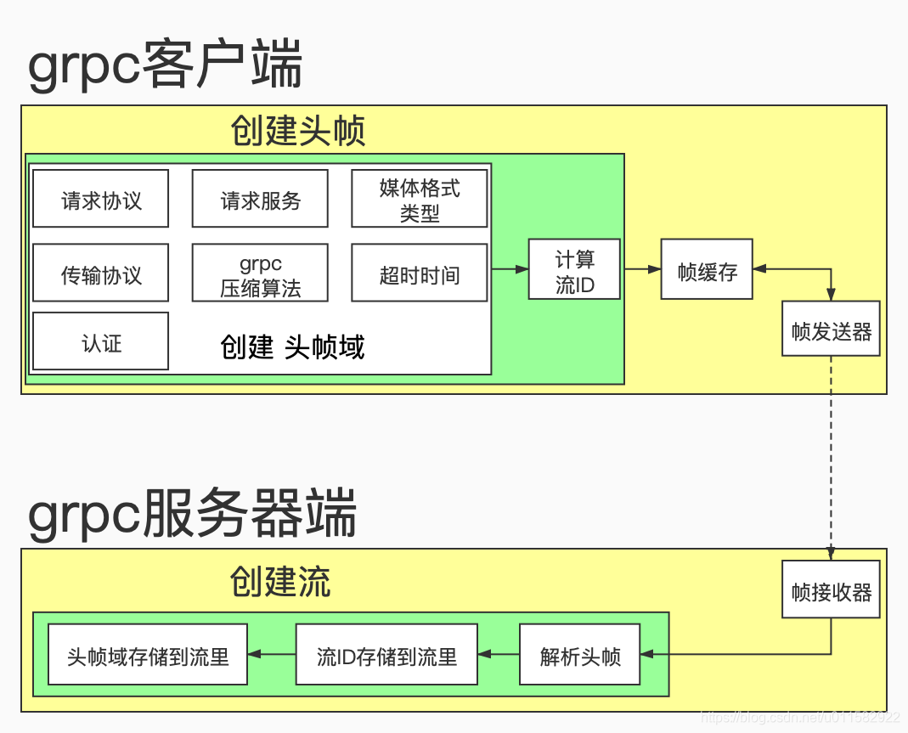
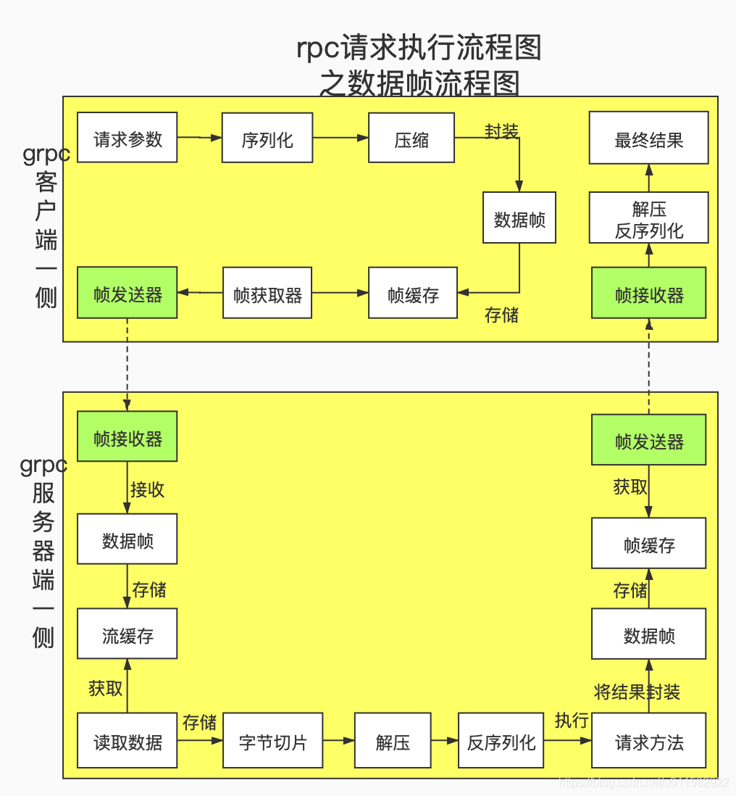
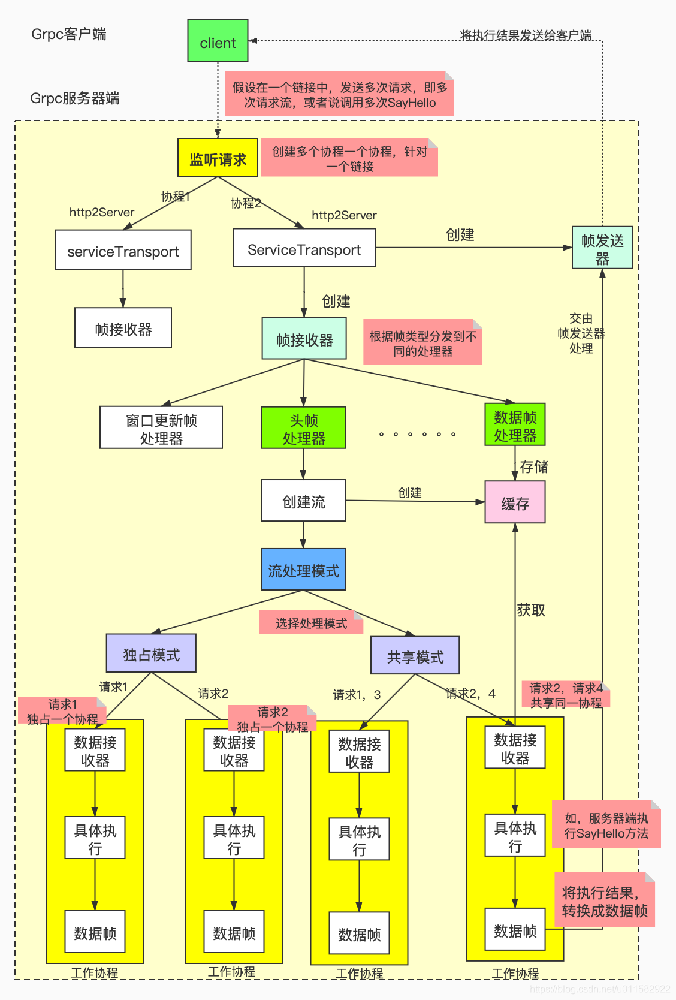

# 整体流程

在grpc-go框架中grpc客户端跟grpc服务器端整个交互主要经历以下阶段：

1、rpc 链接建立阶段

- 建立 tcp 链接阶段
  - 用户设置链接参数，如拦截器设置，链接地址设置等
  - 解析器根据链接地址来获取后端对应的grpc服务器地址列表
  - 平衡器根据 grpc 服务器地址列表来建立 tcp 链接

- 帧交互阶段
  - grpc服务器端需要自己能够发送的帧大小、窗口大小等信息发送给客户端，
  - 客户端接收到这些信息后，会更新本地的帧大小，窗口大小等信息
  - PRI校验

2、rpc请求阶段

- 客户端将请求服务的名称，方法名称、超时时间等信息封装到头帧里，发送给服务器端；
- 这样服务器端接收到头帧后，就可以解析出客户端请求的方法名称了，如Greeter服务下的SayHello方法名称了
- 客户端需要将SayHello方法的具体参数值，进行序列化，压缩后，封装成数据帧发送服务器端
- 服务器端接收到数据帧后，进行解压，反序列化操作后，就得到了请求方法的具体参数值了，如&pb.HelloRequest{Name: name}
- 服务器端此时已经知道了客户端请求的方法名称，以及该方法名称的具体参数值了，
- 服务器端开始具体执行方法，如真正执行SayHello方法了；执行完成后，
- 服务器端创建头帧，将执行的状态信息发送给客户端，如grpc-status, 状态码200
- 客户端开始接收服务器端的发送的头帧
- 服务器端将执行结果，进行序列化、压缩后，封装成数据帧，发送给客户端
- 客户端接收到服务器端反馈的数据帧后，进行解压，反序列化后，，就可以得到SayHello方法的具体执行结果了。

简单总结一下，rpc 链接，其实就是干了**四件事**:

- 第一，确定 grpc 服务器端的地址列表，有哪些；
- 第二，如何向 grpc 服务器端发起链接，是链接一个 grpc 服务器端，还是全部连接，还是选择负载低的 grpc服务器进行链接，
- 第三，调用 golang 原生的 net 包，进行 tcp 链接；
- 第四，进行 http2 帧的交互过程，如接下来传输的帧的大小是多少，窗口大小是多少等

### rpc 请求，干了哪些事呢？

- 第一，通过头帧，将客户端请求方法的服务名称，方法名称等信息传输给服务器端；如服务名称为helloworld.Greeter，方法名称为 SayHello
- 第二，通过数据帧，客户端将请求方法的参数值发送给服务器端，
- 第三，到目前为止，服务器端就知道客户端要执行的哪个服务下的哪个方法了，并且也知道该方法的具体参数值了；就可以具体执行了
- 第四，服务器端，将具体的执行结果，封装成数据帧，再反馈客户端，这样客户端就获得了最终的执行结果，也就是实现了在本地调用了远程服务中的某个方法，或者说不同内存空间的方法调用

在这里我们只需要简单了解一下grpc客户端跟grpc服务器端交互的整体流程即可。

# Server 启动

可以自己先思考一下，假设让我们自己去开发一个简单版本的grpc服务器端启动时都会做什么事情呢?

- 一些初始化工作
- 监听某个端口
- 注册服务端提供的服务
  。。。。。

接下来看一下grpc-go框架服务器端启动时的流程图：

在下面的章节中只是介绍了常用的初始化组件，有些功能需要手动显示的调用，

或者 import 导入才能初始化或者注册，

比方说 grpc-go/encoding/gzip/gzip.go 文件中的 gzip 压缩器需要手动导入，因此就不再一一介绍了。

一个链接请求，对应一个 http2Server 对象，一个帧接收器，一个帧发送器;

## 1、注册、初始化工作

1. 注册服务

通过下面的形式，可以将提供的服务注册到grpc服务器端，以供客户端调用；

这里我们以源码中自带的heloworld为例，将SayHello服务注册到grpc服务器端：

2. 解析器初始化
   1. passthrough解析器(默认使用，启动时自己注册)
   2. dns解析器(启动时自己注册)
   3. Manual解析器(需要手动显示的注册)
   4. xds 解析器(需要手动显示的注册)

3. 平衡构建器的注册
   注意：
   平衡构建器是用来创建平衡器的。
   平衡器的创建是在客户端跟服务器端进行链接过程中创建的
   1. baseBuilder平衡构建器
   2. pickFirst平衡构建器注册
   3. round_robin平衡器注册
   4. grpclb平衡器注册

4. 编解码器初始化

5. 拦截器初始化

   拦截器的初始化主要分为两大步骤：

   1. 自定义拦截器 
   2. 将拦截器注册到服务器端

## 2、服务器监听工作

后面的章节再详细的介绍接收到客户端的请求后，grpc服务器端做了哪些事情。

本篇文章主要是分析了grpc服务器端启动后，都做了哪些事情；

这样的话，以后用到哪个组件时，就知道在什么地方进行的初始化，赋值等操作了。

# 客户端连接

建立过程流程图

## 1.1、服务器端一侧，tcp链接前要做的事情？

- 启动grpc服务器时，主要做了**一些初始化设置，如拦截器的设置、加密认证设置等**
- **将提供的服务，如SayHello注册到grpc服务器里**
- **grpc服务器端启动监听端口**，监听grpc客户端发起的链接请求；如果没有请求，就会一直阻塞着。

# 解析器

在 gRPC（Google Remote Procedure Call）中，解析器（Resolver）是一个关键组件，用于处理服务发现和负载均衡。它负责将逻辑服务名称解析为可以用于实际连接的物理地址。解析器在 gRPC 中扮演了服务发现的角色，可以动态地解析和更新客户端的服务端地址列表。

### 解析器的作用

1. **服务发现**：在分布式系统中，服务的地址可能会动态变化（例如，自动扩展、故障转移）。解析器能够根据逻辑服务名称（如 DNS 名称）动态地查找服务的物理地址列表。
2. **负载均衡**：解析器为 gRPC 客户端提供多个服务器地址，客户端根据这些地址实现负载均衡。解析器可以在不同的时间点返回不同的地址列表，从而实现客户端对服务端的负载均衡。
3. **动态更新**：gRPC 解析器可以在运行时动态更新服务地址列表。如果服务端的 IP 地址或端口发生变化，解析器会通知客户端，客户端随即更新其内部地址列表。

### 解析器的工作流程

1. **初始化**：客户端在发起 gRPC 请求时，首先会通过解析器获取服务端的地址信息。解析器被 gRPC 库初始化时绑定到一个逻辑服务名称（如 `"example.com"`）。
2. **解析**：解析器将逻辑服务名称解析为一个或多个实际的服务端地址（通常是 IP 地址和端口号）。
3. **返回结果**：解析器将解析结果（即服务端地址列表）返回给 gRPC 客户端。客户端可以根据这个列表发起连接。
4. **地址更新**：如果解析器监测到服务端地址变化（例如，服务实例上线/下线），它会实时更新地址列表并通知 gRPC 客户端。客户端则会自动处理这些变化，如重新连接到新地址。

### 解析器的实现

在 gRPC 中，解析器是一个抽象接口，允许开发者根据不同的服务发现机制定制解析器。常见的解析器实现包括：

- **DNS 解析器**：默认情况下，gRPC 使用 DNS 解析器，将域名解析为 IP 地址列表。
- **静态解析器**：直接提供固定的 IP 地址列表，无需动态解析。
- **自定义解析器**：用户可以根据自己的需求实现解析器。例如，从一个服务注册中心（如 Consul 或 etcd）中获取服务地址。

# 建立rpc连接后，进入rpc请求阶段，此阶段主要有哪些过程？

## 1、帧的介绍

  gRPC-go[框架](https://so.csdn.net/so/search?q=框架&spm=1001.2101.3001.7020)的底层传输协议是HTTP2，在HTTP2协议中引入了帧的概念，实现了将普通的请求/响应，拆解为帧实现请求和响应的并发；在HTTP2中规定了10中类型的帧。如

- HEADER帧
- DATA帧
- PRIORITY帧
- RST_STREAM帧
- SETTINGS帧
- PUSH_PROMISE帧
- PING帧
- GOAWAY帧
- WINDOW_UPDATE帧
- CONTINUATION帧

  在http2里，每个帧都是有一个stremID号的；但是，这个streamID号并不能确定唯一的一个帧，并不能作为身份确认的ID号，因为不同的帧可以使用相同的streamID号；

  在HTTP2协议里，我们可以认为帧就是传输数据的最小单位。

  在gRPC-go框架中也定义了一些帧；在grpc-go/internal/transport/controlbuf.go文件中定义的一些帧，如dataFrame，incomingSettings,goAway,ping等等；或者说，我们可以简单的认为，为了满足不同的使用场景，而定义了一些数据结构；

  在gRPC-go框架中，我们可以将帧分为三种类型：

| 名称   | 用途                                                         |
| ------ | ------------------------------------------------------------ |
| 头帧   | 比方说，可以传输本次请求的相关信息，如请求哪个方法等         |
| 数据帧 | 在客户端一侧，可以传输请求的方法的具体参数值;而在服务器端一侧，传输的是返回结果 |
| 设置帧 | 比方说，在grpc客户端跟grpc服务器端进行数据帧传输过程中，双方需要经常性调整发送参数，设置帧可以传输具体的参数值 |

  gRPC-go框架会将自己框架定义的帧最终转换为HTTP2里帧，进行传输的。

  本专栏就不在详细介绍HTTP2帧结构等知识了，其他博主已经介绍的非常详细了，就不在此占用额外的篇幅了。

  我们只需要知道，gRPC-go框架使用的是HTTP2协议作为传输协议；gRPC-go框架会将请求服务名称，请求方法名称，具体参数值等数据，封装成gRPC-go框架自己的帧形式，发送这些数据时，最终调用的是golang.org/x/net/http2包里的frame.go文件中提供的发送方法即可。

## 2、Stream流的介绍

  如果请求方法的参数值比较大，超过了http2帧允许的最大字节，需要将参数拆分成多个数据帧，那么,

grpc服务器端如何判断哪些数据帧是同一个请求呢？grpc服务器端面临的问题是，如何根据接收到的多个数据帧恢复成具体的参数值？

  类似的场景，还有，grpc服务器端接收到多个头帧和多个数据帧后，怎么判断哪些数据帧对应哪个头帧呢？

  像上面的场景，如何解决呢？
  其实，很简单，只需要给同一个[rpc](https://so.csdn.net/so/search?q=rpc&spm=1001.2101.3001.7020)请求的头帧，数据帧添加上相同且唯一的标识，即可。标识，可以有多种表现方式，如streamID号；grpc服务器端接收到多个头帧，多个数据帧后，就可以根据streamID号，来区分哪些数据帧跟哪个头帧对应着，从而进行相应的处理。

  换个角度看，streamID号，是不是将同一个rpc请求中涉及到的所有数据帧，头帧都关联起来了呢，那么，这就是一个流[Stream](https://so.csdn.net/so/search?q=Stream&spm=1001.2101.3001.7020);

  再换句话说，grpc客户端在main.go文件中每一次调用方法，如SayHello方法时，底层都会创建一个Stream为之服务，Stream流将处理同一次请求的数据帧，头帧都关联起来了。

  

Stream流，具有以下特性：

- 一次rpc请求(每调用一次具体的方法，如SayHello)，对应一个Stream流对象
- **每个流都会有一个流ID号，从1，3，5，7，…开始，一直到int类型的最大值；流ID号为0，表示传输的是设置帧**
- grpc客户端跟grpc服务器端，对于同一个rpc请求，具有相同的流ID号
- 当grpc客户端跟grpc服务器端只有一个连接时，多次rpc请求，会产生多次流，这些流可以共享使用同一个连接；多路复用的效果
- 当grpc客户端跟grpc服务器端有多个连接时，多次rpc请求，会产生多次流，那么这些流使用哪个链接进行帧的传输，是由grpc客户端的平衡器中的picker来决定的。
- grpc客户端跟grpc服务器端建立起的每个rpc链接，都会有自己的帧发送器，帧接收器；帧发送器和帧接收器属于链路级别，也就是说，如果多次rpc请求使用的是同一个链路的话，那么，所有的流都是通过本链接的帧发送器发送的；

## 3、头帧跟数据帧有什么区别？

### 3.1、从用途视角来看？

  简单一点说，就是客户端打算请求服务器端做一件事，客户端需要将这件事的基本情况上报给服务器端；头帧就是用来传输基本情况的。

  当服务器端同意客户端的请求后，客户端需要将自己的具体要求等信息传输给服务器端，那么数据帧，就是用来传输具体要求详情的。

  等服务器完成客户端的请求后，需要重新创建头帧，将执行结果的基本情况封装到头帧里，传输给客户端。

  再将具体的执行结果信息，封装成数据帧，传输客户端。

### 3.2、从数据量大小视角来看？

  小数据的传输是通过头帧来传递的。

  大数据的传输时通过数据帧来传递的。

## 4、grpc头帧处理过程？

  每次rpc请求，即grpc客户端每次调用某个方法时(如调用SayHello方法)，都会产生一个Stream, 都会有一个头帧；

### 4.1、grpc头帧处理流程图，如下:

主要处理流程说明：

### 4.2、grpc客户端一侧：处理过程

- a)创建头帧
  - i.创建头帧域：
    - 1.确定请求协议，如POST
    - 2.确定传输协议，如http,https;默认是http
    - 3.请求服务，如/helloworld.Greeter/SayHello
    - 4.媒体格式类型，如application/grpc，application/json
    - 5.grpc压缩算法，如gzip
    - 6.超时时间
      等等
  - ii.计算流ID
    - 1.客户端在本地调用服务器端的服务时，会涉及到多个帧；
    - 2.如果从客户端一侧看的话，存在一个头帧，至少一个以上的数据帧，那么这些服务器端如何知道哪些帧处理的是同一个业务呢？需要给处理相同业务的帧，添加上流ID，组成逻辑的流，这样服务器端接收到帧后，将相同流ID的帧都存储到同一个流的缓存里，反序列时，就可以得到具体的参数类型值了。
- b)将头帧存储到帧缓存里
- c)帧发送器从帧缓存里获取头帧，
- d)帧发送器将头帧发送给服务器端

### 4.3、grpc服务器端一侧：处理过程

- a)帧接收器接收到头帧后，根据帧的类型，交由头帧处理器来处理
- b)头帧处理器：
  - i.从帧里获取流ID，将流ID存储到流里
  - ii.解析头帧域，将头帧域存储到流里，如加密，认证，超时时间 都存储到流的上下文里

  头帧传输结束后，客户端一侧，已经将请求协议，请求方法，数据的压缩算法，超时时间等信息，告诉服务器端了；

  服务器端将这些信息最终存储到里流里；接下来进入数据帧处理阶段时，就可以从流里获取相应的信息了。

## 5、grpc数据帧处理过程？

### 5.1、主要流程图如下所示：

  服务器端此时已经知道客户端请求服务的方法名称了，但是不知道方法名称的具体参数值啊？

此时，就需要数据帧来传输了。

  数据帧的整体处理流程说明：

### 5.2、grpc客户端一侧：处理流程

- a)用户需要设置具体的请求参数值；如，在grpc客户端main.go文件，类似代码：msg, err := c.SayHello1(ctx, &pb.HelloRequest{Name: name}, grpc.MaxCallSendMsgSize(12))；其中 数据帧主要传输的就是&pb.HelloRequest{Name: name}
- b)grpc框架需要将请求参数值进行序列化
- c)对序列化后的值进行压缩
- d)获取流ID，
- e)最终封装成数据帧
- f)将数据帧缓存到帧缓存里
- g)帧获取器从帧缓存里获取到数据帧，交给帧发送器；
- h)帧发送器将数据帧，发送给服务器端

### 5.3、grpc服务器端一侧：处理流程

- a)帧接收器接收到数据帧
- b)从数据帧里获取流ID，从而获取到对应的流，将数据帧数据缓存到流的缓存里
- c)利用golang原生的IO中read方法从流的缓存里，不断的读取数据，直到所有的数据帧全部接收完毕，
- d)将读取到的数据存储到字节切片
- e)等所有的数据帧接收完毕后，对字节切片进行解压，
- f)就解压后的数据进行反序列，这样的话，就得到的了请求方法的具体参数值了；如&pb.HelloRequest{Name: name}
- g)从流里获取客户端要请求的方法名称，如SayHello
- h)开始执行方法，如执行SayHelo方法
- i)将具体的执行结果，封装成数据帧，存储到帧缓存里
- j)帧发送器会将数据帧发送到客户端

####  

# 服务器端处理客户端请求的整体流程?

## 1、grpc服务器端处理grpc客户端的整体流程介绍

  直接上图，整体流程处理图:

主要流程如下：

- 客户端跟服务器端发起rpc链接请求，双方链接建立后
- 客户端向服务器端发起多次服务请求，如客户端本地调用多次SayHello方法
- 服务器端接收到客户端的请求后，会创建一个协程，来专门处理
- 在此协程里，会创建ServiceTransport，即http2Server; http2Server创建好，基本上标志着双方底层已经建立好了链接。
- 使用协程的方式创建一个帧发送器
- 使用http2Server启动帧接收器，在帧接收器里可以处理多种类型的帧。
- 帧接收器接收到客户端的头帧后，对头帧进行解析，获得协议字段，如grpc-timeout，context-type, grpc-encoding等，有了协议字段，就可以知道如何读取数据了，比方说，将获取到的数据根据grpc-encoding进行解压，客户端调用服务器的哪个方法等
- 从头帧里可以获取到流ID，然后创建流，创建流的同时，需要创建一个缓存，专门用于存储从数据帧里的接收到的数据。注意，每个流都有自己的缓存，多个流之间不共享缓存的。
- 流创建好后，需要根据流处理模式来处理刚创建好的流；
  - grpc服务器端提供了两种模式：
    - 一种是独占模式，即一个方法请求，单独创建一个流；
    - 另外一种是共享模式，即先初始化N个工作协程，将客户端请求均衡的分发N个协程里，比方说请求1，请求3使用同一个协程去处理
- 假设采用独占模式，将请求转发给工作协程，工作协程中的数据接收器会专门从流的缓存里死循环式的读取数据，直到读取完成，然后根据协议字段grpc-encoding决定是否对数据进行解压。
- 从头帧中可以获取到客户端请求的方法名称，如/helloworld.Greeter/SayHello，数据帧中的数据其实就是SayHello方法的参数值
- 服务器端已经知道客户端要调用的方法的名称以及具体的参数值了，就可以具体执行了。
- 服务器端将执行的结果，转换为数据帧，交由帧发送器处理
- 帧发送器将数据帧，也就是具体的执行结果，发送给客户端，

服务器端的主要处理流程，基本结束了，剩下的就是客户端利用自己的帧接收器进行接收了。

