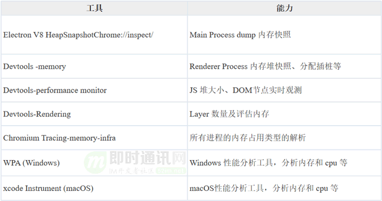
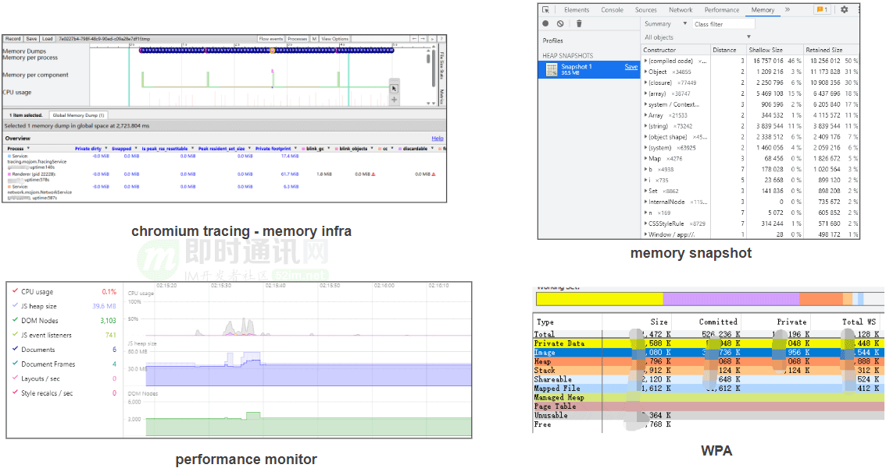
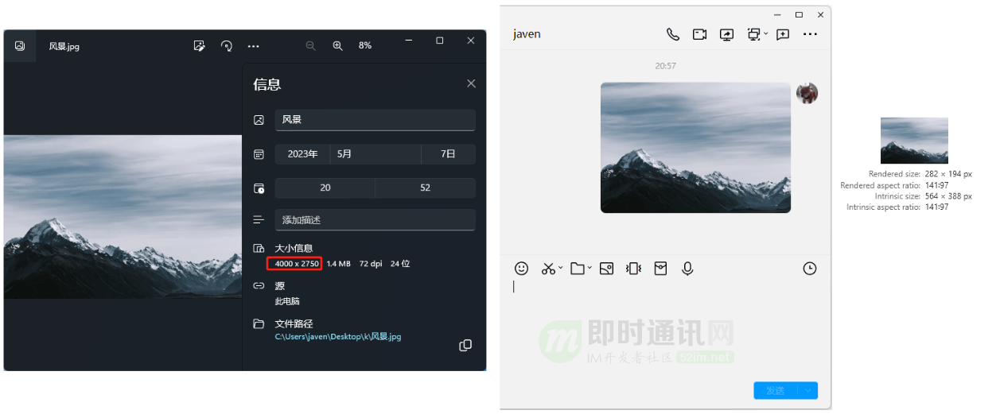
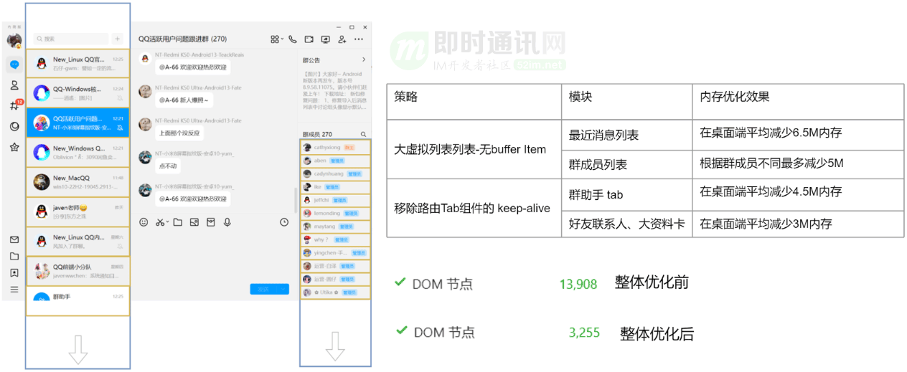
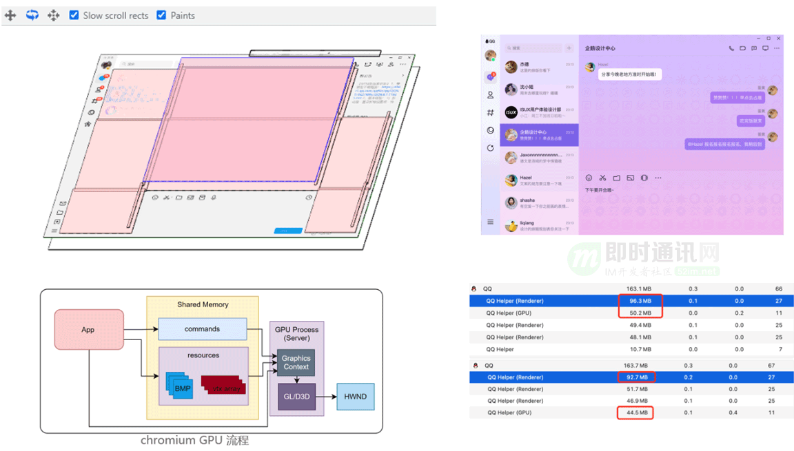

# electron 优化方案

### 优化原则和方向

性能优化的原则是**以更好的用户体验为标准**，具体就是实现下面的目标：

1. 多使用内存、缓存或者其他方法
2. 减少 CPU 和GPU 计算，更快展现

优化的方向有两个：

- **减少页面体积，提升网络加载**
- **优化页面渲染**

### 减少页面体积，提升网络加载

- 静态资源的压缩合并（JS 代码压缩合并、CSS 代码压缩合并、雪碧图）
- 静态资源缓存（资源名称加 MD5 戳）
- 使用 CDN 让资源加载更快

### 优化页面渲染

- CSS 放前面，JS 放后面
- 懒加载（图片懒加载、下拉加载更多）
- 减少DOM 查询，对 DOM 查询做缓存
- 减少DOM 操作，多个操作尽量合并在一起执行（`DocumentFragment`）
- 事件节流
- 尽早执行操作（`DOMContentLoaded`）
- 使用 SSR 后端渲染，数据直接输出到 HTML 中，减少浏览器使用 JS 模板渲染页面 HTML 的时间

### 详细解释

#### 静态资源的压缩合并

如果不合并，每个都会走一遍之前介绍的请求过程

```xml
<script src="a.js"></script>
<script src="b.js"></script>
<script src="c.js"></script>
```

如果合并了，就只走一遍请求过程

```xml
<script src="abc.js"></script>
```

#### 静态资源缓存

通过链接名称控制缓存

```xml
<script src="abc_1.js"></script>
```

只有内容改变的时候，链接名称才会改变

```xml
<script src="abc_2.js"></script>
```

这个名称不用手动改，可通过前端构建工具根据文件内容，为文件名称添加 MD5 后缀。

#### 使用 CDN 让资源加载更快

CDN 会提供专业的加载优化方案，静态资源要尽量放在 CDN 上。例如：

```xml
<script src="https://cdn.bootcss.com/zepto/1.0rc1/zepto.min.js"></script>
```

#### 使用 SSR 后端渲染

可一次性输出 HTML 内容，不用在页面渲染完成之后，再通过 Ajax 加载数据、再渲染。例如使用 smarty、Vue SSR 等。

#### CSS 放前面，JS 放后面

上文讲述浏览器渲染过程时已经提过，不再赘述。

#### 懒加载

一开始先给为 `src` 赋值成一个通用的预览图，下拉时候再动态赋值成正式的图片。如下，`preview.png`是预览图片，比较小，加载很快，而且很多图片都共用这个`preview.png`，加载一次即可。待页面下拉，图片显示出来时，再去替换`src`为`data-realsrc`的值。

```routeros

```

另外，这里为何要用`data-`开头的属性值？—— 所有 HTML 中自定义的属性，都应该用`data-`开头，因为`data-`开头的属性浏览器渲染的时候会忽略掉，提高渲染性能。

#### DOM 查询做缓存

两段代码做一下对比：

```arcade
var pList = document.getElementsByTagName('p')  // 只查询一个 DOM ，缓存在 pList 中了
var i
for (i = 0; i < pList.length; i++) {
}
var i
for (i = 0; i < document.getElementsByTagName('p').length; i++) {  // 每次循环，都会查询 DOM ，耗费性能
}
```

总结：DOM 操作，无论查询还是修改，都是非常耗费性能的，应尽量减少。

#### 合并 DOM 插入

DOM 操作是非常耗费性能的，因此插入多个标签时，先插入 Fragment 然后再统一插入 DOM。

```gml
var listNode = document.getElementById('list')
// 要插入 10 个 li 标签
var frag = document.createDocumentFragment();
var x, li;
for(x = 0; x < 10; x++) {
    li = document.createElement("li");
    li.innerHTML = "List item " + x;
    frag.appendChild(li);  // 先放在 frag 中，最后一次性插入到 DOM 结构中。
}
listNode.appendChild(frag);
```

#### 事件节流

例如要在文字改变时触发一个 change 事件，通过 keyup 来监听。使用节流。

```javascript
var textarea = document.getElementById('text')
var timeoutId
textarea.addEventListener('keyup', function () {
    if (timeoutId) {
        clearTimeout(timeoutId)
    }
    timeoutId = setTimeout(function () {
        // 触发 change 事件
    }, 100)
})
```

#### 尽早执行操作

```javascript
window.addEventListener('load', function () {
    // 页面的全部资源加载完才会执行，包括图片、视频等
})
document.addEventListener('DOMContentLoaded', function () {
    // DOM 渲染完即可执行，此时图片、视频还可能没有加载完
})
```

#### 性能优化怎么做

上面提到的都是性能优化的单个点，性能优化项目具体实施起来，应该按照下面步骤推进：

1. 建立性能数据收集平台，摸底当前性能数据，通过性能打点，将上述整个页面打开过程消耗时间记录下来
2. 分析耗时较长时间段原因，寻找优化点，确定优化目标
3. 开始优化
4. 通过数据收集平台记录优化效果
5. 不断调整优化点和预期目标，循环2~4步骤

性能优化是个长期的事情，不是一蹴而就的，应该本着先摸底、再分析、后优化的原则逐步来做。


## QQ方案：

## 内存优化我们都做了什么


接下来，将重点介绍我们是如何掌控和优化 Electron 的内存的。

我们的工作主要包括以下几个方面。

***1）\*工具分析**：首先，我们需要使用不同维度的内存分析工具，从 V8 引擎到进程，再到整个应用程序，打通整个链路进行多角度的细节分析，以此来定位内存使用的瓶颈。

***2）\*定向优化**：在通过工具定位到问题之后，我们会采取一系列的针对性优化策略，包括缓存策略、按需加载、优雅降级等。具体的优化工作我们将在后面进行详细介绍。

***3）\*线上监控**：在本地或小范围内验证通过之后，我们需要广大用户的验证来确认我们的优化措施是否适用于所有场景。然而，如何获取用户在 Windows 任务管理器中看到的内存使用量是一个挑战，我们已经做了大量的研究和验证。

***4）\*防止性能退化和自动化测试**：为了保护我们辛苦得来的优化成果，并避免频繁的版本迭代影响 QQ 的内存目标，我们会借助开发框架、工具建设、代码审查等手段来预防性能退化。

## 选择合适的分析工具


在进行性能优化之前，我们需要选择合适的工具来帮助我们分析问题。

QQ 的代码不仅包含 V8 的 JS 部分，还包括许多 Native 的 C++ 模块。仅依靠 Chromium 开发者工具进行性能分析是不够的，因此我们需要组合使用多种工具来共同解决问题。





这些工具如何使用，由于篇幅的关系我们在这里不做详细介绍。





▲ 部分内存分析工具截图


## 定向优化1：最大化资源使用率

**首先是代码瘦身：**对于第三方包或 SDK，它们往往包含了完备的 Web 兼容性及能力，而这些对于 Electron 客户端来说并不是必需的。因此，我们会对它们进行定制裁剪或独立实现，以减少代码的加载。

**对于 QQ 的业务代码：**分包策略不完全按照每个页面（窗口）以及模块复用次数来进行制订，更多的情况是按照场景模块来进行细粒度的定制。


### 图片资源

**举个例子：**一张分辨率为 4000 x 2750 的图片，结合设备屏幕像素和聊天区设计尺寸，只需渲染宽度为 567 像素的分辨率图像即可清晰展示。如果以宽度为 4000 像素的分辨率渲染，理论上两者位图所占用的内存大小差距可达 50 倍，并且还会因为渲染带来性能损失。





▲ 图片尺寸对内存影响举例

在聊天消息列表中的大部分图片仅仅起到预览作用，缩略图渲染就满足了需要。而仅仅在用户真正打开图片查看器放大查看时，才会需要用原图渲染。

实测在聊天中多张不同大尺寸分辨率图片在展示时，渲染进程和 GPU 进程的内存占用有着明显差别。在收发图片时，我们会根据屏幕设备信息和计算展示区域所需实际渲染分辨率，当原图分辨率超出计算所需值，则先调用压缩服务进行图片压缩，生成渲染所需分辨率的缩略图，并在聊天区域进行渲染上屏。在这个策略的优化下，一般聊天图片场景测试下来，使用缩略图比原图约有 30M ~ 50M 的内存优化。

## 定向优化2：可视区域按需渲染

### DOM 元素数量


在 DOM 元素使用数量我们也有严格的控制，总体采用”所见即占用“的 DOM 渲染策略。在 QQ 大面板中只有视口所见的内容才会渲染对应 DOM 元素。其他所有组件在不渲染展示时，均会移除组件及其 DOM 元素来避免其内存开销。





▲ 大虚拟列表控制 DOM 数量

**尤其对于各个大列表模块：**比如联系人列表和群成员列表，DOM 元素都非常多。最开始的内测版本中，使用有大量好友和群聊的 QQ 号，窗口平均 DOM 数达到 13000。我们将 QQ 所有的普通分页列表替换为虚拟滚动列表，并且对列表滚动 buffer 进行极限压缩甚至是 0 buffer 。由于不再一味采取空间换时间，没有 buffer 的情况下必然面对列表滑动性能挑战，因此也需不断优化各类 item 组件渲染性能。

**此外：**我们还通过精简组件 DOM 层级，移除非核心组件 keep-alive（重新优化渲染性能）等方式，大账号使用下整体的 DOM 数量从 13000 减少到控制在平均 4000 以内，这部分优化减少约 20M 内存。


### 渲染图层


​		渲染图层方面，在渲染时满足某些特殊条件的渲染层，会被浏览器自动提升为合成层，达到提升渲染性能的目的。但是每个合成层都占用额外的内存，应当去掉过量且不必要的合成层来控制图层带来的内存占用。当然结合渲染性能考量，对于高频且列表等核心模块，是可以单独提升合成层。




▲ QQ 对于渲染合成层的优化处理

​		在桌面端 QQ 中通过超级调色盘可以为进行色彩换肤，在这个场景中全局各模块有不少单独提升的合成层来实现毛玻璃、渐变和纹理效果。另外还有许多不经意间被提升的隐式合成层。通过对不必要的合成层进行移除与合并，整体也优化了约 9.3M 内存。


## 定向优化5：消灭内存泄漏

我们知道 V8 有自己的垃圾回收机制，虽然它在 GC（垃圾回收）方面有着其各种策略，并做了各种优化从而尽可能的确保垃圾得以回收，但我们仍应当避免任何可能导致无法回收的代码操作。

**常见的例子包括：**

- ***1）\***未移除的监听器和定时器：在监听事件处理函数其中引用的不被释放导致的泄漏；
- ***2）\***游离 DOM 未释放：移出 document 后游离 DOM 仍存在引用导致无法释放。较多发生于框架的组件销毁时，相关监听未取消导致组件没有释放的情况；
- ***3）\***监控 / 打点导致的泄漏：在使用 Performance.mark 打点监控时，产生 PerformanceMark 对象，在用完之后没有手动清除，也会导致内存泄漏；
- ***4）\***console.error 导致的泄漏：控制台持有被打印对象始终不释放，导致应用的泄漏；
- ***5）\***其他不当的闭包及隐式的全局变量。


以上是桌面 QQ 在早期遇到的常见问题。后续，我们通过代码检测手段来防范这类问题的出现。

与一般的前端项目不同，由于桌面 QQ 的长周期使用特性，任何缓慢而微小的内存泄漏都可能被放大，这也是我们极力把控并阻止任何可能导致内存泄漏的代码引入的原因。


