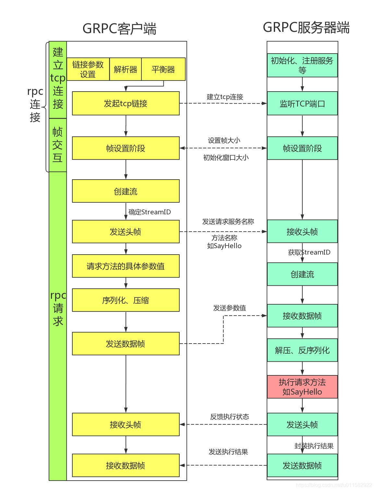
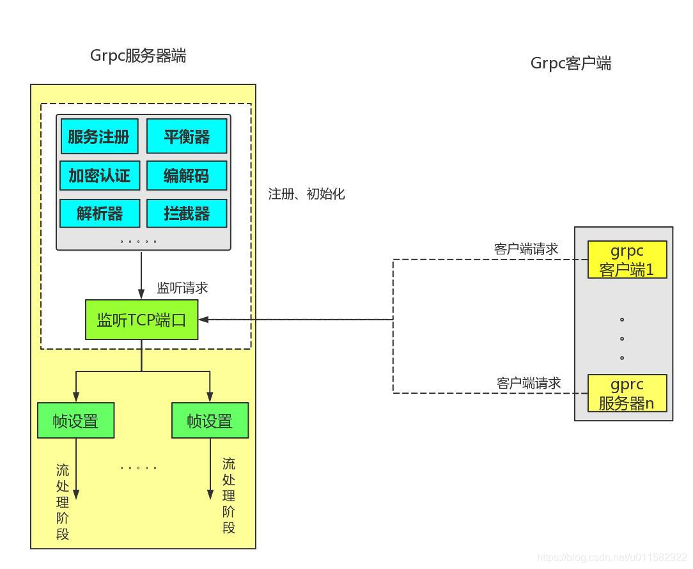
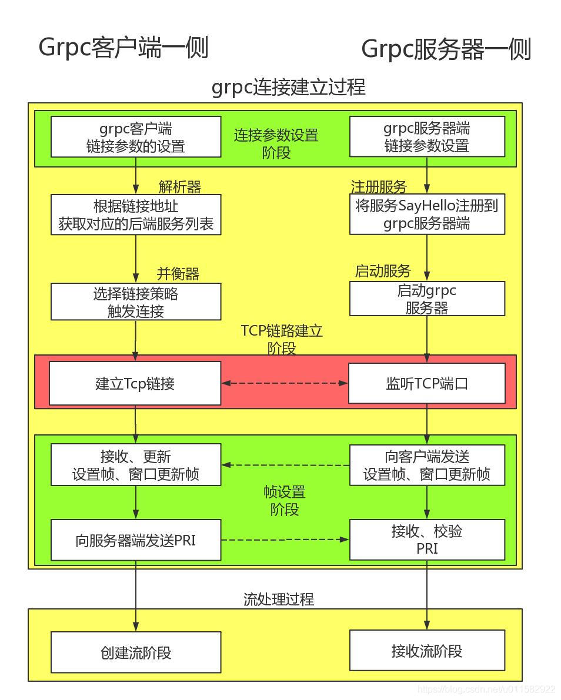

# 整体流程

在grpc-go框架中grpc客户端跟grpc服务器端整个交互主要经历以下阶段：

1、rpc 链接建立阶段

- 建立 tcp 链接阶段
  - 用户设置链接参数，如拦截器设置，链接地址设置等
  - 解析器根据链接地址来获取后端对应的grpc服务器地址列表
  - 平衡器根据 grpc 服务器地址列表来建立 tcp 链接

- 帧交互阶段
  - grpc服务器端需要自己能够发送的帧大小、窗口大小等信息发送给客户端，
  - 客户端接收到这些信息后，会更新本地的帧大小，窗口大小等信息
  - PRI校验

2、rpc请求阶段

- 客户端将请求服务的名称，方法名称、超时时间等信息封装到头帧里，发送给服务器端；
- 这样服务器端接收到头帧后，就可以解析出客户端请求的方法名称了，如Greeter服务下的SayHello方法名称了
- 客户端需要将SayHello方法的具体参数值，进行序列化，压缩后，封装成数据帧发送服务器端
- 服务器端接收到数据帧后，进行解压，反序列化操作后，就得到了请求方法的具体参数值了，如&pb.HelloRequest{Name: name}
- 服务器端此时已经知道了客户端请求的方法名称，以及该方法名称的具体参数值了，
- 服务器端开始具体执行方法，如真正执行SayHello方法了；执行完成后，
- 服务器端创建头帧，将执行的状态信息发送给客户端，如grpc-status, 状态码200
- 客户端开始接收服务器端的发送的头帧
- 服务器端将执行结果，进行序列化、压缩后，封装成数据帧，发送给客户端
- 客户端接收到服务器端反馈的数据帧后，进行解压，反序列化后，，就可以得到SayHello方法的具体执行结果了。

简单总结一下，rpc 链接，其实就是干了**四件事**:

- 第一，确定 grpc 服务器端的地址列表，有哪些；
- 第二，如何向 grpc 服务器端发起链接，是链接一个 grpc 服务器端，还是全部连接，还是选择负载低的 grpc服务器进行链接，
- 第三，调用 golang 原生的 net 包，进行 tcp 链接；
- 第四，进行 http2 帧的交互过程，如接下来传输的帧的大小是多少，窗口大小是多少等

### rpc 请求，干了哪些事呢？

- 第一，通过头帧，将客户端请求方法的服务名称，方法名称等信息传输给服务器端；如服务名称为helloworld.Greeter，方法名称为 SayHello
- 第二，通过数据帧，客户端将请求方法的参数值发送给服务器端，
- 第三，到目前为止，服务器端就知道客户端要执行的哪个服务下的哪个方法了，并且也知道该方法的具体参数值了；就可以具体执行了
- 第四，服务器端，将具体的执行结果，封装成数据帧，再反馈客户端，这样客户端就获得了最终的执行结果，也就是实现了在本地调用了远程服务中的某个方法，或者说不同内存空间的方法调用

在这里我们只需要简单了解一下grpc客户端跟grpc服务器端交互的整体流程即可。

# Server 启动

可以自己先思考一下，假设让我们自己去开发一个简单版本的grpc服务器端启动时都会做什么事情呢?

- 一些初始化工作
- 监听某个端口
- 注册服务端提供的服务
  。。。。。

接下来看一下grpc-go框架服务器端启动时的流程图：

在下面的章节中只是介绍了常用的初始化组件，有些功能需要手动显示的调用，

或者 import 导入才能初始化或者注册，

比方说 grpc-go/encoding/gzip/gzip.go 文件中的 gzip 压缩器需要手动导入，因此就不再一一介绍了。

一个链接请求，对应一个 http2Server 对象，一个帧接收器，一个帧发送器;

## 1、注册、初始化工作

1. 注册服务

通过下面的形式，可以将提供的服务注册到grpc服务器端，以供客户端调用；

这里我们以源码中自带的heloworld为例，将SayHello服务注册到grpc服务器端：

2. 解析器初始化
   1. passthrough解析器(默认使用，启动时自己注册)
   2. dns解析器(启动时自己注册)
   3. Manual解析器(需要手动显示的注册)
   4. xds 解析器(需要手动显示的注册)

3. 平衡构建器的注册
   注意：
   平衡构建器是用来创建平衡器的。
   平衡器的创建是在客户端跟服务器端进行链接过程中创建的
   1. baseBuilder平衡构建器
   2. pickFirst平衡构建器注册
   3. round_robin平衡器注册
   4. grpclb平衡器注册

4. 编解码器初始化

5. 拦截器初始化

   拦截器的初始化主要分为两大步骤：

   1. 自定义拦截器 
   2. 将拦截器注册到服务器端

## 2、服务器监听工作

后面的章节再详细的介绍接收到客户端的请求后，grpc服务器端做了哪些事情。

本篇文章主要是分析了grpc服务器端启动后，都做了哪些事情；

这样的话，以后用到哪个组件时，就知道在什么地方进行的初始化，赋值等操作了。

# 客户端连接

建立过程流程图

## 1.1、服务器端一侧，tcp链接前要做的事情？

- 启动grpc服务器时，主要做了**一些初始化设置，如拦截器的设置、加密认证设置等**
- **将提供的服务，如SayHello注册到grpc服务器里**
- **grpc服务器端启动监听端口**，监听grpc客户端发起的链接请求；如果没有请求，就会一直阻塞着。

