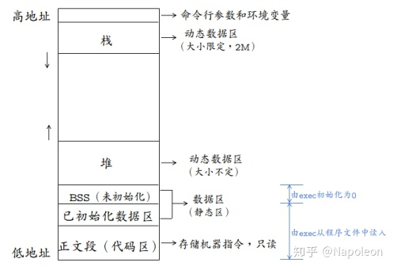

[TOC]

## 进程与线程的概念？

**进程**是对运行时程序的封装，是系统进行资源调度和分配的的基本单位

**线程**是进程的子任务，是 CPU 调度和分派的基本单位

## 进程与线程的区别？

1. 一个线程只能属于一个进程，而一个进程可以有多个线程，但至少有一个线程。线程依赖于进程而存在。

2. 进程在执行过程中拥有独立的内存单元，而多个线程共享进程的内存。
3. 进程是资源分配的最小单位，线程是CPU调度的最小单位；
4. 通信：由于同一进程中的多个线程具有相同的地址空间，致使它们之间的同步和通信的实现，也变得比较容易。
5. 进程编程调试简单可靠性高，但是创建销毁开销大；线程正相反，开销小，切换速度快，但是编程调试相对复杂。
6. 进程间不会相互影响 ；线程一个线程挂掉将导致整个进程挂掉
7. 进程适应于多核、多机分布；线程适用于多核

## 有了进程，为什么还要有线程？

进程在同一时间只能干一件事；
进程在执行的过程中如果阻塞，整个进程就会挂起，即使进程中有些工作不依赖于等待的资源，仍然不会执行。
因此，操作系统引入了比进程粒度更小的线程，作为并发执行的基本单位，从而减少程序在并发执行时所付出的时空开销，提高并发性。

## 进程是如何通信的？

​		进程间通信主要包括管道、系统IPC（包括消息队列、信号量、信号、共享内存等）、以及套接字socket。


## 线程是如何通信的？

**临界区：** 通过多线程的串行化来访问公共资源或一段代码，速度快，适合控制数据访问；

**互斥量Synchronized/Lock：** 采用互斥对象机制，只有拥有互斥对象的线程才有访问公共资源的权限。因为互斥对象只有一个，所以可以保证公共资源不会被多个线程同时访问

**条件变量：**pthread_con_* 特点：让线程堵塞直至被其他线程唤醒。

**读写锁：**pthread_rwlock_*    特点：写可以多个线程同时进行，读只能一个线程进行

**信号量Semphare：** 为控制具有有限数量的用户资源而设计的，它允许多个线程在同一时刻去访问同一个资源，但一般需要限制同一时刻访问此资源的最大线程数目。
事件(信号)，Wait/Notify：通过通知操作的方式来保持多线程同步，还可以方便的实现多线程优先级的比较操作


## 单核机器上写多线程程序，是否需要考虑加锁？

在单核机器上写多线程程序，仍然需要线程锁。因为线程锁通常用来实现线程的同步和通信。


## 请问线程需要保存哪些上下文，SP、PC、EAX这些寄存器是干嘛用的？

​		线程在切换的过程中需要保存当前线程 Id 、线程状态、堆栈、寄存器状态等信息。其中寄存器主要包括 SP  PC  EAX 等寄存器，其主要功能如下：
**SP:**堆栈指针，指向当前栈的栈顶地址
**PC:**程序计数器，存储下一条将要执行的指令
**EAX:**累加寄存器，用于加法乘法的缺省寄存器

## ❤线程间的同步方式，最好说出具体的系统调用

- **信号量：**
  		    信号量是一种特殊的变量，可用于线程同步。它只取自然数值，并且只支持两种操作：
  **P(SV):** 如果信号量 SV 大于 0 ，将它减一；如果 SV 值为 0 ，则挂起该线程。
  **V(SV)：** 如果有其他进程因为等待 SV 而挂起，则唤醒，然后将 SV+1 ；否则直接将 SV+1 。
  		其系统调用为：
  **sem_wait（sem_t *sem）**：以原子操作的方式将信号量减1，如果信号量值为0，则sem_wait将被阻塞，直到这个信号量具有非0值。
  **sem_post（sem_t *sem)**：以原子操作将信号量值+1。当信号量大于0时，其他正在调用sem_wait等待信号量的线程将被唤醒。
- **互斥量：**
          互斥量又称互斥锁，主要用于线程互斥，不能保证按序访问，可以和条件锁一起实现同步。当进入临界区 时，需要获得互斥锁并且加锁；当离开临界区时，需要对互斥锁解锁，以唤醒其他等待该互斥锁的线程。其主要的系统调用如下：
  **pthread_mutex_init:** 初始化互斥锁
  **pthread_mutex_destroy：** 销毁互斥锁
  **pthread_mutex_lock：** 以原子操作的方式给一个互斥锁加锁，如果目标互斥锁已经被上锁，pthread_mutex_lock调用将阻塞，直到该互斥锁的占有者将其解锁。
  **pthread_mutex_unlock:** 以一个原子操作的方式给一个互斥锁解锁。
- **条件变量:**
          条件变量，又称条件锁，用于在线程之间同步共享数据的值。条件变量提供一种线程间通信机制：当某个共享数据达到某个值时，唤醒等待这个共享数据的一个/多个线程。即，当某个共享变量等于某个值时，调用 signal/broadcast。此时操作共享变量时需要加锁。其主要的系统调用如下：
  **pthread_cond_init:** 初始化条件变量
  **pthread_cond_destroy：** 销毁条件变量
  **pthread_cond_signal：** 唤醒一个等待目标条件变量的线程。哪个线程被唤醒取决于调度策略和优先级。
  **pthread_cond_wait：** 等待目标条件变量。需要一个加锁的互斥锁确保操作的原子性。该函数中在进入wait状态前首先进行解锁，然后接收到信号后会再加锁，保证该线程对共享资源正确访问。

## 说一说并发(concurrency)和并行(parallelism)

**并发（concurrency）：**指宏观上看起来两个程序在同时运行，比如说在单核cpu上的多任务。但是从微观上看两个程序的指令是交织着运行的，你的指令之间穿插着我的指令，我的指令之间穿插着你的，在单个周期内只运行了一个指令。这种并发并不能提高计算机的性能，只能提高效率。
**并行（parallelism）：**指严格物理意义上的同时运行，比如多核cpu，两个程序分别运行在两个核上，两者之间互不影响，单个周期内每个程序都运行了自己的指令，也就是运行了两条指令。这样说来并行的确提高了计算机的效率。所以现在的cpu都是往多核方面发展。


## 死锁发生的条件以及如何解决死锁

​		死锁是指两个或两个以上进程在执行过程中，因争夺资源而造成的下相互等待的现象。死锁发生的四个必要条件如下：
**互斥条件：**进程对所分配到的资源不允许其他进程访问，若其他进程访问该资源，只能等待，直至占有该资源的进程使用完成后释放该资源；
**请求和保持条件：**进程获得一定的资源后，又对其他资源发出请求，但是该资源可能被其他进程占有，此时请求阻塞，但该进程不会释放自己已经占有的资源
**不可剥夺条件**：进程已获得的资源，在未完成使用之前，不可被剥夺，只能在使用后自己释放
**环路等待条件：**进程发生死锁后，必然存在一个进程-资源之间的环形链

​		解决死锁的方法即破坏上述四个条件之一，主要方法如下：
资源一次性分配，从而剥夺请求和保持条件
**可剥夺资源：**即当进程新的资源未得到满足时，释放已占有的资源，从而破坏不可剥夺的条件
**资源有序分配法：**系统给每类资源赋予一个序号，每个进程按编号递增的请求资源，释放则相反，从而破坏环路等待的条件


##  进程状态转换图，动态就绪，静态就绪，动态阻塞，静态阻塞


1）创建状态：进程正在被创建
2）就绪状态：进程被加入到就绪队列中等待CPU调度运行
3）执行状态：进程正在被运行
4）等待阻塞状态：进程因为某种原因，比如等待I/O，等待设备，而暂时不能运行。
5）终止状态：进程运行完毕

- **2、交换技术**
  当多个进程竞争内存资源时，会造成内存资源紧张，并且，如果此时没有就绪进程，处理机会空闲，I/0速度比处理机速度慢得多，可能出现全部进程阻塞等待I/O。
  针对以上问题，提出了两种解决方法：
  1）交换技术：换出一部分进程到外存，腾出内存空间。
  2）虚拟存储技术：每个进程只能装入一部分程序和数据。
  在交换技术上，将内存暂时不能运行的进程，或者暂时不用的数据和程序，换出到外存，来腾出足够的内存空间，把已经具备运行条件的进程，或进程所需的数据和程序换入到内存。
  从而出现了进程的挂起状态：进程被交换到外存，进程状态就成为了挂起状态。
- **3、活动阻塞，静止阻塞，活动就绪，静止就绪**
  1）活动阻塞：进程在内存，但是由于某种原因被阻塞了。
  2）静止阻塞：进程在外存，同时被某种原因阻塞了。
  3）活动就绪：进程在内存，处于就绪状态，只要给CPU和调度就可以直接运行。
  4）静止就绪：进程在外存，处于就绪状态，只要调度到内存，给CPU和调度就可以运行。

**从而出现了：**

1. 活动就绪 —— 静止就绪 （内存不够，调到外存）
2. 活动阻塞 —— 静止阻塞 （内存不够，调到外存）
3. 执行 —— 静止就绪 （时间片用完）


## Linux 虚拟地址空间

​		为了防止不同进程同一时刻在物理内存中运行而对物理内存的争夺和践踏，采用了虚拟内存。
​		事实上，在每个进程创建加载时，内核只是为进程“创建”了虚拟内存的布局，具体就是初始化进程控制表中内存相关的链表，实际上并不立即就把虚拟内存对应位置的程序数据和代码（比如.text .data段）拷贝到物理内存中，只是建立好虚拟内存和磁盘文件之间的映射就好（叫做存储器映射），等到运行到对应的程序时，才会通过**<u>缺页异常</u>**，来拷贝数据。还有进程运行过程中，要动态分配内存，比如 malloc 时，也只是分配了虚拟内存，即为这块虚拟内存对应的页表项做相应设置，当进程真正访问到此数据时，才引发缺页异常。
​		请求分页系统、请求分段系统和请求段页式系统都是针对虚拟内存的，通过请求实现内存与外存的信息置换。

- **虚拟内存的好处：**
  1.扩大地址空间；
  2.内存保护：每个进程运行在各自的虚拟内存地址空间，互相不能干扰对方。虚存还对特定的内存地址提供写保护，可以防止代码或数据被恶意篡改。
  3.公平内存分配。采用了虚存之后，每个进程都相当于有同样大小的虚存空间。
  4.当进程通信时，可采用虚存共享的方式实现。
  5.当不同的进程使用同样的代码时，比如库文件中的代码，物理内存中可以只存储一份这样的代码，不同的进程只需要把自己的虚拟内存映射过去就可以了，节省内存
  6.虚拟内存很适合在多道程序设计系统中使用，许多程序的片段同时保存在内存中。当一个程序等待它的一部分读入内存时，可以把CPU交给另一个进程使用。在内存中可以保留多个进程，系统并发度提高
  7.在程序需要分配连续的内存空间的时候，只需要在虚拟内存空间分配连续空间，而不需要实际物理内存的连续空间，可以利用碎片
- **虚拟内存的代价：**
  1.虚存的管理需要建立很多数据结构，这些数据结构要占用额外的内存
  2.虚拟地址到物理地址的转换，增加了指令的执行时间。
  3.页面的换入换出需要磁盘 I/O ，这是很耗时的
  4.如果一页中只有一部分数据，会浪费内存。


## 操作系统中的程序的内存结构



​		一个程序本质上都是由 BSS 段、data 段、text 段三个组成的。可以看到一个可执行程序在存储（没有调入内存）时分为代码段、数据区和未初始化数据区三部分。
**BSS段（未初始化数据区）：**通常用来存放程序中未初始化的全局变量和静态变量的一块内存区域。BSS段属于静态分配，程序结束后静态变量资源由系统自动释放。
**数据段：**存放程序中已初始化的全局变量的一块内存区域。数据段也属于静态内存分配
**代码段：**存放程序执行代码的一块内存区域。这部分区域的大小在程序运行前就已经确定，并且内存区域属于只读。在代码段中，也有可能包含一些只读的常数变量
text段和data段在编译时已经分配了空间，而BSS段并不占用可执行文件的大小，它是由链接器来获取内存的。
bss段（未进行初始化的数据）的内容并不存放在磁盘上的程序文件中。其原因是内核在程序开始运行前将它们设置为0。需要存放在程序文件中的只有正文段和初始化数据段。
data段（已经初始化的数据）则为数据分配空间，数据保存到目标文件中。
数据段包含经过初始化的全局变量以及它们的值。BSS段的大小从可执行文件中得到，然后链接器得到这个大小的内存块，紧跟在数据段的后面。当这个内存进入程序的地址空间后全部清零。包含数据段和BSS段的整个区段此时通常称为数据区。
可执行程序在运行时又多出两个区域：栈区和堆区。
**栈区：**由编译器自动释放，存放函数的参数值、局部变量等。每当一个函数被调用时，该函数的返回类型和一些调用的信息被存放到栈中。然后这个被调用的函数再为他的自动变量和临时变量在栈上分配空间。每调用一个函数一个新的栈就会被使用。栈区是从高地址位向低地址位增长的，是一块连续的内存区域，最大容量是由系统预先定义好的，申请的栈空间超过这个界限时会提示溢出，用户能从栈中获取的空间较小。
**堆区：**用于动态分配内存，位于BSS和栈中间的地址区域。由程序员申请分配和释放。堆是从低地址位向高地址位增长，采用链式存储结构。频繁的malloc/free造成内存空间的不连续，产生碎片。当申请堆空间时库函数是按照一定的算法搜索可用的足够大的空间。因此堆的效率比栈要低的多。


## 操作系统中的缺页中断

​		malloc() 和 mmap() 等内存分配函数，在分配时只是建立了进程虚拟地址空间，并没有分配虚拟内存对应的物理内存。当进程访问这些没有建立映射关系的虚拟内存时，处理器自动触发一个缺页异常。
​		缺页中断：在请求分页系统中，可以通过查询页表中的<u>状态位</u>来确定所要访问的页面是否存在于内存中。每当所要访问的页面不在内存是，会产生一次缺页中断，此时操作系统会根据页表中的外存地址在外存中找到所缺的一页，将其调入内存。
​		缺页本身是一种中断，与一般的中断一样，需要经过4个处理步骤：
1、保护 CPU 现场
2、分析中断原因
3、转入缺页中断处理程序进行处理
4、恢复 CPU 现场，继续执行
​		但是缺页中断是由于所要访问的页面不存在于内存时，由硬件所产生的一种特殊的中断，因此，与一般的中断存在区别：
1、在指令执行期间产生和处理缺页中断信号
2、一条指令在执行期间，可能产生多次缺页中断
3、缺页中断返回是，执行产生中断的一条指令，而一般的中断返回是，执行下一条指令。


## 用户态和内核态区别

用户态和内核态是操作系统的两种运行级别，两者最大的区别就是特权级不同。用户态拥有最低的特权级，内核态拥有较高的特权级。运行在用户态的程序不能直接访问操作系统内核数据结构和程序。内核态和用户态之间的转换方式主要包括：系统调用，异常和中断。


## 用户态到内核态的转化原理

**用户态切换到内核态的3种方式**
**1、系统调用**
		这是用户进程主动要求切换到内核态的一种方式，用户进程通过系统调用申请操作系统提供的服务程序完成工作。而系统调用的机制其核心还是使用了操系统为用户特别开放的一个中断来实现，例如Linux的ine 80h中断。
**2、异常**
		当 CPU 在执行运行在用户态的程序时，发现了某些事件不可知的异常，这是会触发由当前运行进程切换到处理此。异常的内核相关程序中，也就到了内核态，比如缺页异常。
**3、外围设备的中断**
		当外围设备完成用户请求的操作之后，会向CPU发出相应的中断信号，这时CPU会暂停执行下一条将要执行的指令，转而去执行中断信号的处理程序，如果先执行的指令是用户态下的程序，那么这个转换的过程自然也就发生了有用户态到内核态的切换。比如硬盘读写操作完成，系统会切换到硬盘读写的中断处理程序中执行后续操作等。


## 为什么要分内核态和用户态？

在CPU的所有指令中，有一些指令是非常危险的，如果错用，将导致整个系统崩溃。


## windows 消息机制

​		当用户有操作(鼠标，键盘等)时，系统会将这些事件转化为消息。每个打开的进程系统都为其维护了一个消息队列，系统会将这些消息放到进程的消息队列中，而应用程序会循环从消息队列中取出来消息，完成对应的操作。


## 内存溢出和内存泄漏

- **1、内存溢出**
  		指程序申请内存时，没有足够的内存供申请者使用。内存溢出就是你要的内存空间超过了系统实际分配给你的空间，此时系统相当于没法满足你的需求，就会报内存溢出的错误
  **内存溢出原因：**
  		内存中加载的数据量过于庞大，如一次从数据库取出过多数据 集合类中有对对象的引用，使用完后未清空，使得不能回收 代码中存在死循环或循环产生过多重复的对象实体 使用的第三方软件中的BUG 启动参数内存值设定的过小
- **2、内存泄漏**
          内存泄漏是指由于疏忽或错误造成了程序未能释放掉不再使用的内存的情况。内存泄漏并非指内存在物理上的消失，而是应用程序分配某段内存后，由于设计错误，失去了对该段内存的控制，因而造成了内存的浪费。
  **内存泄漏的分类：**
  1、堆内存泄漏 （Heap leak）。对内存指的是程序运行中根据需要分配通过malloc,realloc new等从堆中分配的一块内存，再是完成后必须通过调用对应的 free或者delete
  删掉。如果程序的设计的错误导致这部分内存没有被释放，那么此后这块内存将不会被使用，就会产生Heap Leak。
  2、系统资源泄露（Resource Leak）。主要指程序使用系统分配的资源比如 Bitmap,handle ,SOCKET等没有使用相应的函数释放掉，导致系统资源的浪费，严重可导致系统效能降低，系统运行不稳定。
  3、没有将基类的析构函数定义为虚函数。当基类指针指向子类对象时，如果基类的析构函数不是virtual，那么子类的析构函数将不会被调用，子类的资源没有正确是释放，因此造成内存泄露。


## 介绍一下 5 种 IO 模型

**1.阻塞 IO :** 调用者调用了某个函数，等待这个函数返回，期间什么也不做，不停的去检查这个函数有没有返回，必须等这个函数返回才能进行下一步动作
**2.非阻塞IO:**非阻塞等待，每隔一段时间就去检测IO事件是否就绪。没有就绪就可以做其他事。
**3.信号驱动IO:**信号驱动IO:linux用套接口进行信号驱动IO，安装一个信号处理函数，进程继续运行并不阻塞，当IO时间就绪，进程收到SIGIO信号。然后处理IO事件。
**4.IO复用/多路转接IO**:linux用select/poll函数实现IO复用模型，这两个函数也会使进程阻塞，但是和阻塞IO所不同的是这两个函数可以同时阻塞多个IO操作。而且可以同时对多个读操作、写操作的IO函数进行检测。知道有数据可读或可写时，才真正调用IO操作函数
**5.异步IO:**linux中，可以调用aio_read函数告诉内核描述字缓冲区指针和缓冲区的大小、文件偏移及通知的方式，然后立即返回，当内核将数据拷贝到缓冲区后，再通知应用程序。


## 操作系统中的结构体对齐，字节对齐

- **1、原因：**
  **1）平台原因（移植原因）：** 不是所有的硬件平台都能访问任意地址上的任意数据的；某些硬件平台只能在某些地址处取某些特定类型的数据，否则抛出硬件异常。
  **2）性能原因：** 数据结构（尤其是栈）应该尽可能地在自然边界上对齐。原因在于，为了访问未对齐的内存，处理器需要作两次内存访问；而对齐的内存访问仅需要一次访问。
- **2、规则**
  **1）数据成员对齐规则：** 结构(struct)(或联合(union))的数据成员，第一个数据成员放在offset为0的地方，以后每个数据成员的对齐按照#pragma
  pack指定的数值和这个数据成员自身长度中，比较小的那个进行。
  **2）结构(或联合)的整体对齐规则：** 在数据成员完成各自对齐之后，结构(或联合)本身也要进行对齐，对齐将按照#pragma
  pack指定的数值和结构(或联合)最大数据成员长度中，比较小的那个进行。
  **3）结构体作为成员：** 如果一个结构里有某些结构体成员，则结构体成员要从其内部最大元素大小的整数倍地址开始存储。
- **3、定义结构体对齐**
  可以通过预编译命令#pragma pack(n)，n=1,2,4,8,16来改变这一系数，其中的n就是指定的“对齐系数”。


## 请你讲述一下互斥锁（mutex）机制，以及互斥锁和读写锁的区别

- **1、互斥锁和读写锁区别：**
  	     互斥锁：mutex，用于保证在任何时刻，都只能有一个线程访问该对象。当获取锁操作失败时，线程会进入睡眠，等待锁释放时被唤醒。
         读写锁：rwlock，分为读锁和写锁。处于读操作时，可以允许多个线程同时获得读操作。但是同一时刻只能有一个线程可以获得写锁。其它获取写锁失败的线程都会进入睡眠状态，直到写锁释放时被唤醒。 注意：写锁会阻塞其它读写锁。当有一个线程获得写锁在写时，读锁也不能被其它线程获取；写者优先于读者（一旦有写者，则后续读者必须等待，唤醒时优先考虑写者）。适用于读取数据的频率远远大于写数据的频率的场合。
  **互斥锁和读写锁的区别：**
  1）读写锁区分读者和写者，而互斥锁不区分
  2）互斥锁同一时间只允许一个线程访问该对象，无论读写；读写锁同一时间内只允许一个写者，但是允许多个读者同时读对象。
- **2、Linux的4种锁机制：**

   ​        互斥锁：mutex，用于保证在任何时刻，都只能有一个线程访问该对象。当获取锁操作失败时，线程会进入睡眠，等待锁释放时被唤醒
   ​        读写锁：rwlock，分为读锁和写锁。处于读操作时，可以允许多个线程同时获得读操作。但是同一时刻只能有一个线程可以获得写锁。其它获取写锁失败的线程都会进入睡眠状态，直到写锁释放时被唤醒。
   **注意**：写锁会阻塞其它读写锁。当有一个线程获得写锁在写时，读锁也不能被其它线程获取；写者优先于读者（一旦有写者，则后续读者必须等待，唤醒时优先考虑写者）。适用于读取数据的频率远远大于写数据的频率的场合。
   ​        自旋锁：spinlock，在任何时刻同样只能有一个线程访问对象。但是当获取锁操作失败时，不会进入睡眠，而是会在原地自旋，直到锁被释放。这样节省了线程从睡眠状态到被唤醒期间的消耗，在加锁时间短暂的环境下会极大的提高效率。但如果加锁时间过长，则会非常浪费CPU资源。
   ​        RCU：即read-copy-update，在修改数据时，首先需要读取数据，然后生成一个副本，对副本进行修改。修改完成后，再将老数据update成新的数据。使用RCU时，读者几乎不需要同步开销，既不需要获得锁，也不使用原子指令，不会导致锁竞争，因此就不用考虑死锁问题了。而对于写者的同步开销较大，它需要复制被修改的数据，还必须使用锁机制同步并行其它写者的修改操作。在有大量读操作，少量写操作的情况下效率非常高。

## 软链接和硬链接区别

​		为了解决文件共享问题，Linux引入了软链接和硬链接。除了为Linux解决文件共享使用，还带来了隐藏文件路径、增加权限安全及节省存储等好处。若1个inode号对应多个文件名，则为硬链接，即硬链接就是同一个文件使用了不同的别名,使用ln创建。若文件用户数据块中存放的内容是另一个文件的路径名指向，则该文件是软连接。软连接是一个普通文件，有自己独立的inode,但是其数据块内容比较特殊。


## 什么是大端小端以及如何判断大端小端

​		大端是指低字节存储在高地址；小端存储是指低字节存储在低地址。我们可以根据联合体来判断该系统是大端还是小端。因为联合体变量总是从低地址存储。

判断大小端：

```c++
bool isBig2(){
	union Demo{
		char ch;
		short sh;
	}demo;
  
	demo.sh = 0x0001;//小端：0x0100    大端:0x0001
	if(demo.ch == 0x01)
		return false;//小端
	else
		return true;//大端
}
```

转化大小端：

```c++
#define BigtoLittle32(A)   ((((uint32)(A)&0xff000000)>>24) | \
                           (((uint32)(A)&0x00ff0000)>>8)   | \
                           (((uint32)(A)&0x0000ff00)<<8)   | \
                           (((uint32)(A)&0x000000ff)<<24))
```


## ❤其他重要问题

windows dll、Reactor、hashmap原理、线程通信、IO复用


