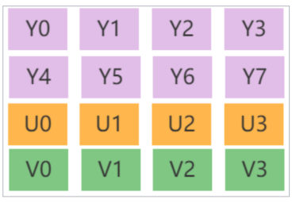

# 音视频录制原理

### 视频流

图像帧（图像采集）--->图像处理（亮度等）--->图像帧队列（排队）--->视频编码（压缩）

--->视频包队列（排队封装）

### 音频流

采样帧（音频采集）--->音频处理--->采样帧队列（排队）--->音频编码（压缩）

--->（音频包队列）

### 时钟

用于音视频同步采集。

### 复用器

按照格式进行封装

# 音视频播放原理

### 解复用器

按照格式进行解包

# 图像基础概念

- **像素**：像素是一个图片的基本单位，pix 是英语单词 picture 的简写，加上英语单词 “元素element”，就得到了 “ pixel ”，简称 px，所以“像素”有“图像元素” 之意。
- **分辨率**：是指图像的大小或尺寸。比如1920x1080。 
- **位深**：RGB ，是指在记录数字图像的颜色时，计算机实际上是用每个像素需要的位深来表示的。比如红色分量用8bit。 
- **帧率**：在 1 秒钟时间里传输的图片的帧数，也可以理解为图形处理器每秒钟 能够刷新几次。比如25fps表示一秒有25张图片。 
- **码率**：视频文件在<u>单位时间内使用的数据流量</u>。比如1Mbps。 
- **Stride**：指在内存中每行像素所占的空间。为了实现内存对齐每行像素在 内存中所占的空间并不一定是图像的宽度。

## RGB、YUV深入讲解 

### RGB

​		红R、绿G、蓝B三基色。	

​		通常的图像像素是按 RGB顺序进行排列，但有些图像处理要转成其他顺序，比如OpenCV经常转成BGR的排列方式。

 

### YUV

<u>“Y”表示明亮度（Luminance或Luma），也就是灰阶值，“U”和“V”表 示的则是色度（Chrominance或Chroma）。</u>

​		与我们熟知 RGB 类似，YUV也是一种颜色编码方法，它是指将**亮度**参量（Y：Luminance 或Luma）和色度参量（UV：Chrominance或Chroma）分开进行表示的像素编码格式。

这样分开的好处就是不但可以避免相互干扰，没有 UV 信息一样可以显示完整的图像， 因而解决了彩色电视与黑白电视的兼容问题；还可以**降低色度的采样率而不会对图像质量影响太大**，降低了视屏信号传输时对频宽（带宽）的要求。 Y Y 共用一组 UV 分量

​		YUV是一个比较笼统地说法，针对它的具体排列方式，可以分为很多种具体的格式： 

- **打包（packed）格式**：将每个像素点的Y、U、V分量交叉排列并以像素点为单元连续的存放 在同一数组中，通常几个相邻的像素组成一个宏像素（macro-pixel） 
- **平面（planar）格式**：使用三个数组分开连续的存放Y、U、V三个分量，即Y、U、V分别存放在各自的数组中。

### YUV采样表示法

​		YUV采用 A:B:C 表示法来描述 Y,U,V 采样频率比例，下图中黑点表示采样像素点 Y 分量，空心圆表示采样像素点的UV分量。主要分为YUV4:4:4、YUV4:2:2、YUV4:2:0这几种常用的类型

- 4:4:4表示色度频道没有下采样，即一个**Y分量对应着一个U分量和一个V分量。**
- 4:2:2表示2:1 的水平下采样，没有垂直下采样，即**每两个Y分量共用一个U分量和一个V分量**。
- 4:2:0表示2:1 的水平下采样，2:1 的垂直下采样，即**每四个Y分量共用一个U分量和一个V分量**。

### YUV数据存储

下面以每个分量数据存储在一个char（或byte）中为例描述YUV的数据存储方式。

#### 4:4:4格式

比如I444(YUV444P)格式,对应Ffmpeg像素表示AV_PIX_FMT_YUV444P,///<planarYUV平面模式

#### 4:2:2格式

比如I422(YUV422P)格式，对应Ffmpeg像素表示AV_PIX_FMT_**YUV422P,**///<planarYUV4:2:2,16bpp,(1Cr&Cbsampleper2x1Ysamples)

#### 4:2:0格式

比如I420(YUV420P)格式，对应Ffmpeg像素表示AV_PIX_FMT_YUV420P,///<planarYUV4:2:0,12bpp,(1Cr&Cbsampleper2x2Ysamples)

#### 4:2:0格式-NV12

比如NV12格式，对应Ffmpeg像素表示AV_PIX_FMT_NV12, **Y是平面模式排列，UV是打包模式排列**

#### 4:2:0格式-参考

### RGB 和 YUV 的转换

通常情况下RGB和YUV直接的相互转换都是调用接口实现，比如Ffmpeg的swscale或者libyuv等库。

主要转换标准是BT601和BT709。

​		8bit位深的情况下

- TV range是16-235(Y)、16-240(UV) , 也叫Limited Range 
- PC range是0-255，也叫Full Range
- 而RGB没有range之分，全是0-255

### YUV Stride 对齐问题

​		比如分辨率 638x480 的 YUV420P  图像，我们在内存处理的时候如果要以 16 字节对齐，则 638 不能被 16 整除，<u>我们需要在每行尾部填充 2 个字节</u>。就是 640。此时该图片的 Y stride 为640字节。

# 视频的主要概念

**视频码率：kb/s**，是指视频文件在单位时间内使用的数据流量，也叫码流率。码率越大，说明单位时间内取样率越大，数据流精度就越高。

**视频帧率：fps**，通常说一个视频的25帧，指的就是这个视频帧率，即1秒中会显示25帧。帧率越高，给人的视觉就越流畅。

**视频分辨率**：分辨率就是我们常说的640x480分辨率、1920x1080分辨率，分辨率影响视频图像的大小。

### I帧 P帧 B帧

**I 帧（Intra coded frames）**：这个帧是可以直接解析出一个画面的帧，I 帧不需要参考其他画面而生成, 解码时仅靠自己就重构完整图像;

- I帧图像采用帧内编码方式;
- I帧所占数据的信息量比较大;
- I帧图像是周期性出现在图像序列中的，出现频率可由编码器选择;
- I帧是P帧和B帧的参考帧(其质量直接影响到同组中以后各帧的质量);
- I帧是帧组GOP的基础帧(第一帧),在一组中只有一个I帧;
- I帧不需要考虑运动矢量;

**P 帧（Predicted frames）**：**根据本帧与相邻的前一帧（ I 帧或 P 帧）的不同点来压缩本帧数据**，同时利用了空间和时间上的相关性。

- P 帧属于前向预测的帧间编码。它需要参考前面最靠近它的I帧或P帧来解码。

**B 帧（Bi-directional predicted frames）**：B 帧图像采用双向时间预测，可以大大提高压缩倍数。

**GOP**是“Group of Pictures”的缩写，这是一个视频压缩术语。在视频压缩和处理中，GOP是一组<u>连续</u>的帧，它们作为一个整体进行编码和解码。

### 常用视频压缩算法

MPEG2	MPEG阵营
H264		MPEG阵营
H265		MPEG阵营
AVS   		中国阵营
VP8    	Google阵营
VP9    	Google阵营

