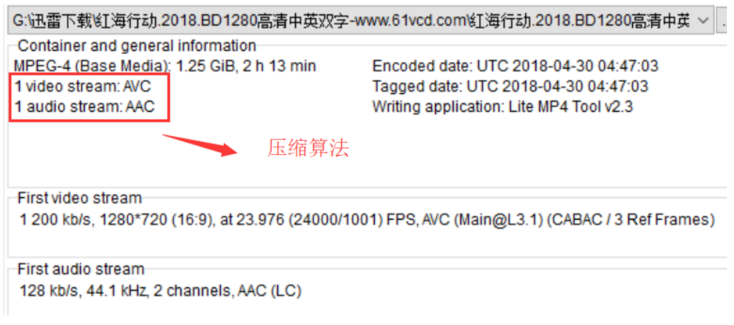

# 封装格式

​		封装格式(也叫容器）**就是将已经编码压缩好的视频流、音频流及字幕按照一定的方案放到一个文件中，便于播放软件播放。**

​		一般来说，视频文件的后缀名就是它的封装格式。封装的格式不一样，后缀名也就不一样。

​		比如：同样的陷可以做成饺子也可以做成包子。对于视频也是一个道理，同样的音视频流可以用不同容器来承载。

### 封装格式示例

**这里的压缩算法：**
	**视频Video：使用了 H264/AVC 压缩算法**
	**音频Audio：使用了 AAC 压缩算法**

**封装则使用 MP4 封装格式**

### 常见的视频封装格式

AVI、MKV、MPE、MPG、MPEG
MP4、WMV、MOV、3GP
M2V、M1V、M4V、OGM
RM、RMS、RMM、RMVB、IFO
SWF、FLV、F4V、
ASF、PMF、XMB、DIVX、PART
DAT、VOB、M2TS、TS、PS

**H264+AAC封装为FLV或MP4是最为流行的模式**

# 音视频同步基础

**DTS（Decoding Time Stamp）**：即解码时间戳，这个时间戳的意义在于告诉播放器该在什么时候解码这一帧的数据。
**PTS（Presentation Time Stamp）**：即显示时间戳，这个时间戳用来告诉播放器该在什么时候显示这一帧的数据。

### 同步方式：

**Audio Master**：同步视频到音频
**Video Master**：同步音频到视频
**External Clock Master**：同步音频和视频到外部时钟。

一般情况下 Audio Master > External Clock Master > Video Master 

