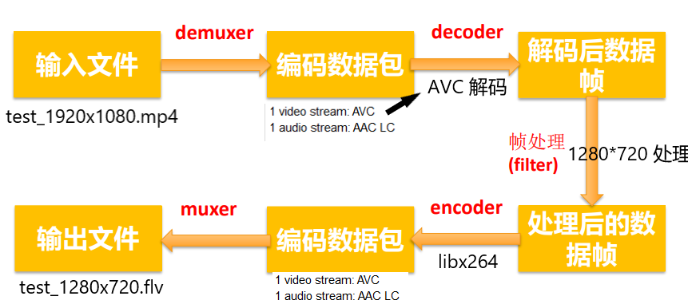
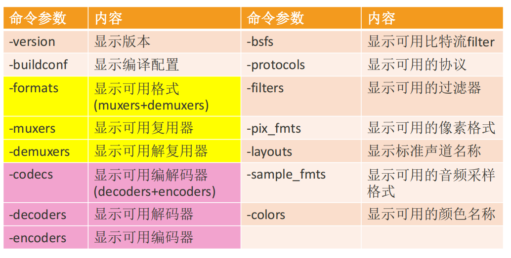
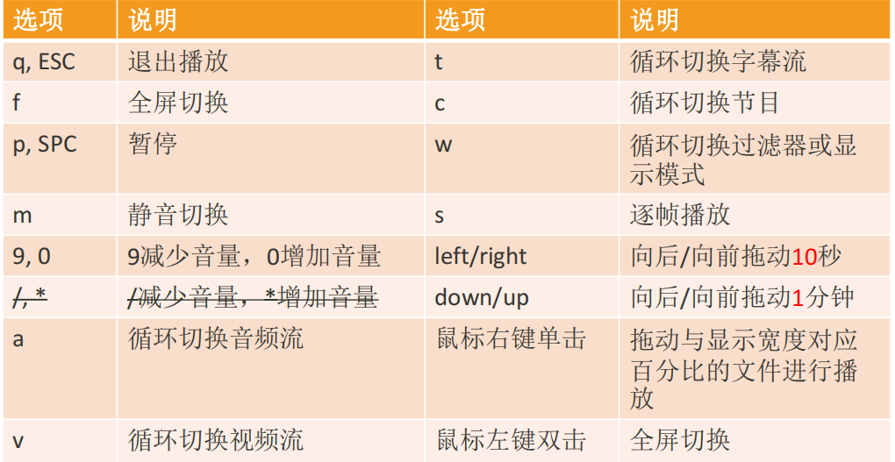

### ffmpeg / ffplay/ ffprobe区别

- **ffmpeg**: Hyper fast Audio and Video encoder 超快音视频编码器（类似爱剪辑）
- **ffplay**: Simple media player简单媒体播放器 
- **ffprobe**: Simple multimedia streams analyzer 简单多媒体流分析器


### 查看帮助文档

- 基本信息：ffmpeg -h 
- 高级信息：ffmpeg -h long 
- 所有信息：ffmpeg -h full


### 音视频处理流程

先看两条命令：

```shell
ffmpeg -i test_1920x1080.mp4 -acodec copy -vcodec libx264 -s 1280x720 test_1280x720.flv

ffmpeg -i test_1920x1080.mp4 -acodec copy -vcodec libx265 -s 1280x720 test_1280x720.mkv
```


一般流程


对于

**`ffmpeg -i test_1920x1080.mp4 -acodec copy -vcodec libx264 -s 1280x720 test_1280x720.flv`**

解析后的流程就为：




### 常用命令分类



### ffplay播放控制




### ffplay命令-主要选项

| **选项**            | **说明**                                                     |
| ------------------- | ------------------------------------------------------------ |
| -x width            | 强制显示宽带。                                               |
| -y height           | 强制显示高度。                                               |
| -video_size size    | 帧尺寸 设置显示帧存储(WxH格式)，仅适用于类似<br />原始YUV等没有包含帧大小(WxH)的视频。<br />比如: ffplay -pixel_format yuv420p **-video_size 320x240** -framerate 5 yuv420p_320x240.yuv |
| -pixel_format forma | 格式设置像素格式。                                           |
| -fs                 | 以全屏模式启动。                                             |
| -an                 | 禁用音频（不播放声音）                                       |
| -vn                 | 禁用视频（不播放视频）                                       |
| -sn                 | 禁用字幕（不显示字幕）                                       |
| -ss pos             | 根据设置的秒进行定位拖动，注意时间单位：比如'55' 55<br />seconds, '12:03:45' ,12 hours, 03 minutes and 45 seconds, '23.189' 23.189 second |
| -t duration         | 设置播放视频/音频长度，时间单位如 -ss选项                    |


