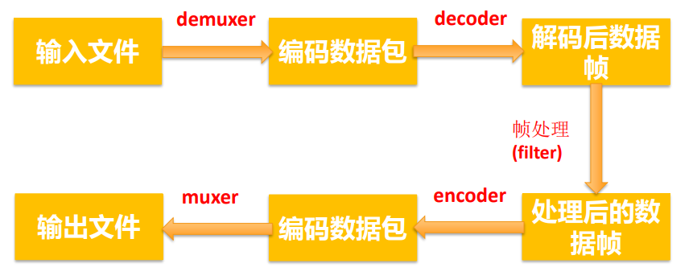

### ffmpeg / ffplay/ ffprobe区别

- **ffmpeg**: Hyper fast Audio and Video encoder 超快音视频编码器（类似爱剪辑）
- **ffplay**: Simple media player简单媒体播放器 
- **ffprobe**: Simple multimedia streams analyzer 简单多媒体流分析器


### 查看帮助文档

- 基本信息：ffmpeg -h 
- 高级信息：ffmpeg -h long 
- 所有信息：ffmpeg -h full


### 音视频处理流程

先看两条命令：

```shell
ffmpeg -i test_1920x1080.mp4 -acodec copy -vcodec libx264 -s 1280x720 test_1280x720.flv

ffmpeg -i test_1920x1080.mp4 -acodec copy -vcodec libx265 -s 1280x720 test_1280x720.mkv
```


一般流程



对于

**`ffmpeg -i test_1920x1080.mp4 -acodec copy -vcodec libx264 -s 1280x720 test_1280x720.flv`**

解析后的流程就为：


### 常用命令分类


### ffplay播放控制


### ffplay命令-主要选项

| **选项**                | **说明**                                                     |
| ----------------------- | ------------------------------------------------------------ |
| -x width                | 强制显示宽带。                                               |
| -y height               | 强制显示高度。                                               |
| -video_size size        | 帧尺寸 设置显示帧存储(WxH格式)，仅适用于类似原始 YUV 等没有包含帧大小 (W x H) 的视频。<br />比如: ffplay -pixel_format yuv420p **-video_size 320x240** -framerate 5 yuv420p_320x240.yuv |
| -pixel_format forma     | 格式设置像素格式。                                           |
| -fs                     | 以全屏模式启动。                                             |
| -an                     | 禁用音频（不播放声音）                                       |
| -vn                     | 禁用视频（不播放视频）                                       |
| -sn                     | 禁用字幕（不显示字幕）                                       |
| -ss pos                 | 根据设置的秒进行定位拖动，注意时间单位：比如'55' 55<br />seconds, '12:03:45' ,12 hours, 03 minutes and 45 seconds, '23.189' 23.189 second |
| -t duration             | 设置播放视频/音频长度，时间单位如 -ss选项                    |
| -bytes                  | 按字节进行定位拖动（0=off 1=on **-1=auto**）。               |
| -seek_interval interval | 自定义左/右键定位拖动间隔（以秒为单位），默认值为10秒（代码没有看到实现） |
| -nodisp                 | 关闭图形化显示窗口，视频将不显示                             |
| -noborder               | 无边框窗口                                                   |
| -volume vol             | 设置起始音量。音量范围[0 ~100]                               |
| -f fmt                  | 强制使用设置的格式进行解析。比如-f s16le                     |
| -window_title title     | 设置窗口标题（默认为输入文件名）                             |
| -loop number            | 设置播放循环次数                                             |
| -showmode mode          | 设置显示模式，可用的模式值：0 显示视频，1 显示音频波形，2 显示音频频谱。缺省为0，如果视频不存在则自动选择2 |
| -vf filtergraph         | 设置视频滤镜                                                 |
| -af filtergraph         | 设置音频滤镜                                                 |


### ffplay命令-高级选项

| **选项**                              | **说明**                                                     |
| ------------------------------------- | ------------------------------------------------------------ |
| -stats                                | 打印多个回放统计信息，包括显示流持续时间，编解码器参数，流中的当前位置，以及音频/视频同步差值。默认情况下处于启用状态，要显式禁用它则需要指定-nostats。 |
| -fast                                 | 非标准化规范的多媒体兼容优化                                 |
| -genpts                               | 生成pts。                                                    |
| **-sync type**                        | 同步类型 将主时钟设置为audio（type=audio），video（type=video）或external（type=ext），默认是audio为主时钟。 |
| -ast audio_stream_specifier           | 指定音频流索引，比如-ast 3，播放流索引为3的音频流            |
| -vst video_stream_specifier           | 指定视频流索引，比如-vst 4，播放流索引为4的视频流            |
| -sst subtitle_stream_specifier        | 指定字幕流索引，比如-sst 5，播放流索引为5的字幕流            |
| -autoexit                             | 视频播放完毕后退出。                                         |
| -exitonkeydown                        | 键盘按下任何键退出播放                                       |
| -exitonmousedown                      | 鼠标按下任何键退出播放                                       |
| **-codec:media_specifier codec_name** | 强制使用设置的多媒体解码器，media_specifier可用值为a（音频）， v（视频）和s字幕。比如-codec:v h264_qsv 强制视频采用h264_qsv解码 |
| **-acodec codec_name**                | 强制使用设置的音频解码器进行音频解码                         |
| **-vcodec codec_name**                | 强制使用设置的视频解码器进行视频解码                         |
| **-scodec codec_name**                | 强制使用设置的字幕解码器进行字幕解码                         |
| -autorotate                           | 根据文件元数据自动旋转视频。值为0或1 ，默认为1。             |
| -framedrop                            | 如果视频不同步则丢弃视频帧。当主时钟非视频时钟时默认开启。若需禁用则使用 -noframedrop |
| **-infbuf**                           | 不限制输入缓冲区大小。尽可能快地从输入中读取尽可能多的数据。播放实时流时默认启用，如果未及时读取数据，则可能会丢弃数据。此选项将不限制缓冲区的大小。若需禁用则使用-noinfbuf |
| aaaaaaaaaaaaaaaaaaaaaaaaaaaa          |                                                              |


### ffplay命令播放

- 播放本地文件
  - ffplay -window_title "test time" -ss 2 -t 10 -autoexit test.mp4
  - ffplay buweishui.mp3
- 播放网络流
  - ffplay -window_title "rtmp stream" rtmp://202.69.69.180:443/webcast/bshdlive-pc
- 强制解码器
  - mpeg4解码器：ffplay -vcodec mpeg4 test.mp4
  - h264解码器：ffplay -vcodec h264 test.mp4 
- 禁用音频或视频
  - 禁用音频：ffplay test.mp4 -an
  - 禁用视频：ffplay test.mp4 -vn

- 播放YUV数据
  - ffplay **-pixel_format** **yuv420p** **-video_size** 320x240 **-framerate** 5  yuv420p_320x240.yuv
- 播放RGB数据
  - ffplay -pixel_format rgb24 -video_size 320x240 -i rgb24_320x240.rgb
  - ffplay -pixel_format rgb24 -video_size 320x240 -framerate 5 -i rgb24_320x240.rgb
- 播放PCM数据
  -  ffplay **-ar** 48000 **-ac** 2 **-f** f32le 48000_2_f32le.pcm
    - -ar set audio sampling rate (in Hz) (from 0 to INT_MAX) (default 0)
    - -ac set number of audio channels (from 0 to INT_MAX) (default 0)


### ffplay简单过滤器

- 视频旋转

ffplay -i test.mp4 -vf transpose=1

- 视频反转

ffplay test.mp4 -vf hflip

ffplay test.mp4 -vf vflip

- 视频旋转和反转

ffplay test.mp4 -vf hflip,transpose=1

- 音频变速播放

ffplay -i test.mp4 -af atempo=2

- 视频变速播放

ffplay -i test.mp4 -vf setpts=PTS/2

- 音视频同时变速

ffplay -i test.mp4 -vf setpts=PTS/2 -af atempo=2


### ffmpeg 命令参数说明

- 主要参数：
  - -i 设定输入流
  - -f 设定输出格式(format)
  - -ss 开始时间
  - -t 时间长度

- 音频参数：
  - -aframes 设置要输出的音频帧数
  - -b:a 音频码率
  - -ar 设定采样率
  - -ac 设定声音的 Channel 数
  - -acodec 设定声音编解码器，如果用copy表示原始编解码数据必须被拷贝。
  - -an 不处理音频
  - -af 音频过滤器

- 视频参数：
  - -vframes 设置要输出的视频帧数
  - -b 设定视频码率
  - -b:v 视频码率
  - -r 设定帧速率
  - -s 设定画面的宽与高
  - -vn 不处理视频

- -aspect aspect 设置横纵比 4:3 、16:9 或 1.3333 1.7777

- -vcodec 设定视频编解码器，如果用copy表示原始编解码数据必须被拷贝。

- -vf 视频过滤器


### ffmpeg命令提取音视频数据

- **保留封装格式**

ffmpeg -i test.mp4 -acodec copy -vn audio.mp4

ffmpeg -i test.mp4 -vcodec copy -an video.mp4

-  **提取视频**

保留编码格式：ffmpeg -i test.mp4 -vcodec copy -an test_copy.h264

强制格式：ffmpeg -i test.mp4 -vcodec libx264 -an test.h264

- **提取音频**

保留编码格式：ffmpeg -i test.mp4 -acodec copy -vn test.aac

强制格式：ffmpeg -i test.mp4 -acodec libmp3lame -vn test.mp3


### ffmpeg命令提取像素格式

- 提取YUV
  - 提取3秒数据，分辨率和源视频一致

    ffmpeg -i test_1280x720.mp4 -t 3 **-pix_fmt** yuv420p yuv420p_orig.yuv

  - 提取3秒数据，分辨率转为320x240

    ffmpeg -i test_1280x720.mp4 -t 3 **-pix_fmt** yuv420p -s 320x240 yuv420p_320x240.yuv

- 提取RGB
  - 提取3秒数据，分辨率转为320x240

    ffmpeg -i test.mp4 -t 3 -pix_fmt rgb24 -s 320x240 rgb24_320x240.rgb

- RGB和YUV之间的转换

  ​	ffmpeg -s 320x240 -pix_fmt yuv420p -i yuv420p_320x240.yuv -pix_fmt rgb24 rgb24_320x240_2.rgb


### ffmpeg命令提取PCM数据

- **提取 PCM**

  ffmpeg -i buweishui.mp3 -ar 48000 -ac 2 **-f** s16le 48000_2_s16le.pcm

  ffmpeg -i buweishui.mp3 -ar 48000 -ac 2 -sample_fmt s16 out_s16.wav

  ffmpeg -i buweishui.mp3 -ar 48000 -ac 2 -codec:a pcm_s16le out2_s16le.wav

  ffmpeg -i buweishui.mp3 -ar 48000 -ac 2 -f f32le 48000_2_f32le.pcm

  ffmpeg -i test.mp4 -t 10 -vn -ar 48000 -ac 2 -f f32le 48000_2_f32le_2.pcm


### ffmpeg命令转封装

- **保持编码格式：**

  ffmpeg -i test.mp4 -vcodec copy -acodec copy test_copy.ts

  ffmpeg -i test.mp4 -codec copy test_copy2.ts

-  **改变编码格式：**

  ffmpeg -i test.mp4 -vcodec libx265 -acodec libmp3lame out_h265_mp3.mkv

-  **修改帧率：**

  ffmpeg -i test.mp4 -r 15 -codec copy output.mp4 (错误命令)

  ffmpeg -i test.mp4 -r 15 output2.mp4

-  **修改视频码率：**

  ffmpeg -i test.mp4 -b 400k output_b.mkv （此时音频也被重新编码）

- **修改视频码率：**

  ffmpeg -i test.mp4 -b:v 400k output_bv.mkv

- **修改音频码率：**

  ffmpeg -i test.mp4 -b:a 192k output_ba.mp4

  如果不想重新编码video，需要加上-vcodec copy

-  **修改音视频码率**：

  ffmpeg -i test.mp4 -b:v 400k -b:a 192k output_bva.mp4

- **修改视频分辨率：**

  ffmpeg -i test.mp4 -s 480x270 output_480x270.mp4

- **修改音频采样率:** 

  ffmpeg -i test.mp4 -ar 44100 output_44100hz.mp4


