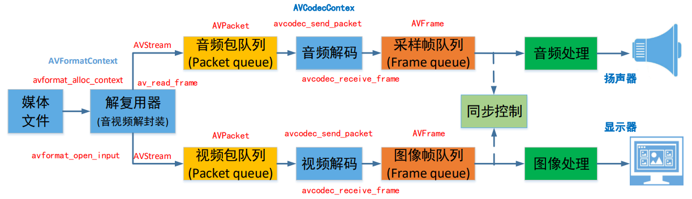
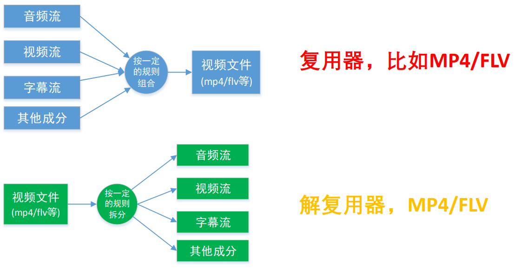
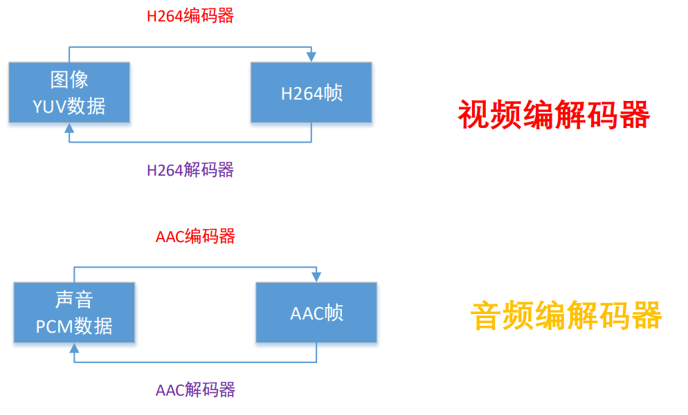
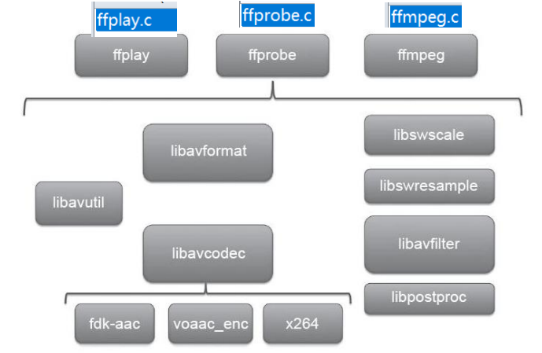
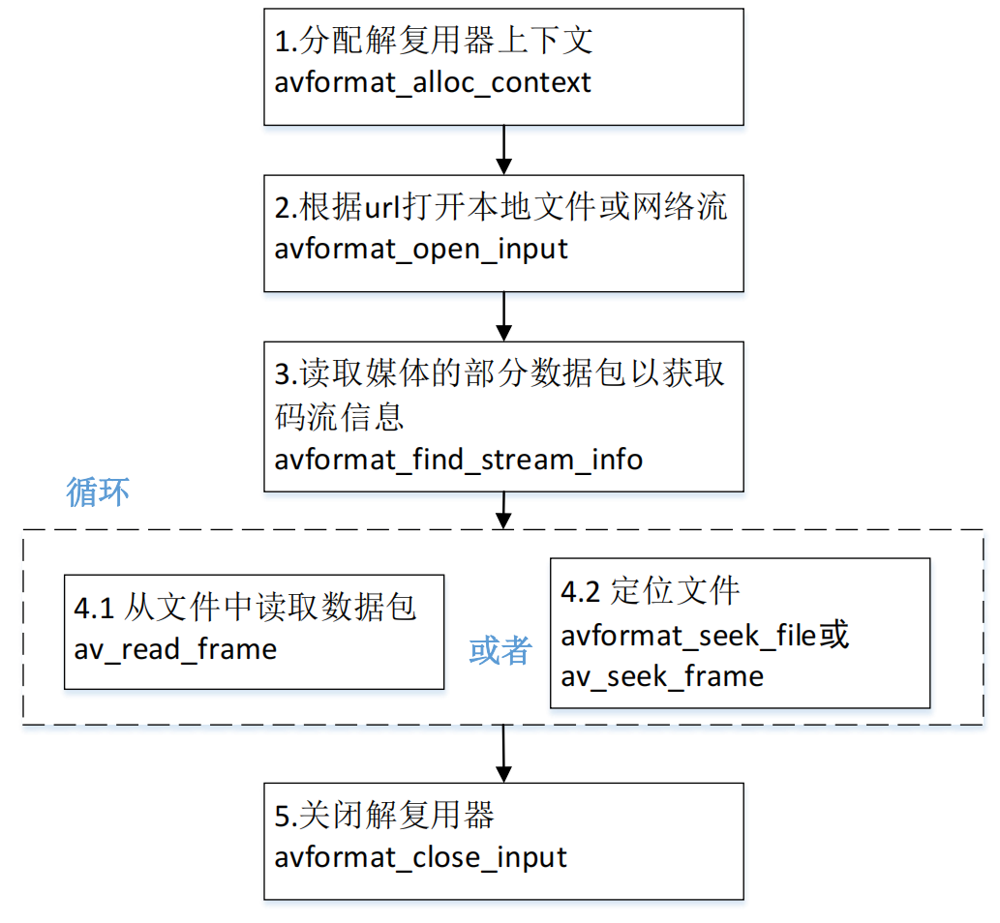
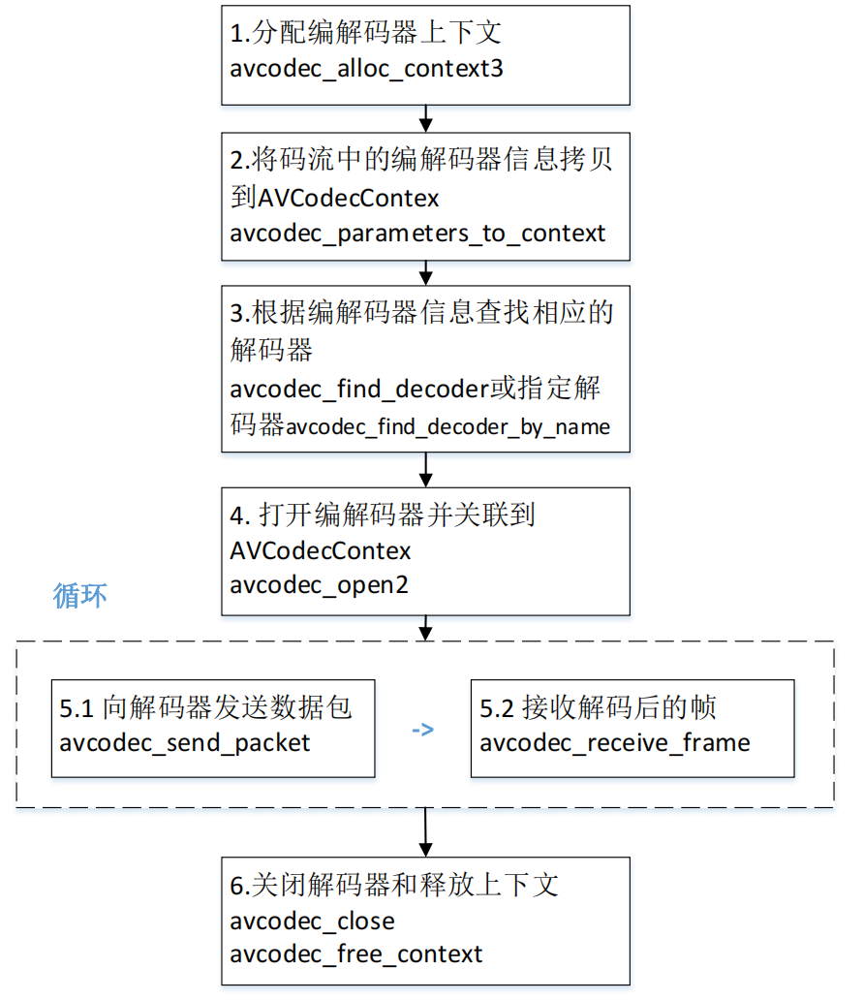
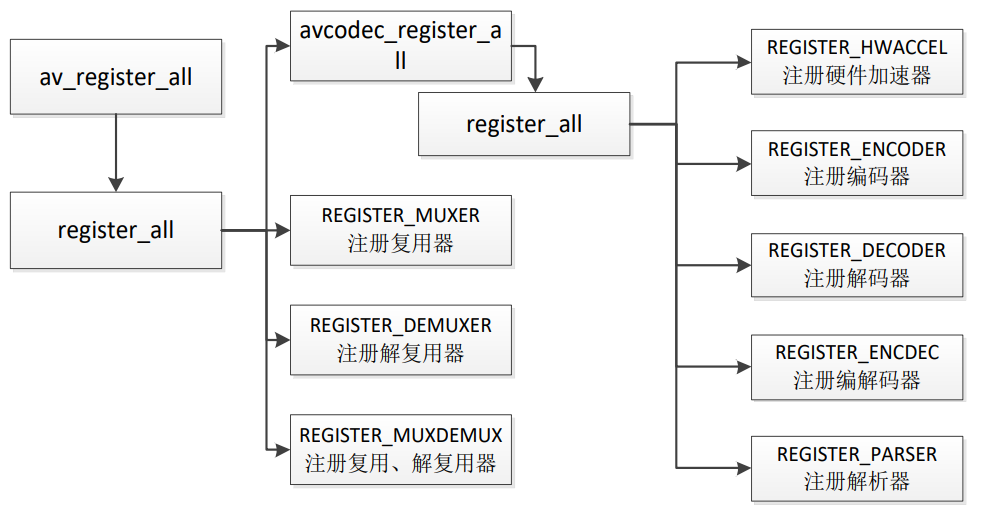
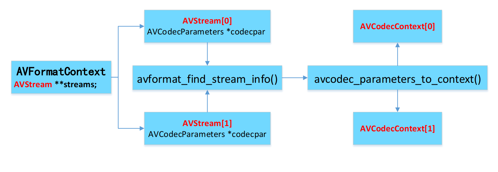
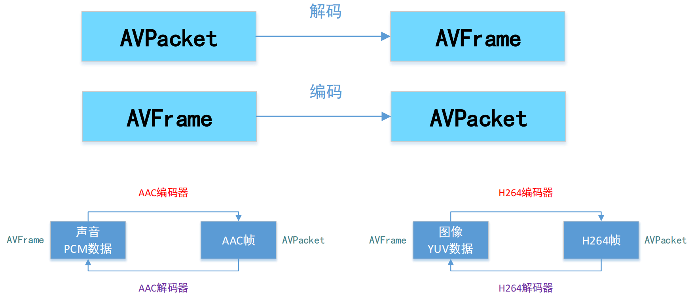

# FFmpeg编程入门


## 播放器框架

下面图中带有对应的ffmpeg函数：




## 常用音视频术语

- **容器／文件（Conainer/File）**：即特定格式的多媒体文件， 比如 mp4、flv、mkv 等。
- **媒体流（Stream）**：表示时间轴上的一段连续数据，如一 段**声音数据**、一段**视频数据**或一段**字幕数据**，可以是压缩的，也可以是非压缩的，压缩的数据需要关联特定的编解码器（有些码流音频他是纯PCM）。 
- **数据帧／数据包（Frame/Packet）**：通常，一个媒体流是由大量的数据帧组成的，对于压缩数据，帧对应着编解码器的最小处理单元，分属于不同媒体流的数据帧交错存储于容器之中。 
- **编解码器**：编解码器是以帧为单位实现压缩数据和原始数 据之间的相互转换的。

### 复用器




### 编解码器




## FFmpeg 库简介

### FFmpeg的整体结构



FFMPEG有 8 个常用库： 

- **AVUtil**：核心工具库，下面的许多其他模块都会依赖该库做一些基本的音视频处理操作。
- **AVFormat**：文件格式和协议库，该模块是最重要的模块之一，封装了 Protocol 层和 Demuxer、Muxer 层，使得协议和格式对于开发者来说是透明的。
- **AVCodec**：编解码库，封装了 Codec 层，但是有一些 Codec 是具备自己的 License 的，FFmpeg 是不会默认添加像 libx264、FDK-AAC等 库的，但是 FFmpeg 就像一个平台一样，可以将其他的第三方的 Codec 以插件的方式添加进来，然后为开发者提供统一的接口。
- **AVFilter**：音视频滤镜库，该模块提供了包括音频特效和视频特效的处理， 在使用 FFmpeg 的 API 进行编解码的过程中，直接使用该模块为音视频数据做特效处理是非常方便同时也非常高效的一种方式
- **AVDevice**：输入输出设备库，比如，需要编译出播放声音或者视频的工具 ffplay，就需要确保该模块是打开的，同时也需要 SDL 的预先编译，因为该设备模块播放声音与播放视频使用的都是 SDL 库。 
- **SwrRessample**：该模块可用于音频重采样，可以对数字音频进行声道数、数据格式、采样率等多种基本信息的转换。
- **SWScale**：该模块是将图像进行格式转换的模块，比如，可以将 YUV 的数据转换为 RGB 的数据，缩放尺寸由1280 * 720 变为 800 * 480。
- **PostProc**：该模块可用于进行后期处理，当我们使用 AVFilter 的时 候需要打开该模块的开关，因为 Filter 中会使用到该模块的一些基础函数。


### 函数简介

- avdevice_register_all(); 对设备进行注册，比如 V4L2 等。
- avformat_network_init(); 初始化网络库以及网络加密协议相关的库（比如openssl）

#### 封装格式相关

- **avformat_alloc_context()**; 负责申请一个 **AVFormatContext** 结构的内存,  并进行简单初始化 
- **avformat_free_context**();  释放该结构里的所有东西以及该结构本身 
- **avformat_close_input**();  关闭解复用器。关闭后就不再需要使用 avformat_free_context 进行释放。 
- **avformat_open_input**();  打开输入视频文件 
- **avformat_find_stream_info**()：获取音视频文件信息 
- **av_read_frame**(); 读取音视频包 
- **avformat_seek_file**(); 定位文件 
- **av_seek_frame**(): 定位文件

#### 调用：




### 解码器相关

- **avcodec_alloc_context3**():  分配解码器上下文 
- **avcodec_find_decoder**()：根据 ID 查找解码器 
- **avcodec_find_decoder_by_name**():  根据解码器名字查找解码器
- **avcodec_open2**()： 打开编解码器 
- **avcodec_parameters_to_context():** 将 `AVCodecParameters` 结构中的编解码参数拷贝到 `AVCodecContext` 结构。这个函数帮助初始化编解码器上下文，为后续的编解码操作做准备。
  - **AVCodecContext**：编解码过程中用于存储具体的编解码器上下文信息。来方便多路编解码。
- ~~**avcodec_decode_video2**()：解码一帧视频数据~~ 
- ~~**avcodec_decode_audio4**()：解码一帧音频数据~~ 
- **avcodec_send_packet**():  发送编码数据包 
- **avcodec_receive_frame**():  接收解码后数据 
- **vcodec_free_context**():  释放解码器上下文，包含了 avcodec_close() 
- **avcodec_close**():  关闭解码器

#### 调用：




## FFmpeg 3.x 组件注册方式

​		我们使用 ffmpeg，首先要执行 **`av_register_all`**，把全局的解码器、编码器等结构体注册到**各自全局的对象链表里**，以便后面查找调用。




## FFmpeg 4.x 组件注册方式

FFmpeg 内部去做，不需要用户调用 API 去注册。 以 codec 编解码器为例： 

1. 在 configure 的时候生成要注册的组件 
   `./configure:7203:print_enabled_components libavcodec/codec_list.c  AVCodec codec_list $CODEC_LIST` 

   这里会生成一个 codec_list.c 文件，里面只有 static const AVCodec *  const **codec_list**[] 数组。 

2. 在 **libavcodec/allcodecs.c** 将 static const AVCodec * const codec_list[] 的编解码器用链表的方式组织起来。


## FFmpeg 数据结构简介

#### AVFormat<u>Context</u> 

封装格式上下文结构体，也是统领全局的结构体，保存了视频文件封装格式相关信息。 

#### AVInputFormat demuxer 

每种封装格式（例如FLV, MKV, MP4, AVI）对应一个该结构体。 

#### AVOutputFormat muxer AVStream 

视频文件中每个视频（音频）流对应一个该结构体。 

#### AVCodec<u>Context</u> 

编解码器上下文结构体，保存了视频（音频）编解码相关信息。 

#### AVCodec 

每种视频（音频）编解码器(例如H.264解码器)对应一个该结构体。 

#### AVPacket 

存储一帧压缩编码数据。

####  AVFrame 

存储一帧解码后像素（采样）数据。


### FFmpeg 数据结构之间的关系

##### AVFormatContext 和 AVInputFormat 之间的关系

​	**AVFormatContext API调用** 
​	**AVInputFormat 主要是 FFMPEG 内部调用** 

```c++
AVFormatContext 封装格式上下文结构体 													 数  据
struct AVInputFormat * iformat; 

 
    
AVInputFormat 每种封装格式（例如FLV, MKV, MP4）可重入    							   方  法
int (*read_header)(struct AVFormatContext * ); 
int (*read_packet)(struct AVFormatContext *, AVPacket *pkt); 

int avformat_open_input(AVFormatContext **ps, const char *filename, AVInputFormat *fmt, AVDictionary **options)
```


##### AVFormatContext, AVStream和AVCodecContext之间的关系



##### 区分不同的码流

- AVMEDIA_TYPE_VIDEO视频流

  video_index = av_find_best_stream(ic, AVMEDIA_TYPE_VIDEO, -1,-1, NULL, 0)

- AVMEDIA_TYPE_AUDIO音频流

  audio_index = av_find_best_stream(ic, AVMEDIA_TYPE_AUDIO, -1,-1, NULL, 0)

AVPacket 里面也有一个**index**的字段


##### AVPacket和AVFrame之间的关系




### FFmpeg 数据结构分析

- **AVFormatContext**
  - iformat：输入媒体的AVInputFormat，比如指向AVInputFormat ff_flv_demuxer
  - **nb_streams**：输入媒体的 AVStream 个数
  - streams：输入媒体的 AVStream [] **数组**
  - duration：输入媒体的时长（以微秒为单位），计算方式可以参考 **av_dump_format()** 函数。
  - bit_rate：输入媒体的码率

- **AVInputFormat**
  - name：封装格式名称
  - extensions：封装格式的扩展名
  - id：封装格式ID
  - 一些封装格式处理的接口函数,比如 read_packet()

- **AVStream**
  - index：标识该视频/音频流
  - time_base：该流的时基，PTS * time_base= 真正的时间（秒）
  - avg_frame_rate： 该流的帧率
  - duration：该视频/音频流长度
  - codecpar：编解码器参数属性

- **AVCodecParameters**
  - codec_type：媒体类型，比如AVMEDIA_TYPE_VIDEO 
  - AVMEDIA_TYPE_AUDIO等
  - codec_id：编解码器类型， 比如AV_CODEC_ID_H264、AV_CODEC_ID_AAC等。

- **AVCodecContext**
  - codec：编解码器的AVCodec，比如指向AVCodec ff_aac_latm_decoder
  - width, height：图像的宽高（只针对视频）
  - pix_fmt：像素格式（只针对视频）
  - sample_rate：采样率（只针对音频）
  - channels：声道数（只针对音频）
  - sample_fmt：采样格式（只针对音频）

- **AVCodec**
  - name：编解码器名称
  - type：编解码器类型
  - id：编解码器ID
  - 一些编解码的接口函数，比如int (*decode)()

- **AVPacket**
  - pts：显示时间戳
  - dts：解码时间戳
  - data：压缩编码数据
  - size：压缩编码数据大小
  - pos:数据的偏移地址
  - stream_index：所属的 AVStream

- **AVFrame**
  - data：解码后的图像像素数据（音频采样数据）
  - linesize：对视频来说是图像中一行像素的大小；对音频来说是整个音频帧的大小
  - width, height：图像的宽高（只针对视频）
  - key_frame：是否为关键帧（只针对视频） 。
  - pict_type：帧类型（只针对视频） 。例如 I， P， B
  - sample_rate：音频采样率（只针对音频）
  - nb_samples：音频每通道采样数（只针对音频）
  - pts：显示时间戳


