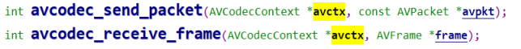
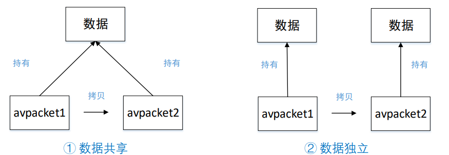
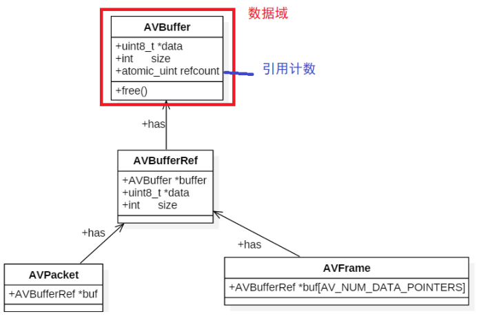
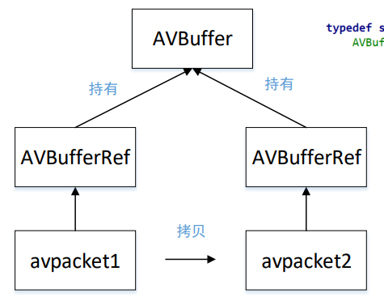

# FFmpeg 内存模型

由上图可知，在音视频解码时，会调用下面这两个函数：

问题： 

1. 从 av_read_frame 读取到一个 AVPacket 后怎么放入队列？ 

2. 从 avcodec_recevice_frame 读取到一个 AVFrame 后又怎么放入队列？

从现有的 Packet 拷贝一个新 Packet 的时候，有两种情况：

- 两个 Packet 的 buf 引用的是同一数据缓存空间，这时候要注意数据缓存空间的释放问题；
- 两个 Packet 的 buf 引用不同的数据缓存空间，每个 Packet 都有数据缓存空间的 copy；

针对数据共享，**AVBuffer** 中会有一个引用计数来记录持有的数量：

更精确的模型为：

- 对于多个AVPacket共享同一个缓存空间，FFmpeg 使用的引用计数的机制（reference-count）： 
  - **<u>初始化引用计数为 0，只有真正分配 AVBuffer 的时候， 引用计数初始化为 1;</u>** 
  - 当有新的Packet引用共享的缓存空间时，就将引用计数 +1； 
  - 当释放了引用共享空间的Packet，就将引用计数-1；引 用计数为0时，就释放掉引用的缓存空间AVBuffer。 
- AVFrame也是采用同样的机制。

# AVPacket 常用 API

| 函数原型                                               | 说明                                           |
| ------------------------------------------------------ | ---------------------------------------------- |
| AVPacket *av_packet_alloc(void);                       | 分配AVPacket 这个时候和buffer没有关系          |
| void av_packet_free(AVPacket **pkt);                   | 释放AVPacket 和_alloc对应                      |
| void av_init_packet(AVPacket *pkt);                    | 初始化AVPacket 只是单纯初始化pkt字段           |
| int av_new_packet(AVPacket *pkt, int size);            | 给AVPacket的buf分配内存，**引用计数初始化为1** |
| int av_packet_ref(AVPacket *dst, const AVPacket *src   | 增加引用计数                                   |
| void av_packet_unref(AVPacket *pkt);                   | 减少引用计数                                   |
| void av_packet_move_ref(AVPacket *dst, AVPacket *src); | 转移引用计数                                   |
| AVPacket *av_packet_clone(const AVPacket *src);        | 等于 av_packet_alloc()+av_packet_ref()         |

# AVFrame 常用 API

| 函数原型                                            | 说明                                 |
| --------------------------------------------------- | ------------------------------------ |
| AVFrame *av_frame_alloc(void);                      | 分配AVFrame                          |
| void av_frame_free(AVFrame **frame);                | 释放AVFrame                          |
| int av_frame_ref(AVFrame *dst, const AVFrame *src); | 增加引用计数                         |
| void av_frame_unref(AVFrame *frame);                | 减少引用计数                         |
| void av_frame_move_ref(AVFrame *dst, AVFrame *src); | 转移引用计数                         |
| int av_frame_get_buffer(AVFrame *frame, int align); | 根据AVFrame分配内存                  |
| AVFrame *av_frame_clone(const AVFrame *src);        | 等于 av_frame_alloc()+av_frame_ref() |

