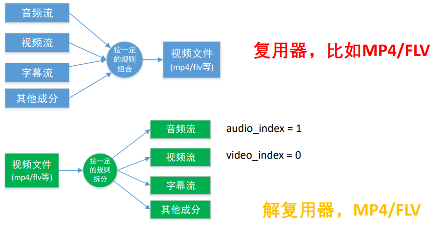
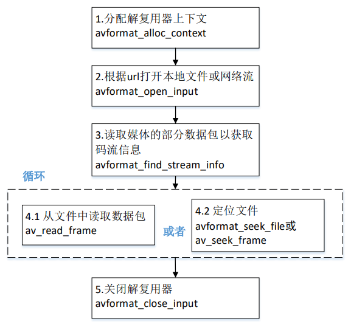

 

# 解封装



### 封装格式相关函数

- **avformat_alloc_context**(); 负责申请一个 **AVFormatContext** 结构的内存,并进行简单初始化 
- **avformat_free_context**(); 释放该结构里的所有东西以及该 结构本身 
- **avformat_close_input**(); 关闭解复用器。关闭后就不再需要使用avformat_free_context 进行释放。 
- **avformat_open_input**(); 打开输入视频文件 
- **avformat_find_stream_info**()：获取视频文件信息 
- **av_read_frame**();  读取音视频包 
- **avformat_seek_file**();  定位文件 
- **av_seek_frame**(): 定位文件


### 解封装流程



### FFmpeg 数据结构之间的关系

#### 区分不同的码流

- AVMEDIA_TYPE _VIDEO 视频流 
  `video_index = av_find_best_stream(ic, AVMEDIA_TYPE_VIDEO, -1,-1, NULL, 0)` 
- AVMEDIA_TYPE_AUDIO 音频流 
  `audio_index = av_find_best_stream(ic, AVMEDIA_TYPE_AUDIO, -1,-1, NULL, 0)`

AVPacket 里面也有一个 index 的字段


​		**`avformat_open_input`** 和 **`avformat_find_stream_info`** 分别用于**打开一个流**和**分析流信息**。 在初始信息不足的情况下（比如 FLV 和 H264 文件）， **`avformat_find_stream_info`** 接口需要在内部调用 **`read_frame_internal`** 接口读取流数据（音视频帧），然后再分析后，设置核心数据结构 AVFormatContext 。 

​		由于需要读取数据包，**`avformat_find_stream_info`** 接口会带来很大的延迟。


# 解封装代码

```c++
extern "C" {
#include <libavutil/avutil.h>
#include <libavformat/avformat.h>
}


void funcDemux() {
  std::string filename = "believe.mp4";

  //AVFormatContext 是描述一个媒体文件或媒体流的构成和基本信息的结构体
  AVFormatContext * pFormatCtx = NULL; //输入文件的demux

  int videoindex = -1; //视频流索引
  int audioindex = -1; //音频流索引

  //打开文件
  int ret = avformat_open_input(&pFormatCtx, filename.c_str(), NULL, NULL);
  if (ret != 0) {
    std::cout << "[error] avformat_open_input open failed :" << ret << std::endl;
    return;
  }

  ret = avformat_find_stream_info(pFormatCtx, NULL);
  if (ret != 0) {
    std::cout << "[error] avformat_find_stream_info failed :" << ret << std::endl;
    return;
  }

  std::cout << "open file success" << std::endl;
  av_dump_format(pFormatCtx, 0, filename.c_str(), 0);

  std::cout << std::endl;
  std::cout << "dump format========:" << std::endl;
  std::cout << "medianame(媒体名称)        :" << pFormatCtx->url << std::endl;
  std::cout << "nb_streams(流媒体数量)     :" << pFormatCtx->nb_streams << std::endl;
  std::cout << "bit_rate(比特率)           :" << pFormatCtx->bit_rate << std::endl;
  std::cout << "media average rate(码率)   :" << pFormatCtx->bit_rate / 1024 << "kbps" << std::endl;
  std::cout << "format name(封装格式名称)  :" << pFormatCtx->iformat->name << std::endl;
  std::cout << "duration(时长)             :" << (pFormatCtx->duration/AV_TIME_BASE)/3600 << "h"
                                              << ((pFormatCtx->duration/AV_TIME_BASE)%3600)/60 << "m"
                                              << ((pFormatCtx->duration/AV_TIME_BASE)%3600)%60 << "s" 
                                              << std::endl;

  std::cout << std::endl;
  std::cout << "---------start read [stream]-------" << std::endl;
  std::cout << std::endl;
  for (uint32_t i = 0; i < pFormatCtx->nb_streams; ++i) {
    AVStream* stream = pFormatCtx->streams[i];
    std::cout << "--------------------------------" << std::endl;
    if (AVMEDIA_TYPE_AUDIO == stream->codecpar->codec_type) {
      audioindex = i;
      std::cout << "read audio info========:" << std::endl;
      std::cout << "frame index(index)              :" << stream->index << std::endl;
      std::cout << "audio sample rate(采样率)       :" << stream->codecpar->sample_rate << std::endl;
      std::cout << "audio channels(通道数)          :" << stream->codecpar->channels << std::endl;
      std::cout << "audio bit rate(比特率)          :" << stream->codecpar->bit_rate << std::endl;
      std::cout << "audio frame size(帧长)          :" << stream->codecpar->frame_size << std::endl;
      std::cout << "audio codec name(压缩编码格式)  :" << avcodec_get_name(stream->codecpar->codec_id) << std::endl;
      std::cout << "audio codec format(格式)        :" << av_get_sample_fmt_name((AVSampleFormat)stream->codecpar->format) << std::endl;
      if (stream->duration != AV_NOPTS_VALUE) {
        int duration = stream->duration * av_q2d(stream->time_base);
        std::cout << "audio duration(时长)            :" << (duration) / 3600 << "h"
                                                         << ((duration) % 3600) / 60 << "m"
                                                         << ((duration) % 3600) % 60 << "s"
                                                         << std::endl;
      }
      else {
        std::cout << "audio duration(时长)            :" << "unknown" << std::endl;
      }
    } else if (AVMEDIA_TYPE_VIDEO == stream->codecpar->codec_type) {
      videoindex = i;
      std::cout << "read video info========:" << std::endl;
      std::cout << "frame index(index)              :" << stream->index << std::endl;
      std::cout << "video fps                       :" << av_q2d(stream->avg_frame_rate) << std::endl;
      std::cout << "video width(宽,高)              :" << stream->codecpar->width << "," << stream->codecpar->height << std::endl;
      std::cout << "video bit rate(比特率)          :" << stream->codecpar->bit_rate << std::endl;
      std::cout << "video codec name(压缩编码格式)  :" << avcodec_get_name(stream->codecpar->codec_id) << std::endl;
      if (stream->duration != AV_NOPTS_VALUE) {
        int duration = stream->duration * av_q2d(stream->time_base);
        std::cout << "audio duration(时长)            :" << (duration) / 3600 << "h"
                                                         << ((duration) % 3600) / 60 << "m"
                                                         << ((duration) % 3600) % 60 << "s"
                                                         << std::endl;
      }
      else {
        std::cout << "audio duration(时长)            :" << "unknown" << std::endl;
      }
    } else {
      std::cout << "read other stream" << std::endl;
    }
    std::cout << std::endl;
  }

  std::cout << std::endl;
  std::cout << "---------start read frame-------" << std::endl;
  std::cout << std::endl;

  AVPacket *packet = av_packet_alloc();
  while (av_read_frame(pFormatCtx, packet) >= 0) {
    if (packet->stream_index == videoindex) {
      std::cout << "read video frame======" << std::endl;
      std::cout << "frame pts(时间戳)              :" << packet->pts << std::endl;
      std::cout << "frame dts(解码时间戳)          :" << packet->dts << std::endl;
      std::cout << "frame duration(帧时长s)        :" << packet->duration * av_q2d(pFormatCtx->streams[packet->stream_index]->time_base) << std::endl;
      std::cout << "frame size(帧大小)             :" << packet->size << std::endl;
      std::cout << "frame pos(帧在文件中的位置)    :" << packet->pos << std::endl;
      std::cout << "frame flags(标志)              :" << packet->flags << std::endl;
    } else if (packet->stream_index == audioindex) {
      std::cout << "read audio frame======" << std::endl;
      std::cout << "frame pts(时间戳)              :" << packet->pts << std::endl;
      std::cout << "frame dts(解码时间戳)          :" << packet->dts << std::endl;
      std::cout << "frame duration(帧时长s)        :" << packet->duration * av_q2d(pFormatCtx->streams[packet->stream_index]->time_base) << std::endl;
      std::cout << "frame size(帧大小)             :" << packet->size << std::endl;
      std::cout << "frame pos(帧在文件中的位置)    :" << packet->pos << std::endl;
      std::cout << "frame flags(标志)              :" << packet->flags << std::endl;
    } else {
      std::cout << "read other frame" << std::endl;
    }
    std::cout << std::endl;
    av_packet_unref(packet);
  }

  if (packet){
    av_packet_free(&packet);
  }
}

```


