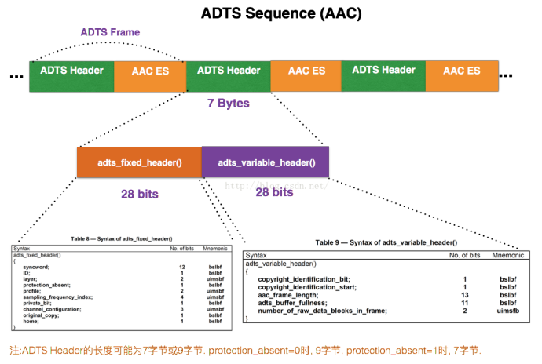

# AAC ADTS 格式分析

**AAC 音频格式**：**Advanced Audio Coding(⾼级音频解码)**，是⼀种由 MPEG-4 标准定义的有损⾳频压缩格式，由Fraunhofer 发展，Dolby, Sony 和 AT&T 是主要的贡献者。

- **ADIF**：Audio Data Interchange Format 音频数据交换格式。这种格式的特 征是可以确定的找到这个⾳频数据的开始，不需进⾏在⾳频数据流中间开始 的解码，即它的解码必须在明确定义的开始处进行。故这种格式常⽤在磁盘 ⽂件中。 
- **ADTS**：ADTS的全称是Audio Data Transport Stream。是AAC⾳频的传输流格 式。AAC 音频格式在MPEG-2（ISO-13318-7 2003）中有定义。AAC 后来又被采用到 MPEG-4 标准中。这种格式的特征是它是⼀个有同步字的比特流，解码可以在这个流中任何位置开始。它的特征类似于mp3数据流格式。 

​        简单说，ADTS 可以在任意帧解码，也就是说它**<u>每⼀帧都有头信息</u>**。ADIF 只有⼀个统⼀的头，所以必须得到所有的数据后解码。

​		且这两种的 header 的格式也是不同的，⽬前⼀般编码后的和抽取出的都是 ADTS 格式的⾳频流。两者具体的组织结构如下所示：

- AAC的ADIF格式⻅下图：
   

- AAC的ADTS的⼀般格式⻅下图： 
  

  空⽩处表示前后帧 

​        有的时候当你编码 AAC 裸流的时候，会遇到写出来的 AAC ⽂件并不能在 PC 和⼿机上播放，很⼤的可能就是AAC ⽂件的每⼀帧⾥缺少了 ADTS 头信息⽂件的包装 拼接。

​		只需要加⼊头⽂件 ADTS 即可。⼀个 AAC 原始数据块⻓度是可变的，对原始帧加 上 ADTS 头进⾏ ADTS 的封装，就形成了 ADTS 帧。

​		**<u>AAC⾳频⽂件的每⼀帧由 ADTS Header 和 AAC Audio Data 组成</u>**。结构体如下：



​		每⼀帧的 ADTS 的头⽂件都包含了⾳频的采样率，声道，帧⻓度等信息，这样解码器才能解析读取。

⼀般情况下 ADTS 的头信息都是 7 个字节，分为 2 部分： 

- **adts_fixed_header();** 
- **adts_variable_header();** 

​        其⼀为**固定头信息**，紧接着是**可变头信息**。<u>固定头信息中的数据每⼀帧都相同，⽽可变头信息则在帧与帧之间可变。</u>

### 固定头信息


**syncword** ：同步头总是 0xFFF, all bits must be 1，**代表着⼀个 ADTS 帧的开始** 

**ID**：MPEG 标识符，0 标识 MPEG-4，1 标识 MPEG-2 

**Layer**：always: '00' 

**protection_absent**：表示是否误码校验。Warning, set to 1 if there is no CRC and 0 if there is CRC 

**profile**：表示使⽤哪个级别的 AAC，如 01 Low Complexity(LC)--- AAC LC。有些芯⽚只⽀持 AAC LC 。
	在**MPEG-2 AAC**中定义了3种：


​	profile 的值等于 Audio Object Type(下图) 的值减 1 
​	`profile = MPEG-4 Audio Object Type - 1`


**sampling_frequency_index**：表示使⽤的采样率下标，通过这个下标在 Sampling Frequencies[ ]数组中查找得知采样率的值。


**channel_configuration**: 表示声道数，⽐如2表示⽴体声双声道


### 可变头信息


**frame_length** : **⼀个 ADTS 帧的⻓度包括 ADTS 头和 AAC 原始流.** 
frame length, this value must include 7 or 9 bytes of header length: 
aac_frame_length = (protection_absent == 1 ? 7 : 9) + size(AACFrame) 
protection_absent=0时, header length=9bytes 
protection_absent=1时, header length=7bytes

**adts_buffer_fullness**：0x7FF 说明是码率可变的码流。 
	number_of_raw_data_blocks_in_frame：表示 ADTS 帧中有 
	number_of_raw_data_blocks_in_frame + 1 个 AAC 原始帧。 
所以说 number_of_raw_data_blocks_in_frame == 0 表示说 ADTS 帧中有⼀个 AAC 数据块。


下⾯是ADTS的AAC⽂件部分： **⾼字节开始**


### 生成代码：

```c++

void funcExtractAAC() {
  std::string input_filename = "believe.mp4";
  std::string output_filename = "out.aac";

  AVFormatContext * pFormatCtx = NULL; //输入文件的demux

  int ret = avformat_open_input(&pFormatCtx, input_filename.c_str(), NULL, NULL);
  if (ret != 0) {
    std::cout << "[error] open input failed";
    return;
  }

  ret = avformat_find_stream_info(pFormatCtx, NULL);
  if (ret != 0) {
    std::cout << "[error] find stream info failed";
    return;
  }

  av_dump_format(pFormatCtx, 0, input_filename.c_str(), 0);

  int audio_index = av_find_best_stream(pFormatCtx, AVMEDIA_TYPE_AUDIO, -1, -1, NULL, 0);

  if (audio_index < 0) {
    std::cout << "[error] cant find audio stream";
    return;
  }

  std::cout << std::endl;
  std::cout << "find a audio stream index:" << audio_index << std::endl;
  auto audio_stream = pFormatCtx->streams[audio_index];
  std::cout << "info:" << std::endl;
  std::cout << "采样率:" << audio_stream->codecpar->sample_rate << std::endl;
  std::cout << "type:" << av_get_media_type_string(audio_stream->codecpar->codec_type) << std::endl;
  std::cout << "压缩编码格式  :" << avcodec_get_name(audio_stream->codecpar->codec_id) << std::endl;
  std::cout << "audio profile  :" << audio_stream->codecpar->profile<< std::endl;

  if (audio_stream->codecpar->codec_id != AV_CODEC_ID_AAC) {
    std::cout << "[error] is not aac";
    return;
  }

  std::ofstream  output_s;
  output_s.open(output_filename, std::ios::binary);

  AVPacket* pakt = av_packet_alloc();
  while (av_read_frame(pFormatCtx, pakt) >= 0) {
    if (pakt->stream_index == audio_index) {
      //写入head
      char head[7] = { 0 };
      int adtsLen = pakt->size + 7;
      head[0] = 0xFF;//syncword  高8bits

      head[1] = 0xf0;         //syncword:0xfff                          低 4 bits
      head[1] |= (0 << 3);        //MPEG Version:0 for MPEG-4,1 for MPEG-2  1 bit
      head[1] |= (0 << 1);    //Layer:0                                 2 bits
      head[1] |= 1;           //protection absent:1                     1 bit

      head[2] = (audio_stream->codecpar->profile) << 6;            //profile:profile               2bits
      head[2] |= (3 & 0x0f) << 2; //sampling frequency index:sampling_frequency_index  4bits
      head[2] |= (0 << 1);             //private bit:0                   1bit
      head[2] |= (audio_stream->codecpar->channels & 0x04) >> 2; //channel configuration:channels  高1bit

      head[3] = (audio_stream->codecpar->channels & 0x03) << 6; //channel configuration:channels 低2bits
      head[3] |= (0 << 5);               //original：0                1bit
      head[3] |= (0 << 4);               //home：0                    1bit
      head[3] |= (0 << 3);               //copyright id bit：0        1bit
      head[3] |= (0 << 2);               //copyright id start：0      1bit
      head[3] |= ((adtsLen & 0x1800) >> 11);           //frame length：value   高2bits

      head[4] = (uint8_t)((adtsLen & 0x7f8) >> 3);     //frame length:value    中间8bits
      head[5] = (uint8_t)((adtsLen & 0x7) << 5);       //frame length:value    低3bits
      head[5] |= 0x1f;                                 //buffer fullness:0x7ff 高5bits
      head[6] = 0xfc;      //11111100       //buffer fullness:0x7ff 低6bits
      // number_of_raw_data_blocks_in_frame：
      //    表示ADTS帧中有number_of_raw_data_blocks_in_frame + 1个AAC原始帧。


      output_s.write(head, 7);// 写adts header , ts流不适用，ts流分离出来的packet带了adts header

      char buf[1024] = { 0 };
      memcpy(buf,pakt->data, pakt->size);
      output_s.write(buf, pakt->size);   // 写adts data
      output_s.flush();
    }
  }
  av_packet_free(&pakt);
  output_s.close();

}
```


