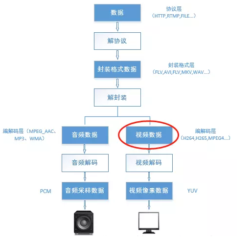
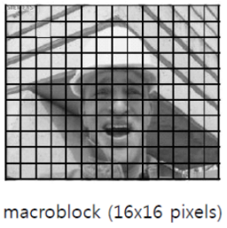
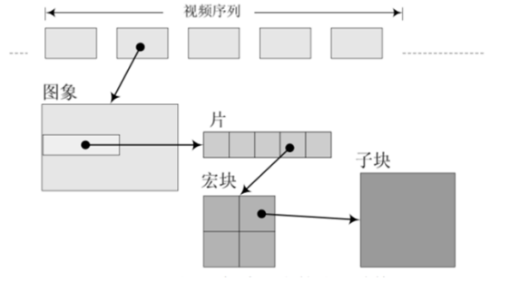
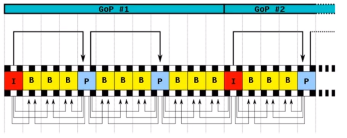
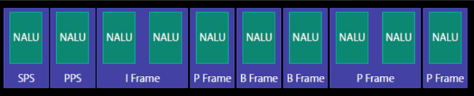
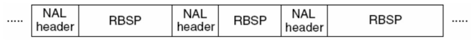
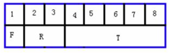
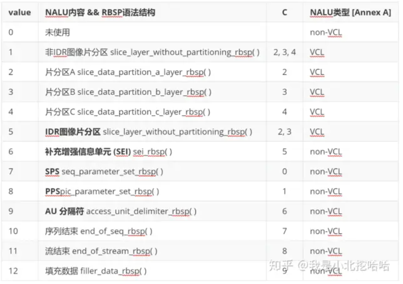

# H264 NALU分析

### NALU(Network Abstract Layer Unit)

⾳视频编码在流媒体和⽹络领域占有重要地位；流媒体编解码流程⼤致如下图所示：




## H264 简介

​		H.264 从 1999 年开始，到 2003 年形成草案，最后在 2007 年定稿有待核实。在 ITU 的标准⾥称为 H.264，在 MPEG 的标准⾥是 MPEG-4 的⼀个组成部分 – MPEG-4 Part 10，⼜叫 Advanced Video Codec，**因此常常称为MPEG-4 AVC 或直接叫 AVC。**

​		H.264/AVC项目的目的是为了创建一个比以前的视频压缩标准，在更低的比特率的情况下依然能够提供良好视频质量的标准（如，一半或者更少于MPEG-2,H.263,或者MPEG-4 Part2 ）。同时，还要不会太大的增加设计的复杂性。 优势： 1）网络亲和性，即可适用于各种传输网络 2）高的视频压缩比，当初提出的指标是比 H.263，MPEG-4，约为它们的 2 倍，现在都已基本实现;


## H264 编解码解析

### H264 编码原理

​		在⾳视频传输过程中，视频⽂件的传输是⼀个极⼤的问题；⼀段分辨率为 1920 * 1080，每个像素点为 RGB 占⽤ 3 个字节，帧率是 25 的视频，对于传输带宽的要求是： 

​		`1920 * 1080 * 3 * 25 / 1024/1024=148.315MB/s`

换成 bps 则意味着视频每秒带宽为 1186.523 Mbps，这样的速率对于⽹络存储是不可接受的。因此视频压缩和编码技术应运而生。

​		对于视频⽂件来说，视频由单张图⽚帧所组成，⽐如每秒 25 帧，但是图⽚帧的像素块之间存在相似性，因此视频帧图像可以进⾏图像压缩；H264 采⽤了 16*16 的分块⼤⼩对，视频帧图像 进⾏相似⽐较和压缩编码。如下图所示：



### H264 中的 I 帧、P 帧和 B 帧

​		H264 使⽤帧内压缩和帧间压缩的⽅式提⾼编码压缩率；H264 采⽤了独特的 I 帧、P 帧和 B 帧策略来实现，连续帧之间的压缩:


如上图所示:

| 帧的分类 | 中⽂                                                         | 意义                                                         |
| -------- | ------------------------------------------------------------ | ------------------------------------------------------------ |
| I帧      | 帧内编码帧 intra picture                                     | I 帧通常是每个 GOP（MPEG 所使⽤的⼀种视频压缩技术） 的第⼀个帧，经过适度地压缩，做为随机访问的参考点，可 以当成图象。I帧可以看成是⼀个图像经过压缩后的产物。 <br />**⾃身可以通过视频解压算法解压成⼀张单独的完整的图⽚。** |
| P帧      | 前向预测编码帧 predictive-frame                              | 通过充分将低于图像序列中前⾯已编码帧的时间冗余信息来 压缩传输数据量的编码图像，也叫预测帧。<br /> **需要参考其前⾯的⼀个I frame 或者P frame来⽣成⼀张完整的图⽚。** |
| B帧      | 双向预测帧 <br />bi-directional interpolated prediction frame | 既考虑与源图像序列前⾯已编码帧，也顾及源图像序列后⾯已编码帧之间的时间冗余信息来压缩传输数据量的编码图像, 也叫双向预测帧。 <br />**则要参考其前⼀个I或者P帧及其后⾯的⼀个P帧来⽣成⼀张完整的图⽚。** |
| aaaaaaaa | aaaaaaaaaaaaaaaa                                             |                                                              |

**压缩率 B > P > I**


### H264 编码结构解析

​		H264 除了实现了对视频的压缩处理之外，为了⽅便⽹络传输，提供了对应的视频编码和分⽚策略；类似于⽹络数据封装成 IP 帧，在 H264 中将其称为**组(GOP, group of pictures)**、**⽚ （slice）**、**宏块（Macroblock）**这些⼀起组成了 H264 的码流分层结构；H264 将其组织成为**序列(GOP)**、**图⽚(pictrue)**、**⽚(Slice)**、**宏块(Macroblock)**、**⼦块(subblock)**五个层次。 GOP （图像组）主要⽤作形容⼀个 IDR 帧到下⼀个 IDR 帧之间的间隔了多少个帧。



H264 将视频分为连续的帧进⾏传输，在连续的帧之间使用 I 帧、P 帧和 B 帧。同时对于帧内⽽⾔，将图像分块为⽚、宏块和字块进⾏分⽚传输；通过这个过程实现对视频⽂件的压缩包装。


#### IDR（Instantaneous Decoding Refresh，即时解码刷新）

​		**⼀个序列的第⼀个图像叫做 IDR 图像**（⽴即刷新图像），IDR 图像都是 I 帧图像。 I 和 IDR 帧都使用帧内预测。I 帧不用参考任何帧，但是之后的 P 帧和 B 帧是有可能参考这个 I 帧之前的帧的。IDR 就不允许这样。比如（解码的顺序）：

- IDR1 P4 B2 B3 P7 B5 B6 **I10** B8 B9 P13 B11 B12 P16 B14 B15 这⾥的 B8 可以跨过 I10 去参考 P7 
  原始图像： IDR1 B2 B3 P4 B5 B6 P7 B8 B9 I10
- IDR1 P4 B2 B3 P7 B5 B6 IDR8 P11 B9 B10 P14 B11 B12 这⾥的 B9 就只能参照 IDR8 和 P11，不可以参考IDR8 前⾯的帧

其核⼼作⽤是，是为**<u>了解码的重同步，当解码器解码到 IDR 图像时，⽴即将参考帧队列清空，将已解码的数据全部输出或抛弃，重新查找参数集，开始⼀个新的序列</u>**。这样，如果前⼀个序列出现重⼤错误，在这⾥可以获得重新同步的机会。**<u>IDR 图像之后的图像永远不会使⽤ IDR 之前的图像的数据来解码。</u>**

下⾯是⼀个H264码流的举例（从码流的帧分析可以看出来B帧不能被当做参考帧）：




### NALU



**SPS**：序列参数集，SPS中保存了⼀组编码视频序列(Coded video sequence)的全局参数。 

**PPS**：图像参数集，对应的是⼀个序列中某⼀幅图像或者某⼏幅图像的参数。 

**I 帧**：帧内编码帧，可独⽴解码⽣成完整的图⽚。 

**P 帧**: 前向预测编码帧，需要参考其前⾯的⼀个I 或者B 来⽣成⼀张完整的图⽚。 

**B 帧**: 双向预测内插编码帧，则要参考其前⼀个I或者P帧及其后⾯的⼀个P帧来⽣成⼀张完整的 图⽚。 

<u>发 I 帧之前，⾄少要发⼀次 SPS 和 PPS。</u>


#### NALU结构

​		H.264 原始码流(裸流)是由⼀个接⼀个 NALU 组成，它的功能分为两层，VCL (视频编码层)和 NAL (⽹络提取层)：

- **VCL (视频编码层)**：包括核⼼压缩引擎和块，宏块和⽚的语法级别定义，设计⽬标是尽可能地独⽴于⽹络进⾏⾼效的编码； 
- **NAL (⽹络提取层)**：负责将 VCL 产⽣的⽐特字符串适配到各种各样的⽹络和多元环境中，覆盖了所有⽚级 以上的语法级别

在 VCL 进⾏数据传输或存储之前，这些编码的 VCL 数据，被映射或封装进 NAL 单元。

**<u>⼀个 NALU = ⼀组对应于视频编码的 NALU 头部信息 + ⼀个原始字节序列负荷(RBSP,Raw Byte Sequence Payload).</u>**

​		NALU结构单元的主体结构如下所示；⼀个原始的 H.264 NALU单元通常由 **[StartCode] [NALU Header] [NALU Payload]** 三部分组成，其中 **[StartCode]** ⽤于标示这是⼀个 NALU 单元的开始，必须是 "00 00 00 01" 或 "00 00 01"，除此之外基本相当于⼀个 NAL header + RBSP ：



（对于 FFmpeg 解复⽤后，MP4 ⽂件读取出来的 packet 是不带 startcode，但 TS ⽂件读取出来的 packet 带了 startcode）


#### 解析 NALU

​		每个 NAL 单元是⼀个⼀定语法元素的可变⻓字节字符串，包括包含**⼀个字节的头信息**（⽤来表示数据类型），以及若⼲整数字节的**负荷数据**。

NALU 头信息（⼀个字节）：



其中： 

- T 为负荷**数据类型**，占 5 bit 
  nal_unit_type：这个 NALU 单元的类型,1～12 由 H.264 使⽤，24～31 由 H.264 以外的应⽤使⽤ 
- R 为重要性指示位，占 2 bit 
  nal_ref_idc.：取 00~11,似乎指示这个 NALU 的重要性,如 00 的 NALU 解码器可以丢弃它⽽不影响图像的回放, 0～3，取值越⼤，表示当前 NAL 越重要，需要优先受到保护。如果当前 NAL 是属于参考帧的⽚，或是序列参数集，或是图像参数集这些重要的单位时，本句法元素必需⼤于 0。 
- 最后的 F 为禁⽌位，占 1bit 
  forbidden_zero_bit： 在 H.264 规范中规定了这⼀位必须为 0.

H.264 标准指出，当数据流是储存在介质上时，在每个 NALU 前添加起始码：0x000001 或 0x00000001，⽤来指示⼀个 NALU 的起始和终⽌位置：

- 在这样的机制下，在码流中检测起始码，作为⼀个NALU得起始标识，当检测到下⼀个起始 码时，当前NALU结束。 
- 3字节的0x000001只有⼀种场合下使⽤，就是⼀个完整的帧被编为多个slice（⽚）的时 候，包含这些slice的NALU 使⽤3字节起始码。其余场合都是4字节0x00000001的。


例⼦：

0x00 00 00 01 67 … 

0x00 00 00 01 68 … 

0x00 00 00 01 65 … 

**67**： ⼆进制：0110 0111 , 低 5 位为 00111 = 7（⼗进制），nal_unit_type = 7

nal_unit_type 的定义：




### H264 annexb 模式

H264有两种封装

- ⼀种是annexb模式，传统模式，有startcode，SPS和PPS是在ES中 
- ⼀种是mp4模式，⼀般mp4 mkv都是mp4模式，没有startcode，SPS和PPS以及其它信息被封装在container中，每⼀个frame前⾯4个字节是这个frame的⻓度

很多解码器只⽀持 annexb 这种模式，因此需要将 mp4 做转换：在 ffmpeg 中⽤ h264_mp4toannexb_filter 可以做转换

实现：

```c++
 const AVBitStreamFilter *bsfilter = av_bsf_get_by_name("h264_mp4toannexb");
 AVBSFContext *bsf_ctx = NULL;
 // 2 初始化过滤器上下⽂
 av_bsf_alloc(bsfilter, &bsf_ctx); //AVBSFContext;
 // 3 添加解码器属性
 avcodec_parameters_copy(bsf_ctx->par_in, ifmt_ctx->streams[videoindex]->cod
ecpar);
 av_bsf_init(bsf_ctx);
```


