# FLV 格式分析

​		FLV(Flash Video) 是 Adobe 公司推出的⼀种流媒体格式，由于其封装后的<u>⾳视频⽂件体积 ⼩、封装简单</u>等特点，⾮常适合于互联⽹上使⽤。⽬前主流的视频⽹站基本都⽀持FLV。采⽤ FLV格式封装的⽂件后缀为.flv。

​		FLV 封装格式是由⼀个**⽂件头(file header)**和**⽂件体(file Body)**组成。其中，FLV body 由⼀对对的（Previous Tag Size 字段 + tag）组成。Previous Tag Size 字段排列在 Tag 之前，占⽤ 4 个字节。Previous Tag Size 记录了前⾯⼀个 Tag 的⼤⼩，⽤于逆向读取处理。FLV header 后的第⼀个 Pervious Tag Size 的值为 0。

⼀个标准 FLV 文件结构如下图：

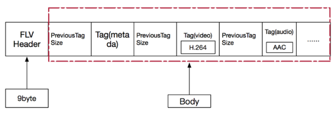

FLV 文件的详细内容结构如下图：

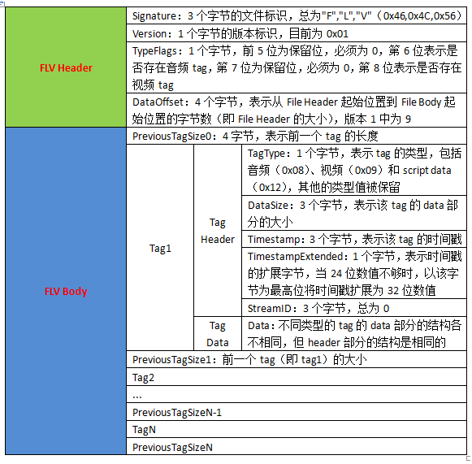

​		Tag ⼀般可以分为 3 种类型：脚本(帧)数据类型、⾳频数据类型、视频数据。FLV 数据以大端序进行存储，在解析时需要注意。

## 大体的解析框架

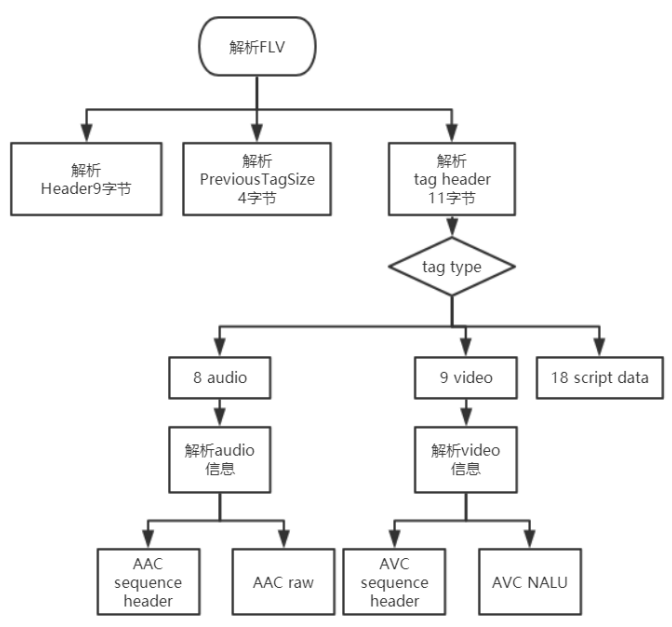

## FLV header

​		FLV 头占 9 个字节，⽤来标识⽂件为 FLV 类型，以及后续存储的⾳视频流。⼀个 FLV ⽂件，每种类型的 tag 都属于⼀个流，也就是⼀个 flv ⽂件最多只有⼀个⾳频流，⼀个视频流，不存在多个 独⽴的⾳视频流在⼀个⽂件的情况。

FLV 头的结构如下：

| Field         | Type     | Comment                                                      |
| ------------- | -------- | ------------------------------------------------------------ |
| 签名          | UI8      | 'F'(0x46)                                                    |
| 签名          | UI8      | 'L'(0x4C)                                                    |
| 签名          | UI8      | 'V'(0x56)                                                    |
| 版本          | UI8      | FLV的版本。0x01表示FLV版本为1                                |
| 保留字段      | UB5      | 前五位都为0                                                  |
| ⾳频流标识    | UB1      | 是否存在⾳频流                                               |
| 保留字段      | UB1      | 为0                                                          |
| 视频流标识    | UB1      | 是否存在视频流                                               |
| ⽂件头⼤⼩    | UI32     | FLV版本1时填写9，表明的是FLV头的⼤⼩，为后期的 FLV版本扩展使⽤。包括这四个字节。数据的起始位置 就是从⽂件开头偏移这么多的⼤⼩。 |
| aaaaaaaaaaaaa | aaaaaaaa |                                                              |

> 注：在上⾯的数据 type 中，UI 表示⽆符号整形，后⾯跟的数字表示其⻓度是多少位。⽐如 UI8，表示⽆符号整形，⻓度⼀个字节。UI24 是三个字节, UI[8*n] 表示多个字节。UB 表示位域，UB5 表示⼀个字节的 5 位。可以参考 c 中的位域结构体。

## FLV Body

​		FLV Header 之后，就是 FLV File Body。FLV File Body 是由⼀连串的 back-pointers + tags 构成。 Back-pointer 表示 Previous Tag Size （前⼀个 tag 的字节数据⻓度），占 4 个字节。

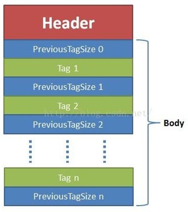

### FLV Tag

​		每⼀个 Tag 也是由两部分组成: tag header 和 tag data。Tag Header ⾥存放的是当前 tag 的类型、数据区(tag data) 的⻓度等信息。

#### tag header

​		tag header ⼀般占 11 个字节的内存空间。FLV tag 结构如下：

| Field                          | Type | Comment                                                      |
| ------------------------------ | ---- | ------------------------------------------------------------ |
| Tag类型 Type                   | UI8  | **8:audeo 9:video 18:Script data(脚本数据)** all Others:reserved 其他所有值未使⽤ |
| 数据区⼤⼩                     | UI24 | 当前tag的数据域的⼤⼩，不包含 tag header。 Length of the data in the Data field |
| 时间戳Timestamp                | UI24 | 当前帧时戳，单位是毫秒。相对值，第⼀个tag的时戳总是为 0      |
| 时戳扩展字段 TimestampExtended | UI8  | 如果时戳⼤于 0xFFFFFF，将会使⽤这个字节。**<u>这个字节是时戳的⾼ 8位，上⾯的三个字节是低 24 位。</u>** |
| StreamID                       | UI24 | 总是为 0                                                     |
| 数据域                         |      | 数据域数据                                                   |

注意： 

1. flv ⽂件中 Timestamp 和 TimestampExtended 拼出来的是 dts。也就是解码时间。 Timestamp 和TimestampExtended 拼出来 dts 单位为 ms。(如果不存在 B 帧，当然 dts 等于 pts) 
2. CompositionTime 表示 PTS 相对于 DTS 的偏移值， 在每个视频 tag 的第 14~16 字节， 。 

显示时间(pts) = 解码时间（tag的第5~8字节） + CompositionTime CompositionTime 的单位也是ms

#### Tag Data

##### Script Tag Data结构(脚本类型、帧类型)

​		**Script data 脚本数据**就是描述视频或⾳频的信息的数据，如宽度、⾼度、时间等等，⼀个文件中通常只有⼀个元数据，⾳频 tag 和视频 tag 就是⾳视频信息了，采样、声道、频率，编码等信息。

​		该类型 Tag ⼜被称为 MetaData Tag，存放⼀些关于 FLV 视频和⾳频的元信息，⽐如：duration、width、 height 等。通常该类型 Tag 会作为 FLV ⽂件的第⼀个 tag，并且只有⼀个，跟在 File Header 后。该类型 Tag DaTa 的结构如下所示（source.200kbps.768x320.flv⽂件为例）:

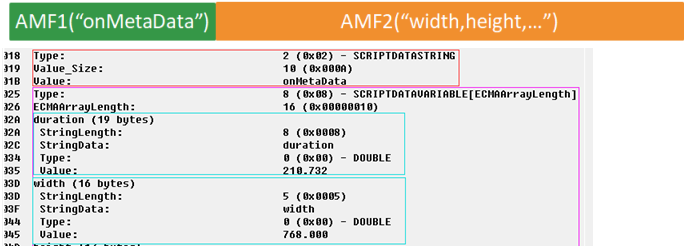

第⼀个 AMF 包： 第 1 个字节表示 AMF 包类型，⼀般总是 0x02，表示字符串。第 2-3 个字节为 UI16 类型值， 标识字符串的⻓度，⼀般总是 0x000A（“onMetaData”⻓度）。后⾯字节为具体的字符串，⼀般总为 “ onMetaData ”（6F,6E,4D,65,74,61,44,61,74,61）。 

第⼆个 AMF 包： 第 1 个字节表示 AMF 包类型，⼀般总是 0x08，表示数组。第 2-5 个字节为 UI32 类型值，表示数组元素的个数。后⾯即为各数组元素的封装，数组元素为**元素名称和值组成的对**。常⻅的数组元素如下表所示。

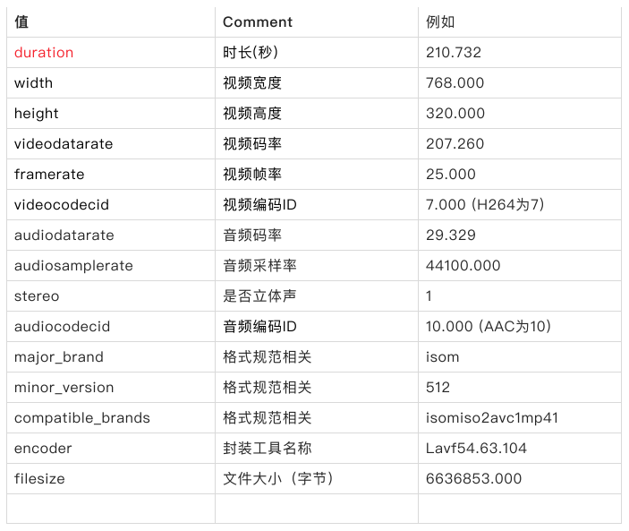

##### ※Audio Tag Data结构(⾳频类型)

⾳频 Tag Data 区域开始的： 

- 第⼀个字节包含了⾳频数据的参数信息， 
- **第⼆个字节开始为⾳频流数据。** 

第⼀个字节为⾳频的信息（仔细看spec发现对于AAC⽽⾔，⽐较有⽤的字段是 SoundFormat），格式如下：

| Field                | Type | Comment                                                      |
| -------------------- | ---- | ------------------------------------------------------------ |
| ⾳频格式 SoundFormat | UB4  | 0 = Linear PCM, platform endian  1 = ADPCM  2 = MP3  3 = Linear PCM, little endian  4 = Nellymoser 16-kHz mono  5 = Nellymoser 8-kHz mono  6 = Nellymoser  7 = G.711 A-law logarithmic PCM  8 = G.711 mu-law logarithmic PCM  9 = reserved  **10 = AAC** 11 = Speex  14 = MP3 8-Khz  15 = Device-specific sound |
| 采样率 SoundRate     | UB2  | 0 = 5.5kHz        1 = 11kHz  2 = 22.05kHz    3 = 44.1kHz  对于AAC总是3。但实际上AAC是可以⽀持到48khz以上的频率 (这个参数对于AAC意义不⼤)。 |
| 采样精度 SoundSize   | UB1  | 0 = snd8Bit         1 = snd16Bit  此参数仅适⽤于未压缩的格式，压缩后的格式都是将其设为1 |
| ⾳频声道 SoundType   | UB1  | 0 = sndMono 单声道  1 = sndStereo ⽴体声，双声道  对于AAC总是1 |

If the **SoundFormat indicates AAC**, the SoundType should be set to 1 (stereo) and the SoundRate should be set to 3 (44 kHz). However, this does not mean that AAC audio in FLV is always stereo, 44 kHz data. Instead, the Flash Player ignores these values and extracts the channel and **sample rate data is encoded in the AAC bitstream.**

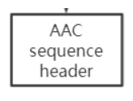

**<u>第⼆个字节开始为⾳频数据（需要判断该数据是真正的⾳频数据，还是⾳频config信息）。</u>**

| Field    | Type    | Comment                                                      |
| -------- | ------- | ------------------------------------------------------------ |
| ⾳频数据 | UI[8*n] | if SoundFormat == 10 **(AAC类型)**  AACAUDIODATA  else  Sound data—varies by format |

**AAC AUDIO DATA**

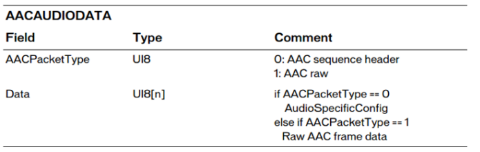

The AudioSpecificConfig is explained in ISO 14496-3. AAC sequence header存放的是 AudioSpecificConfig结构，该结构则在“ISO-14496-3 Audio”中描述。 

**如果是AAC数据，如果他是AAC RAW, tag data[3] 开始才是真正的AAC frame data。**

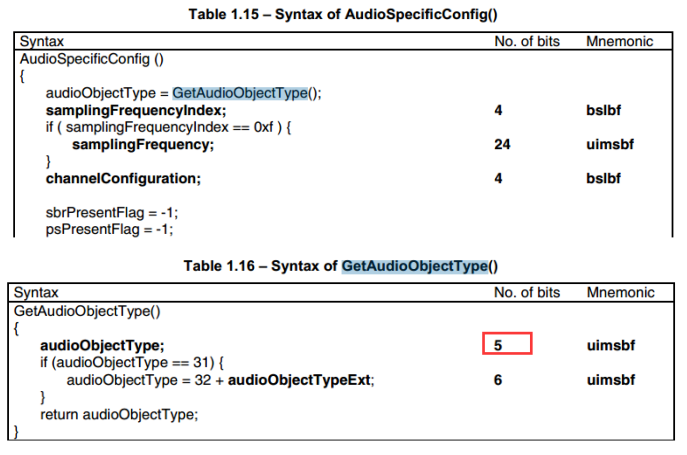

##### ※Video Tag Data结构(视频类型)

视频Tag Data开始的： 

- **第⼀个字节包含视频数据的参数信息，** 
- **第⼆个字节开始为视频流数据。**

第⼀个字节包含视频信息，格式如下:

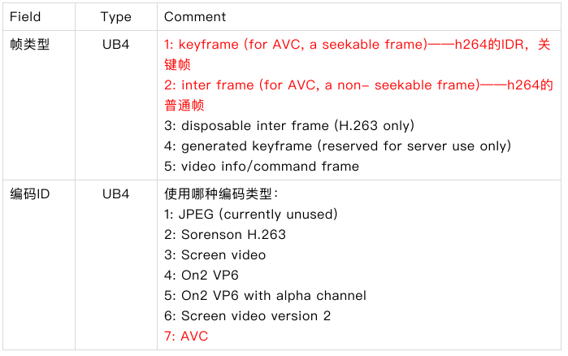

第⼆个字节开始为视频数据

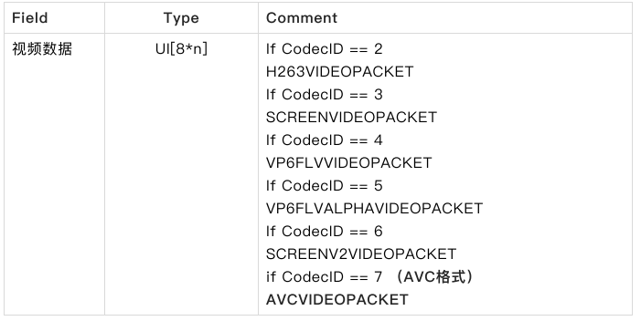

**AVC VIDEO PACKET**

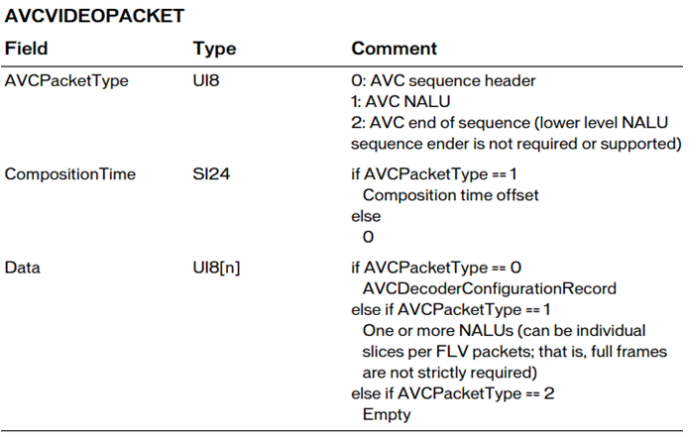

1. **CompositionTime 单位毫秒** 
   CompositionTime 每个视频 tag（<u>整个 tag</u> ）的第 14~16 字节（如果是 tag data 偏移[3]~[5], [0] , [1] [2:AVCPackettype] ）（表示PTS相对于DTS的偏移值 ）。 
   CompositionTime 单位为 ms : 显示时间 = 解码时间（tag的第5~8字节,位置索引[4]~[7]） + CompositionTime

2. **AVCDecoderConfigurationRecord**

   ​	AVC sequence header就是AVCDecoderConfigurationRecord结构，该结构在标准⽂档“ISO-14496-15 AVC file format” SOIEC 14496-15 Advanced Video Coding (AVC) file format.pdf中有详细说明。

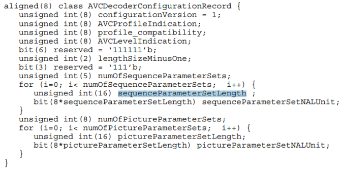

