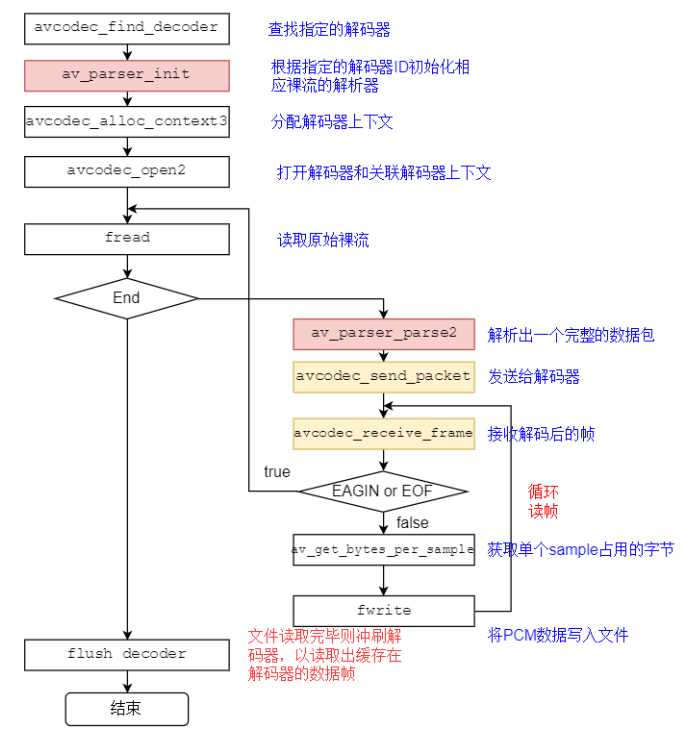

# 音频解码实战


## ⾳频解码过程

⾳频解码过程如下图所示：


## FFmpeg 流程



## 关键函数说明： 

- **avcodec_find_decoder**：根据指定的 AVCodecID 查找注册的解码器。 
- **av_parser_init**：初始化 AVCodecParserContext。 
- **avcodec_alloc_context3**：为 AVCodecContext 分配内存。 
- **avcodec_open2**：打开解码器。
- **av_parser_parse2**：解析获得⼀个 Packet。
- **avcodec_send_packet**：将 AVPacket 压缩数据给解码器。 
- **avcodec_receive_frame**：获取到解码后的 AVFrame 数据。 
- **av_get_bytes_per_sample**: 获取每个 sample 中的字节数。


## avcodec 编解码 API 介绍

avcodec_send_packet、avcodec_receive_frame 的 API 是 FFmpeg3 版本加⼊的。 以下内容摘译⾃⽂档说明 

FFmpeg 提供了两组函数，分别⽤于编码和解码： 

- **解码：avcodec_send_packet()、avcodec_receive_frame()。** 
- **编码：avcodec_send_frame()、avcodec_receive_packet()。** 

API的设计与编解码的流程⾮常贴切。

建议的使⽤流程如下： 

1. 像以前⼀样设置并打开 AVCodecContext。 

2. 输⼊有效的数据： 

   - 解码：调⽤ avcodec_send_packet() 给解码器传⼊包含原始的压缩数据的 AVPacket 对象。 
   - 编码：调⽤ avcodec_send_frame() 给编码器传⼊包含解压数据的 AVFrame 对象。 

   两种情况下推荐AVPacket 和 AVFrame 都使⽤ refcounted（引⽤计数）的模式，否则 libavcodec 可能不得不对输⼊的数据进⾏拷⻉。 

3. 在⼀个循环体内去接收 codec 的输出，即周期性地调⽤ **`avcodec_receive_*()`** 来接收 codec 输出的数据:

   - 解码：调⽤ **avcodec_receive_frame()**，如果成功会返回⼀个包含未压缩数据的 AVFrame。 
   - 编码：调⽤ **avcodec_receive_packet()**，如果成功会返回⼀个包含压缩数据的 AVPacket。 

   反复地调⽤ **avcodec_receive_packet()** <u>直到返回 AVERROR(EAGAIN) 或其他错误</u>。返回 AVERROR(EAGAIN)错误表示 codec 需要新的输⼊来输出更多的数据。对于每个输入的 packet 或 frame，codec ⼀般会输出⼀个frame 或 packet，但是也有可能输出 0 个或者多于 1 个。 

4. 流处理结束的时候需要 flush（冲刷） codec。因为codec可能在内部缓冲多个 frame 或 packet，出于性能或其他必要的情况（如考虑B帧的情况）。 处理流程如下： 调⽤ **`avcodec_send_*()`** 传⼊的 AVFrame 或AVPacket 指针设置为 NULL。 这将进⼊ **draining mode（排⽔模式）**。 反复地调⽤ **`avcodec_receive_*()`** 直到返回 AVERROR_EOF，该⽅法在 draining mode 时不会返回 AVERROR(EAGAIN) 的错误，除⾮你没有进⼊ draining mode。 当重新开启 codec 时，需要先调⽤ **`avcodec_flush_buffers()`** 来重置 codec。

   1. **为什么需要Flush Codec**：
      1. 编解码器在处理音视频数据时，可能会在内部缓存多个帧（frame）或包（packet）。这是为了提高性能（如批量处理）或处理特定的编码需求（如 B 帧的解码依赖）。
      2. 如果不清空这些缓存，一些还未处理的帧可能会被遗留在编解码器内部，导致数据丢失或处理不完整。
   2. **如何Flush Codec**：
      1. 通过调用 `avcodec_send_*()` 函数并将 AVFrame 或 AVPacket 指针设置为 `NULL` 来告诉编解码器进入**排水模式（draining mode）**。这是一个信号，表明没有更多的数据要发送给编解码器，它应该开始处理剩余的内部缓存数据。
      2. 然后，反复调用 `avcodec_receive_*()` 函数来获取并处理剩余的帧，直到它返回`AVERROR_EOF`，这表明所有缓存的帧都已经被处理完毕。
      3. 在排水模式下，`avcodec_receive_*()` 不会返回 `AVERROR(EAGAIN)` 错误，除非编解码器没有正确进入排水模式。
   3. **重置Codec**：
      1. 当需要重新启动或重新使用编解码器时（例如，开始处理新的流），应首先调用`avcodec_flush_buffers()`来重置编解码器。这确保编解码器的内部状态被清除，准备好处理新的数据。

说明： 

1. 编码或者解码刚开始的时候，codec 可能接收了多个输⼊的 frame 或 packet 后还没有输出数据，直到内部的buffer 被填充满。上⾯的使⽤流程可以处理这种情况。 
2. 理论上，只有在输出数据没有被完全接收的情况调⽤ **`avcodec_send_*()`** 的时候才可能会发⽣AVERROR(EAGAIN)的错误。你可以依赖这个机制来实现区别于上⾯建议流程的处理⽅式，⽐如每次循环都调⽤ **`avcodec_send_*()`**，在出现 AVERROR(EAGAIN) 错误的时候再去调⽤ **`avcodec_receive_*()`**。 
3.  并不是所有的 codec 都遵循⼀个严格、可预测的数据处理流程，唯⼀可以保证的是 “ 调⽤ **`avcodec_send_*()`**/**`avcodec_receive_*()`**返回 AVERROR(EAGAIN) 的时候去 **`avcodec_receive_*()`**/**`avcodec_send_*()`**会成功，否则不应该返回 AVERROR(EAGAIN)  的错误。”⼀般来说，任何 codec 都不允许⽆限制地缓存输⼊或者输出。 
4. 在同⼀个 AVCodecContext 上混合使⽤新旧 API 是不允许的，这将导致未定义的⾏为。 


### avcodec_send_packet

- **函数**：int avcodec_send_packet(AVCodecContext *avctx, const AVPacket *avpkt); 

- **作⽤**：⽀持将裸流数据包送给解码器 
- **警告**： 输⼊的 avpkt-data 缓冲区必须⼤于 AV_INPUT_PADDING_SIZE，因为优化的字节流读取器必须⼀次读取 32 或者 64 ⽐特的数据不能跟之前的 API (例如avcodec_decode_video2)混⽤，否则会返回不可预知的错误 
- **备注**： 在将包发送给解码器的时候，AVCodecContext 必须已经通过 avcodec_open2 打开 
- **参数**：
  - avctx：解码上下⽂ 
  - avpkt：输⼊AVPakcet.通常情况下，输⼊数据是⼀个单⼀的视频帧或者⼏个完整的⾳频帧。调⽤者保留包的原有属性，解码器不会修改包的内容。解码器可能创建对包的引⽤。 如果包没有引⽤计数将拷⻉⼀份。跟以往的 API 不⼀样，输⼊的包的数据将被完全地消耗， 如果包含有多个帧，要求多次调⽤**`avcodec_recvive_frame`**，直到 avcodec_recvive_frame 返回VERROR(EAGAIN) 或 AVERROR_EOF。输⼊参数可以为 NULL，或者AVPacket的data域设置为 NULL 或者 size 域设置为 0，表示将刷新所有的包， 意味着数据流已经结束了。第⼀次发送刷新会总会成功，第⼆次发送刷新包是没有必要的，并且返回 AVERROR_EOF ,如果×××缓存了⼀些帧，返回⼀个刷新包，将会返回所有的解码包 
- **返回值**： 
  - 0: 表示成功 AVERROR(EAGAIN)：当前状态不接受输⼊，⽤户必须先使⽤avcodec_receive_frame() 读取数据帧； 
  - AVERROR_EOF：解码器已刷新，不能再向其发送新包； 
  - AVERROR(EINVAL)：没有打开解码器，或者这是⼀个编码器，或者要求刷新； 
  - AVERRO(ENOMEN)：⽆法将数据包添加到内部队列。 


### avcodec_receive_frame 

- **函数**：int avcodec_receive_frame ( AVCodecContext * avctx, AVFrame * frame ) 
- **作⽤**：从解码器返回已解码的输出数据。 
- **参数**： 
  - avctx: 编解码器上下⽂ avcodec_send_packet avcodec_receive_frame 
  - frame: 获取使⽤ reference-counted 机制的 audio 或者video 帧（取决于解码器类型）。请注意，在执⾏其他操作之前，函数内部将始终先调⽤ av_frame_unref(frame)。 
- **返回值**： 
  - 0: 成功，返回⼀个帧 
  - AVERROR(EAGAIN): 该状态下没有帧输出，需要使⽤avcodec_send_packet发送新的 packet到解码器 
  - AVERROR_EOF: 解码器已经被完全刷新，不再有输出帧 
  - AVERROR(EINVAL): 编解码器没打开其他 < 0 的值: 具体查看对应的错误码

## 代码


```c++
void codec_audio2() {
  std::string file_name = "believe.aac";
  std::string out_file_name = "test.pcm";

  AVFormatContext* context = avformat_alloc_context();
  if (!context) {
    std::cerr << "Could not allocate format context" << std::endl;
    return;
  }

  if (avformat_open_input(&context, file_name.c_str(), NULL, NULL) < 0) {
    std::cerr << "Could not open input file" << std::endl;
    avformat_free_context(context);
    return;
  }

  av_dump_format(context, 0, file_name.c_str(), 0);

  AVCodec* codec = avcodec_find_decoder(AV_CODEC_ID_AAC);
  if (!codec) {
    std::cerr << "Codec not found" << std::endl;
    avformat_free_context(context);
    return;
  }

  AVCodecParserContext* parser_context = av_parser_init(AV_CODEC_ID_AAC);
  if (!parser_context) {
    std::cerr << "Could not allocate parser context" << std::endl;
    avformat_free_context(context);
    return;
  }

  AVCodecContext* codec_context = avcodec_alloc_context3(codec);
  if (!codec_context) {
    std::cerr << "Could not allocate codec context" << std::endl;
    av_parser_close(parser_context);
    avformat_free_context(context);
    return;
  }

  if (avcodec_open2(codec_context, codec, NULL) < 0) {
    std::cerr << "Could not open codec" << std::endl;
    avcodec_free_context(&codec_context);
    av_parser_close(parser_context);
    avformat_free_context(context);
    return;
  }

  std::ifstream file_in(file_name, std::ios::binary);
  if (!file_in) {
    std::cerr << "Could not open input file" << std::endl;
    avcodec_free_context(&codec_context);
    av_parser_close(parser_context);
    avformat_free_context(context);
    return;
  }

  std::ofstream file_out(out_file_name, std::ios::binary);
  if (!file_out) {
    std::cerr << "Could not open output file" << std::endl;
    avcodec_free_context(&codec_context);
    av_parser_close(parser_context);
    avformat_free_context(context);
    return;
  }

  uint8_t inbuf[AUDIO_INBUF_SIZE + AV_INPUT_BUFFER_PADDING_SIZE] = { 0 };
  uint8_t* data = inbuf;

  AVPacket* pkt = av_packet_alloc();
  if (!pkt) {
    std::cerr << "Could not allocate packet" << std::endl;
    avcodec_free_context(&codec_context);
    av_parser_close(parser_context);
    avformat_free_context(context);
    return;
  }

  AVFrame* decoded_frame = av_frame_alloc();
  if (!decoded_frame) {
    std::cerr << "Could not allocate frame" << std::endl;
    av_packet_free(&pkt);
    avcodec_free_context(&codec_context);
    av_parser_close(parser_context);
    avformat_free_context(context);
    return;
  }

  int data_size = 0;
  int read_size = AUDIO_INBUF_SIZE;
  int file_size = std::filesystem::file_size(file_name);
  int read_pos = 0;

  while (read_pos < file_size) {
    if (data_size < AUDIO_INBUF_SIZE) {
      if (data_size != 0) {
        memmove(inbuf, data, data_size);
        data = inbuf;
        read_size = AUDIO_INBUF_SIZE - data_size;
      } else {
        read_size = AUDIO_INBUF_SIZE;
      }

      if (read_pos + read_size > file_size) {
        read_size = file_size - read_pos;
      }
      file_in.read(reinterpret_cast<char*>(data + data_size), read_size);
      read_pos += read_size;
      data_size += read_size;
    }

    if (!decoded_frame) {
      decoded_frame = av_frame_alloc();
    }

    int ret = av_parser_parse2(parser_context, codec_context, &pkt->data, &pkt->size,
      data, data_size, AV_NOPTS_VALUE, AV_NOPTS_VALUE, 0);
    if (ret < 0) {
      std::cerr << "Error in parsing" << std::endl;
      break;
    }

    data += ret;
    data_size -= ret;

    if (pkt->size) {
      ret = avcodec_send_packet(codec_context, pkt);
      if (ret < 0) {
        std::cerr << "Error sending a packet for decoding" << std::endl;
        break;
      }

      while (ret >= 0) {
        ret = avcodec_receive_frame(codec_context, decoded_frame);
        if (ret == AVERROR(EAGAIN) || ret == AVERROR_EOF) {
          break;
        }
        else if (ret < 0) {
          std::cerr << "Error during decoding" << std::endl;
          break;
        }

        int smp_size = av_get_bytes_per_sample(codec_context->sample_fmt);
        if (smp_size < 0) {
          std::cerr << "Failed to calculate data size" << std::endl;
          break;
        }

        static int s_print_format = 0;
        if (s_print_format == 0) {
          s_print_format = 1;
          print_sample_format(decoded_frame);
        }

        for (int i = 0; i < decoded_frame->nb_samples; i++) {
          for (int ch = 0; ch < codec_context->channels; ch++) {
            file_out.write(reinterpret_cast<char*>(decoded_frame->data[ch] + smp_size * i), smp_size);
          }
        }
      }
    }
  }

  av_frame_free(&decoded_frame);
  av_packet_free(&pkt);
  avcodec_free_context(&codec_context);
  av_parser_close(parser_context);
  avformat_free_context(context);
}
```


# 拓展阅读

MP3⽂件结构解析(超详细) https://blog.csdn.net/u010650845/article/details/53520426